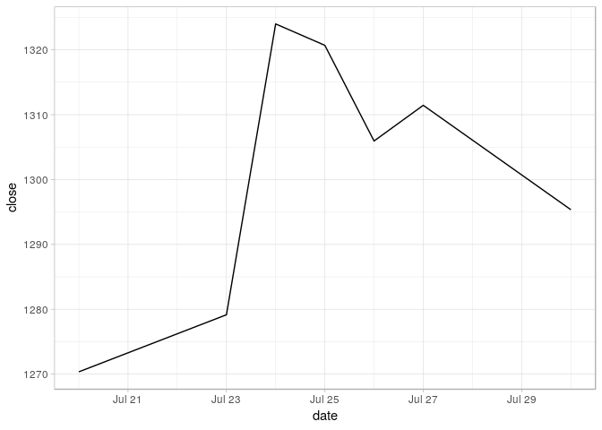

README
================
Gurudev Ilangovan
2018-07-29

[](https://travis-ci.org/ilangurudev/IndianStocksR)

# Introduction

The `IndianStocksR` package is used to download the end of day data of
all stocks in the two primary Indian stock markets,
[NSE](http://nseindia.com/) and [BSE](https://www.bseindia.com/). The
end of data data is provided free by the two stock exchanges from their
websites and consists of information like the open, high, low, close
among others for each script that’s traded in them.

The data can be accessed from their websites based on the date formatted
in a certain way. The R-Bloggers
[article](https://www.r-bloggers.com/extracting-eod-data-from-nse/) was
the source of inspiration for the package. However, the package
modularizes the code, tweaks a lot of things and creates a much more
accessible API that’s more powerful in the sense that it abstracts away
the complexity from the user.

It is advised to create a folder and set the working directory to that
folder before we start work. Even better, if you’re working from R
studio is to create an R project for downloading the data and working on
your analysis.

The package is currently getting submitted to CRAN after which a simple
`install.packages("IndianStocksR")` will get it installed. But for now,
it is available on github.

    install.packages("devtools")
    devtools::install_github("ilangurudev/IndianStocksR")

After installation, we load the package. The package basically creates
data frames and hence plays along well with the concepts of tidy data
and the `tidyverse`. So it is highly encouraged to load that package as
well

``` r
library(IndianStocksR)
library(tidyverse)
```

<br>

# Main Functions

## `download_stocks`

The workhorse of the package is the function `download_stocks`. However,
you will rarely have to use it. It still pays to understand the
parameters as it is the basis of the other functions that you will
probably
use.

``` r
download_stocks(date = "2018-07-20", exchange = c("nse", "bse"), dest_path = "./data", quiet = FALSE)
```

    ## Downloading from 'nse' as exchange not clearly specified.

    ## Dowloaded stocks data from NSE on 20 JUL 2018

  - The `date` parameter can be a date object (and defaults to today).
    It can also be a string (yyyy-mm-dd) or a number that can be parsed
    as a date by `lubridate::as_date()`. For instance, `"2018-05-21"` is
    a valid date.
  - The `exchange` can either be “nse” or “bse”.
  - The `dest_path` specifies where you want the data files to get
    downloaded. It defaults to the data folder in the current working
    directory (which it will create if not found). This is why it is
    advisable to work in a project. This keeps all the data files of a
    project organized. If the path you specify is not found, an error is
    thrown.
  - The `quiet` parameter controls whether you want the download status
    messages or not.

The main purpose of this function is to download data from the specified
exchange on the mentioned date. If data is not available for the date
you specified, you will get an error.

<br>

## `download_stocks_period`

The function you’ll probably have to use first is the
`download_stocks_period`

``` r
df_period <- 
  download_stocks_period(start = "2018-07-21",
                         end = "2018-07-26",
                         exchange = c("both", "nse", "bse"),
                         dest_path = "./data",
                         compile = TRUE,
                         delete_component_files = TRUE,
                         quiet = FALSE)
```

  - `start` and `end`: The download stocks period downloads data for all
    the dates in the date range specified by `start` and `end`. `start`
    defaults to today - 8 days and `end` defaults to today. If today is
    2018-07-30, then end takes that value and start takes the value
    2018-07-22. However, it makes sense to make start today - 365 or
    specify the actual date from when you want the data. You could
    change the `end` value too if you want data for a specific date
    range. The `start` and `end` values follow the same rules as the
    `date` parameter in `download_stocks`
  - The `exchange`function’s behavior is pretty straightforward.
    Downloads data for the date range from NSE if “nse” or BSE from
    “bse” or both NSE and BSE if “both”. Defaults to “both”
  - The `dest_path` does the same job as it does in `download_stocks`
  - The `compile` parameter compiles all the downloaded files into one
    file (if exchange is “both”, one compiled file for “nse”, one for
    “bse” and one combined). This option is by default on as compiled
    files are much more tractable for analysis.
  - The `delete_component_files` deletes everything apart from the
    compiled files. This keeps the work space clean and more efficient
    for updating.
  - The `quiet` does the same job as it does in `download_stocks`

Let’s take a look at
`df_period`.

    df_period %>% slice(1:200)

<div style="border: 1px solid #ddd; padding: 5px; overflow-y: scroll; height:500px; overflow-x: scroll; width:1000px; ">

<table class="table table-striped table-hover table-responsive" style="width: auto !important; ">

<thead>

<tr>

<th style="text-align:left;">

exchange

</th>

<th style="text-align:left;">

date

</th>

<th style="text-align:left;">

symbol

</th>

<th style="text-align:left;">

isin

</th>

<th style="text-align:right;">

open

</th>

<th style="text-align:right;">

high

</th>

<th style="text-align:right;">

low

</th>

<th style="text-align:right;">

close

</th>

<th style="text-align:right;">

volume

</th>

<th style="text-align:left;">

series

</th>

<th style="text-align:right;">

last

</th>

<th style="text-align:right;">

prevclose

</th>

<th style="text-align:right;">

tottrdval

</th>

<th style="text-align:left;">

timestamp

</th>

<th style="text-align:right;">

totaltrades

</th>

<th style="text-align:left;">

sc\_group

</th>

<th style="text-align:right;">

no\_trades

</th>

<th style="text-align:right;">

net\_turnov

</th>

<th style="text-align:left;">

tdcloindi

</th>

</tr>

</thead>

<tbody>

<tr>

<td style="text-align:left;">

nse

</td>

<td style="text-align:left;">

2018-07-20

</td>

<td style="text-align:left;">

20MICRONS

</td>

<td style="text-align:left;">

INE144J01027

</td>

<td style="text-align:right;">

34.90

</td>

<td style="text-align:right;">

35.20

</td>

<td style="text-align:right;">

33.90

</td>

<td style="text-align:right;">

34.40

</td>

<td style="text-align:right;">

42383

</td>

<td style="text-align:left;">

EQ

</td>

<td style="text-align:right;">

34.75

</td>

<td style="text-align:right;">

34.60

</td>

<td style="text-align:right;">

1.456395e+06

</td>

<td style="text-align:left;">

20-JUL-2018

</td>

<td style="text-align:right;">

607

</td>

<td style="text-align:left;">

NA

</td>

<td style="text-align:right;">

NA

</td>

<td style="text-align:right;">

NA

</td>

<td style="text-align:left;">

NA

</td>

</tr>

<tr>

<td style="text-align:left;">

nse

</td>

<td style="text-align:left;">

2018-07-20

</td>

<td style="text-align:left;">

21STCENMGM

</td>

<td style="text-align:left;">

INE253B01015

</td>

<td style="text-align:right;">

34.90

</td>

<td style="text-align:right;">

34.90

</td>

<td style="text-align:right;">

34.90

</td>

<td style="text-align:right;">

34.90

</td>

<td style="text-align:right;">

1202

</td>

<td style="text-align:left;">

EQ

</td>

<td style="text-align:right;">

34.90

</td>

<td style="text-align:right;">

34.25

</td>

<td style="text-align:right;">

4.194980e+04

</td>

<td style="text-align:left;">

20-JUL-2018

</td>

<td style="text-align:right;">

4

</td>

<td style="text-align:left;">

NA

</td>

<td style="text-align:right;">

NA

</td>

<td style="text-align:right;">

NA

</td>

<td style="text-align:left;">

NA

</td>

</tr>

<tr>

<td style="text-align:left;">

nse

</td>

<td style="text-align:left;">

2018-07-20

</td>

<td style="text-align:left;">

3IINFOTECH

</td>

<td style="text-align:left;">

INE748C01020

</td>

<td style="text-align:right;">

3.55

</td>

<td style="text-align:right;">

3.70

</td>

<td style="text-align:right;">

3.50

</td>

<td style="text-align:right;">

3.50

</td>

<td style="text-align:right;">

2998992

</td>

<td style="text-align:left;">

EQ

</td>

<td style="text-align:right;">

3.50

</td>

<td style="text-align:right;">

3.60

</td>

<td style="text-align:right;">

1.071709e+07

</td>

<td style="text-align:left;">

20-JUL-2018

</td>

<td style="text-align:right;">

1137

</td>

<td style="text-align:left;">

NA

</td>

<td style="text-align:right;">

NA

</td>

<td style="text-align:right;">

NA

</td>

<td style="text-align:left;">

NA

</td>

</tr>

<tr>

<td style="text-align:left;">

nse

</td>

<td style="text-align:left;">

2018-07-20

</td>

<td style="text-align:left;">

3MINDIA

</td>

<td style="text-align:left;">

INE470A01017

</td>

<td style="text-align:right;">

21541.00

</td>

<td style="text-align:right;">

23490.00

</td>

<td style="text-align:right;">

21318.55

</td>

<td style="text-align:right;">

23338.75

</td>

<td style="text-align:right;">

9813

</td>

<td style="text-align:left;">

EQ

</td>

<td style="text-align:right;">

23100.00

</td>

<td style="text-align:right;">

21722.15

</td>

<td style="text-align:right;">

2.222181e+08

</td>

<td style="text-align:left;">

20-JUL-2018

</td>

<td style="text-align:right;">

4330

</td>

<td style="text-align:left;">

NA

</td>

<td style="text-align:right;">

NA

</td>

<td style="text-align:right;">

NA

</td>

<td style="text-align:left;">

NA

</td>

</tr>

<tr>

<td style="text-align:left;">

nse

</td>

<td style="text-align:left;">

2018-07-20

</td>

<td style="text-align:left;">

3PLAND

</td>

<td style="text-align:left;">

INE105C01023

</td>

<td style="text-align:right;">

15.00

</td>

<td style="text-align:right;">

15.00

</td>

<td style="text-align:right;">

12.65

</td>

<td style="text-align:right;">

13.15

</td>

<td style="text-align:right;">

2517

</td>

<td style="text-align:left;">

EQ

</td>

<td style="text-align:right;">

13.10

</td>

<td style="text-align:right;">

13.45

</td>

<td style="text-align:right;">

3.373560e+04

</td>

<td style="text-align:left;">

20-JUL-2018

</td>

<td style="text-align:right;">

28

</td>

<td style="text-align:left;">

NA

</td>

<td style="text-align:right;">

NA

</td>

<td style="text-align:right;">

NA

</td>

<td style="text-align:left;">

NA

</td>

</tr>

<tr>

<td style="text-align:left;">

nse

</td>

<td style="text-align:left;">

2018-07-20

</td>

<td style="text-align:left;">

5PAISA

</td>

<td style="text-align:left;">

INE618L01018

</td>

<td style="text-align:right;">

294.75

</td>

<td style="text-align:right;">

304.95

</td>

<td style="text-align:right;">

294.75

</td>

<td style="text-align:right;">

300.85

</td>

<td style="text-align:right;">

2925

</td>

<td style="text-align:left;">

EQ

</td>

<td style="text-align:right;">

302.00

</td>

<td style="text-align:right;">

304.05

</td>

<td style="text-align:right;">

8.753848e+05

</td>

<td style="text-align:left;">

20-JUL-2018

</td>

<td style="text-align:right;">

241

</td>

<td style="text-align:left;">

NA

</td>

<td style="text-align:right;">

NA

</td>

<td style="text-align:right;">

NA

</td>

<td style="text-align:left;">

NA

</td>

</tr>

<tr>

<td style="text-align:left;">

nse

</td>

<td style="text-align:left;">

2018-07-20

</td>

<td style="text-align:left;">

63MOONS

</td>

<td style="text-align:left;">

INE111B01023

</td>

<td style="text-align:right;">

65.25

</td>

<td style="text-align:right;">

66.80

</td>

<td style="text-align:right;">

63.10

</td>

<td style="text-align:right;">

65.55

</td>

<td style="text-align:right;">

216988

</td>

<td style="text-align:left;">

EQ

</td>

<td style="text-align:right;">

65.20

</td>

<td style="text-align:right;">

65.20

</td>

<td style="text-align:right;">

1.410211e+07

</td>

<td style="text-align:left;">

20-JUL-2018

</td>

<td style="text-align:right;">

2403

</td>

<td style="text-align:left;">

NA

</td>

<td style="text-align:right;">

NA

</td>

<td style="text-align:right;">

NA

</td>

<td style="text-align:left;">

NA

</td>

</tr>

<tr>

<td style="text-align:left;">

nse

</td>

<td style="text-align:left;">

2018-07-20

</td>

<td style="text-align:left;">

8KMILES

</td>

<td style="text-align:left;">

INE650K01021

</td>

<td style="text-align:right;">

335.00

</td>

<td style="text-align:right;">

339.00

</td>

<td style="text-align:right;">

307.50

</td>

<td style="text-align:right;">

307.50

</td>

<td style="text-align:right;">

1422247

</td>

<td style="text-align:left;">

EQ

</td>

<td style="text-align:right;">

307.50

</td>

<td style="text-align:right;">

341.65

</td>

<td style="text-align:right;">

4.447500e+08

</td>

<td style="text-align:left;">

20-JUL-2018

</td>

<td style="text-align:right;">

21142

</td>

<td style="text-align:left;">

NA

</td>

<td style="text-align:right;">

NA

</td>

<td style="text-align:right;">

NA

</td>

<td style="text-align:left;">

NA

</td>

</tr>

<tr>

<td style="text-align:left;">

nse

</td>

<td style="text-align:left;">

2018-07-20

</td>

<td style="text-align:left;">

A2ZINFRA

</td>

<td style="text-align:left;">

INE619I01012

</td>

<td style="text-align:right;">

19.65

</td>

<td style="text-align:right;">

20.10

</td>

<td style="text-align:right;">

19.30

</td>

<td style="text-align:right;">

19.80

</td>

<td style="text-align:right;">

168417

</td>

<td style="text-align:left;">

EQ

</td>

<td style="text-align:right;">

19.70

</td>

<td style="text-align:right;">

19.80

</td>

<td style="text-align:right;">

3.304623e+06

</td>

<td style="text-align:left;">

20-JUL-2018

</td>

<td style="text-align:right;">

740

</td>

<td style="text-align:left;">

NA

</td>

<td style="text-align:right;">

NA

</td>

<td style="text-align:right;">

NA

</td>

<td style="text-align:left;">

NA

</td>

</tr>

<tr>

<td style="text-align:left;">

nse

</td>

<td style="text-align:left;">

2018-07-20

</td>

<td style="text-align:left;">

AARTIDRUGS

</td>

<td style="text-align:left;">

INE767A01016

</td>

<td style="text-align:right;">

520.70

</td>

<td style="text-align:right;">

527.00

</td>

<td style="text-align:right;">

520.00

</td>

<td style="text-align:right;">

521.75

</td>

<td style="text-align:right;">

5263

</td>

<td style="text-align:left;">

EQ

</td>

<td style="text-align:right;">

520.00

</td>

<td style="text-align:right;">

520.95

</td>

<td style="text-align:right;">

2.757494e+06

</td>

<td style="text-align:left;">

20-JUL-2018

</td>

<td style="text-align:right;">

538

</td>

<td style="text-align:left;">

NA

</td>

<td style="text-align:right;">

NA

</td>

<td style="text-align:right;">

NA

</td>

<td style="text-align:left;">

NA

</td>

</tr>

<tr>

<td style="text-align:left;">

nse

</td>

<td style="text-align:left;">

2018-07-20

</td>

<td style="text-align:left;">

AARTIIND

</td>

<td style="text-align:left;">

INE769A01020

</td>

<td style="text-align:right;">

1197.15

</td>

<td style="text-align:right;">

1229.80

</td>

<td style="text-align:right;">

1197.15

</td>

<td style="text-align:right;">

1215.45

</td>

<td style="text-align:right;">

7544

</td>

<td style="text-align:left;">

EQ

</td>

<td style="text-align:right;">

1211.00

</td>

<td style="text-align:right;">

1204.40

</td>

<td style="text-align:right;">

9.197825e+06

</td>

<td style="text-align:left;">

20-JUL-2018

</td>

<td style="text-align:right;">

1295

</td>

<td style="text-align:left;">

NA

</td>

<td style="text-align:right;">

NA

</td>

<td style="text-align:right;">

NA

</td>

<td style="text-align:left;">

NA

</td>

</tr>

<tr>

<td style="text-align:left;">

nse

</td>

<td style="text-align:left;">

2018-07-20

</td>

<td style="text-align:left;">

AARVEEDEN

</td>

<td style="text-align:left;">

INE273D01019

</td>

<td style="text-align:right;">

29.60

</td>

<td style="text-align:right;">

30.40

</td>

<td style="text-align:right;">

28.80

</td>

<td style="text-align:right;">

29.10

</td>

<td style="text-align:right;">

8583

</td>

<td style="text-align:left;">

EQ

</td>

<td style="text-align:right;">

29.10

</td>

<td style="text-align:right;">

29.55

</td>

<td style="text-align:right;">

2.509224e+05

</td>

<td style="text-align:left;">

20-JUL-2018

</td>

<td style="text-align:right;">

63

</td>

<td style="text-align:left;">

NA

</td>

<td style="text-align:right;">

NA

</td>

<td style="text-align:right;">

NA

</td>

<td style="text-align:left;">

NA

</td>

</tr>

<tr>

<td style="text-align:left;">

nse

</td>

<td style="text-align:left;">

2018-07-20

</td>

<td style="text-align:left;">

ABAN

</td>

<td style="text-align:left;">

INE421A01028

</td>

<td style="text-align:right;">

101.80

</td>

<td style="text-align:right;">

103.95

</td>

<td style="text-align:right;">

100.15

</td>

<td style="text-align:right;">

101.90

</td>

<td style="text-align:right;">

462821

</td>

<td style="text-align:left;">

EQ

</td>

<td style="text-align:right;">

102.30

</td>

<td style="text-align:right;">

102.20

</td>

<td style="text-align:right;">

4.702502e+07

</td>

<td style="text-align:left;">

20-JUL-2018

</td>

<td style="text-align:right;">

5859

</td>

<td style="text-align:left;">

NA

</td>

<td style="text-align:right;">

NA

</td>

<td style="text-align:right;">

NA

</td>

<td style="text-align:left;">

NA

</td>

</tr>

<tr>

<td style="text-align:left;">

nse

</td>

<td style="text-align:left;">

2018-07-20

</td>

<td style="text-align:left;">

ABB

</td>

<td style="text-align:left;">

INE117A01022

</td>

<td style="text-align:right;">

1164.90

</td>

<td style="text-align:right;">

1179.95

</td>

<td style="text-align:right;">

1129.00

</td>

<td style="text-align:right;">

1134.95

</td>

<td style="text-align:right;">

186787

</td>

<td style="text-align:left;">

EQ

</td>

<td style="text-align:right;">

1132.00

</td>

<td style="text-align:right;">

1157.60

</td>

<td style="text-align:right;">

2.151432e+08

</td>

<td style="text-align:left;">

20-JUL-2018

</td>

<td style="text-align:right;">

14947

</td>

<td style="text-align:left;">

NA

</td>

<td style="text-align:right;">

NA

</td>

<td style="text-align:right;">

NA

</td>

<td style="text-align:left;">

NA

</td>

</tr>

<tr>

<td style="text-align:left;">

nse

</td>

<td style="text-align:left;">

2018-07-20

</td>

<td style="text-align:left;">

ABBOTINDIA

</td>

<td style="text-align:left;">

INE358A01014

</td>

<td style="text-align:right;">

7286.00

</td>

<td style="text-align:right;">

7348.75

</td>

<td style="text-align:right;">

7193.60

</td>

<td style="text-align:right;">

7311.95

</td>

<td style="text-align:right;">

3185

</td>

<td style="text-align:left;">

EQ

</td>

<td style="text-align:right;">

7325.00

</td>

<td style="text-align:right;">

7266.20

</td>

<td style="text-align:right;">

2.321175e+07

</td>

<td style="text-align:left;">

20-JUL-2018

</td>

<td style="text-align:right;">

813

</td>

<td style="text-align:left;">

NA

</td>

<td style="text-align:right;">

NA

</td>

<td style="text-align:right;">

NA

</td>

<td style="text-align:left;">

NA

</td>

</tr>

<tr>

<td style="text-align:left;">

nse

</td>

<td style="text-align:left;">

2018-07-20

</td>

<td style="text-align:left;">

ABCAPITAL

</td>

<td style="text-align:left;">

INE674K01013

</td>

<td style="text-align:right;">

126.00

</td>

<td style="text-align:right;">

127.80

</td>

<td style="text-align:right;">

125.10

</td>

<td style="text-align:right;">

126.45

</td>

<td style="text-align:right;">

1206816

</td>

<td style="text-align:left;">

EQ

</td>

<td style="text-align:right;">

126.90

</td>

<td style="text-align:right;">

125.55

</td>

<td style="text-align:right;">

1.521385e+08

</td>

<td style="text-align:left;">

20-JUL-2018

</td>

<td style="text-align:right;">

11165

</td>

<td style="text-align:left;">

NA

</td>

<td style="text-align:right;">

NA

</td>

<td style="text-align:right;">

NA

</td>

<td style="text-align:left;">

NA

</td>

</tr>

<tr>

<td style="text-align:left;">

nse

</td>

<td style="text-align:left;">

2018-07-20

</td>

<td style="text-align:left;">

ABFRL

</td>

<td style="text-align:left;">

INE647O01011

</td>

<td style="text-align:right;">

136.05

</td>

<td style="text-align:right;">

136.80

</td>

<td style="text-align:right;">

134.25

</td>

<td style="text-align:right;">

135.05

</td>

<td style="text-align:right;">

883312

</td>

<td style="text-align:left;">

EQ

</td>

<td style="text-align:right;">

135.00

</td>

<td style="text-align:right;">

136.05

</td>

<td style="text-align:right;">

1.188593e+08

</td>

<td style="text-align:left;">

20-JUL-2018

</td>

<td style="text-align:right;">

1440

</td>

<td style="text-align:left;">

NA

</td>

<td style="text-align:right;">

NA

</td>

<td style="text-align:right;">

NA

</td>

<td style="text-align:left;">

NA

</td>

</tr>

<tr>

<td style="text-align:left;">

nse

</td>

<td style="text-align:left;">

2018-07-20

</td>

<td style="text-align:left;">

ABGSHIP

</td>

<td style="text-align:left;">

INE067H01016

</td>

<td style="text-align:right;">

5.70

</td>

<td style="text-align:right;">

5.70

</td>

<td style="text-align:right;">

5.30

</td>

<td style="text-align:right;">

5.65

</td>

<td style="text-align:right;">

12835

</td>

<td style="text-align:left;">

BZ

</td>

<td style="text-align:right;">

5.70

</td>

<td style="text-align:right;">

5.55

</td>

<td style="text-align:right;">

7.047700e+04

</td>

<td style="text-align:left;">

20-JUL-2018

</td>

<td style="text-align:right;">

52

</td>

<td style="text-align:left;">

NA

</td>

<td style="text-align:right;">

NA

</td>

<td style="text-align:right;">

NA

</td>

<td style="text-align:left;">

NA

</td>

</tr>

<tr>

<td style="text-align:left;">

nse

</td>

<td style="text-align:left;">

2018-07-20

</td>

<td style="text-align:left;">

ACC

</td>

<td style="text-align:left;">

INE012A01025

</td>

<td style="text-align:right;">

1297.00

</td>

<td style="text-align:right;">

1297.00

</td>

<td style="text-align:right;">

1267.65

</td>

<td style="text-align:right;">

1293.00

</td>

<td style="text-align:right;">

272055

</td>

<td style="text-align:left;">

EQ

</td>

<td style="text-align:right;">

1292.30

</td>

<td style="text-align:right;">

1274.50

</td>

<td style="text-align:right;">

3.497398e+08

</td>

<td style="text-align:left;">

20-JUL-2018

</td>

<td style="text-align:right;">

9555

</td>

<td style="text-align:left;">

NA

</td>

<td style="text-align:right;">

NA

</td>

<td style="text-align:right;">

NA

</td>

<td style="text-align:left;">

NA

</td>

</tr>

<tr>

<td style="text-align:left;">

nse

</td>

<td style="text-align:left;">

2018-07-20

</td>

<td style="text-align:left;">

ACCELYA

</td>

<td style="text-align:left;">

INE793A01012

</td>

<td style="text-align:right;">

1069.00

</td>

<td style="text-align:right;">

1101.85

</td>

<td style="text-align:right;">

1058.45

</td>

<td style="text-align:right;">

1096.90

</td>

<td style="text-align:right;">

4517

</td>

<td style="text-align:left;">

EQ

</td>

<td style="text-align:right;">

1095.00

</td>

<td style="text-align:right;">

1069.80

</td>

<td style="text-align:right;">

4.904186e+06

</td>

<td style="text-align:left;">

20-JUL-2018

</td>

<td style="text-align:right;">

343

</td>

<td style="text-align:left;">

NA

</td>

<td style="text-align:right;">

NA

</td>

<td style="text-align:right;">

NA

</td>

<td style="text-align:left;">

NA

</td>

</tr>

<tr>

<td style="text-align:left;">

nse

</td>

<td style="text-align:left;">

2018-07-20

</td>

<td style="text-align:left;">

ACE

</td>

<td style="text-align:left;">

INE731H01025

</td>

<td style="text-align:right;">

120.30

</td>

<td style="text-align:right;">

129.75

</td>

<td style="text-align:right;">

120.00

</td>

<td style="text-align:right;">

129.05

</td>

<td style="text-align:right;">

258631

</td>

<td style="text-align:left;">

EQ

</td>

<td style="text-align:right;">

128.50

</td>

<td style="text-align:right;">

123.60

</td>

<td style="text-align:right;">

3.247183e+07

</td>

<td style="text-align:left;">

20-JUL-2018

</td>

<td style="text-align:right;">

2521

</td>

<td style="text-align:left;">

NA

</td>

<td style="text-align:right;">

NA

</td>

<td style="text-align:right;">

NA

</td>

<td style="text-align:left;">

NA

</td>

</tr>

<tr>

<td style="text-align:left;">

nse

</td>

<td style="text-align:left;">

2018-07-20

</td>

<td style="text-align:left;">

ADANIENT

</td>

<td style="text-align:left;">

INE423A01024

</td>

<td style="text-align:right;">

152.10

</td>

<td style="text-align:right;">

164.70

</td>

<td style="text-align:right;">

149.70

</td>

<td style="text-align:right;">

162.95

</td>

<td style="text-align:right;">

27020824

</td>

<td style="text-align:left;">

EQ

</td>

<td style="text-align:right;">

161.95

</td>

<td style="text-align:right;">

151.05

</td>

<td style="text-align:right;">

4.276061e+09

</td>

<td style="text-align:left;">

20-JUL-2018

</td>

<td style="text-align:right;">

130410

</td>

<td style="text-align:left;">

NA

</td>

<td style="text-align:right;">

NA

</td>

<td style="text-align:right;">

NA

</td>

<td style="text-align:left;">

NA

</td>

</tr>

<tr>

<td style="text-align:left;">

nse

</td>

<td style="text-align:left;">

2018-07-20

</td>

<td style="text-align:left;">

ADANIGREEN

</td>

<td style="text-align:left;">

INE364U01010

</td>

<td style="text-align:right;">

29.95

</td>

<td style="text-align:right;">

35.60

</td>

<td style="text-align:right;">

29.50

</td>

<td style="text-align:right;">

35.40

</td>

<td style="text-align:right;">

5891772

</td>

<td style="text-align:left;">

EQ

</td>

<td style="text-align:right;">

35.60

</td>

<td style="text-align:right;">

29.70

</td>

<td style="text-align:right;">

2.049862e+08

</td>

<td style="text-align:left;">

20-JUL-2018

</td>

<td style="text-align:right;">

19693

</td>

<td style="text-align:left;">

NA

</td>

<td style="text-align:right;">

NA

</td>

<td style="text-align:right;">

NA

</td>

<td style="text-align:left;">

NA

</td>

</tr>

<tr>

<td style="text-align:left;">

nse

</td>

<td style="text-align:left;">

2018-07-20

</td>

<td style="text-align:left;">

ADANIPORTS

</td>

<td style="text-align:left;">

INE742F01042

</td>

<td style="text-align:right;">

369.60

</td>

<td style="text-align:right;">

376.90

</td>

<td style="text-align:right;">

366.90

</td>

<td style="text-align:right;">

370.05

</td>

<td style="text-align:right;">

1886770

</td>

<td style="text-align:left;">

EQ

</td>

<td style="text-align:right;">

369.95

</td>

<td style="text-align:right;">

369.60

</td>

<td style="text-align:right;">

7.018623e+08

</td>

<td style="text-align:left;">

20-JUL-2018

</td>

<td style="text-align:right;">

33098

</td>

<td style="text-align:left;">

NA

</td>

<td style="text-align:right;">

NA

</td>

<td style="text-align:right;">

NA

</td>

<td style="text-align:left;">

NA

</td>

</tr>

<tr>

<td style="text-align:left;">

nse

</td>

<td style="text-align:left;">

2018-07-20

</td>

<td style="text-align:left;">

ADANIPOWER

</td>

<td style="text-align:left;">

INE814H01011

</td>

<td style="text-align:right;">

22.30

</td>

<td style="text-align:right;">

25.00

</td>

<td style="text-align:right;">

21.65

</td>

<td style="text-align:right;">

24.65

</td>

<td style="text-align:right;">

82844118

</td>

<td style="text-align:left;">

EQ

</td>

<td style="text-align:right;">

24.50

</td>

<td style="text-align:right;">

22.30

</td>

<td style="text-align:right;">

1.991683e+09

</td>

<td style="text-align:left;">

20-JUL-2018

</td>

<td style="text-align:right;">

81277

</td>

<td style="text-align:left;">

NA

</td>

<td style="text-align:right;">

NA

</td>

<td style="text-align:right;">

NA

</td>

<td style="text-align:left;">

NA

</td>

</tr>

<tr>

<td style="text-align:left;">

nse

</td>

<td style="text-align:left;">

2018-07-20

</td>

<td style="text-align:left;">

ADANITRANS

</td>

<td style="text-align:left;">

INE931S01010

</td>

<td style="text-align:right;">

149.20

</td>

<td style="text-align:right;">

157.45

</td>

<td style="text-align:right;">

147.80

</td>

<td style="text-align:right;">

150.40

</td>

<td style="text-align:right;">

464642

</td>

<td style="text-align:left;">

EQ

</td>

<td style="text-align:right;">

149.90

</td>

<td style="text-align:right;">

149.20

</td>

<td style="text-align:right;">

7.077580e+07

</td>

<td style="text-align:left;">

20-JUL-2018

</td>

<td style="text-align:right;">

7670

</td>

<td style="text-align:left;">

NA

</td>

<td style="text-align:right;">

NA

</td>

<td style="text-align:right;">

NA

</td>

<td style="text-align:left;">

NA

</td>

</tr>

<tr>

<td style="text-align:left;">

nse

</td>

<td style="text-align:left;">

2018-07-20

</td>

<td style="text-align:left;">

ADFFOODS

</td>

<td style="text-align:left;">

INE982B01019

</td>

<td style="text-align:right;">

236.95

</td>

<td style="text-align:right;">

244.00

</td>

<td style="text-align:right;">

235.00

</td>

<td style="text-align:right;">

236.45

</td>

<td style="text-align:right;">

89169

</td>

<td style="text-align:left;">

EQ

</td>

<td style="text-align:right;">

236.15

</td>

<td style="text-align:right;">

236.50

</td>

<td style="text-align:right;">

2.120041e+07

</td>

<td style="text-align:left;">

20-JUL-2018

</td>

<td style="text-align:right;">

1360

</td>

<td style="text-align:left;">

NA

</td>

<td style="text-align:right;">

NA

</td>

<td style="text-align:right;">

NA

</td>

<td style="text-align:left;">

NA

</td>

</tr>

<tr>

<td style="text-align:left;">

nse

</td>

<td style="text-align:left;">

2018-07-20

</td>

<td style="text-align:left;">

ADHUNIK

</td>

<td style="text-align:left;">

INE400H01019

</td>

<td style="text-align:right;">

4.25

</td>

<td style="text-align:right;">

4.25

</td>

<td style="text-align:right;">

3.95

</td>

<td style="text-align:right;">

3.95

</td>

<td style="text-align:right;">

91468

</td>

<td style="text-align:left;">

EQ

</td>

<td style="text-align:right;">

3.95

</td>

<td style="text-align:right;">

4.10

</td>

<td style="text-align:right;">

3.762009e+05

</td>

<td style="text-align:left;">

20-JUL-2018

</td>

<td style="text-align:right;">

137

</td>

<td style="text-align:left;">

NA

</td>

<td style="text-align:right;">

NA

</td>

<td style="text-align:right;">

NA

</td>

<td style="text-align:left;">

NA

</td>

</tr>

<tr>

<td style="text-align:left;">

nse

</td>

<td style="text-align:left;">

2018-07-20

</td>

<td style="text-align:left;">

ADHUNIKIND

</td>

<td style="text-align:left;">

INE452L01012

</td>

<td style="text-align:right;">

76.50

</td>

<td style="text-align:right;">

76.50

</td>

<td style="text-align:right;">

71.00

</td>

<td style="text-align:right;">

74.00

</td>

<td style="text-align:right;">

69953

</td>

<td style="text-align:left;">

EQ

</td>

<td style="text-align:right;">

74.15

</td>

<td style="text-align:right;">

74.25

</td>

<td style="text-align:right;">

5.144542e+06

</td>

<td style="text-align:left;">

20-JUL-2018

</td>

<td style="text-align:right;">

228

</td>

<td style="text-align:left;">

NA

</td>

<td style="text-align:right;">

NA

</td>

<td style="text-align:right;">

NA

</td>

<td style="text-align:left;">

NA

</td>

</tr>

<tr>

<td style="text-align:left;">

nse

</td>

<td style="text-align:left;">

2018-07-20

</td>

<td style="text-align:left;">

ADLABS

</td>

<td style="text-align:left;">

INE172N01012

</td>

<td style="text-align:right;">

32.20

</td>

<td style="text-align:right;">

33.90

</td>

<td style="text-align:right;">

32.20

</td>

<td style="text-align:right;">

32.95

</td>

<td style="text-align:right;">

37660

</td>

<td style="text-align:left;">

EQ

</td>

<td style="text-align:right;">

32.95

</td>

<td style="text-align:right;">

32.90

</td>

<td style="text-align:right;">

1.249496e+06

</td>

<td style="text-align:left;">

20-JUL-2018

</td>

<td style="text-align:right;">

522

</td>

<td style="text-align:left;">

NA

</td>

<td style="text-align:right;">

NA

</td>

<td style="text-align:right;">

NA

</td>

<td style="text-align:left;">

NA

</td>

</tr>

<tr>

<td style="text-align:left;">

nse

</td>

<td style="text-align:left;">

2018-07-20

</td>

<td style="text-align:left;">

ADORWELD

</td>

<td style="text-align:left;">

INE045A01017

</td>

<td style="text-align:right;">

269.10

</td>

<td style="text-align:right;">

277.05

</td>

<td style="text-align:right;">

266.10

</td>

<td style="text-align:right;">

269.85

</td>

<td style="text-align:right;">

5028

</td>

<td style="text-align:left;">

EQ

</td>

<td style="text-align:right;">

268.20

</td>

<td style="text-align:right;">

270.50

</td>

<td style="text-align:right;">

1.359517e+06

</td>

<td style="text-align:left;">

20-JUL-2018

</td>

<td style="text-align:right;">

247

</td>

<td style="text-align:left;">

NA

</td>

<td style="text-align:right;">

NA

</td>

<td style="text-align:right;">

NA

</td>

<td style="text-align:left;">

NA

</td>

</tr>

<tr>

<td style="text-align:left;">

nse

</td>

<td style="text-align:left;">

2018-07-20

</td>

<td style="text-align:left;">

ADROITINFO

</td>

<td style="text-align:left;">

INE737B01033

</td>

<td style="text-align:right;">

35.10

</td>

<td style="text-align:right;">

35.45

</td>

<td style="text-align:right;">

29.50

</td>

<td style="text-align:right;">

30.40

</td>

<td style="text-align:right;">

46729

</td>

<td style="text-align:left;">

EQ

</td>

<td style="text-align:right;">

30.00

</td>

<td style="text-align:right;">

35.15

</td>

<td style="text-align:right;">

1.547914e+06

</td>

<td style="text-align:left;">

20-JUL-2018

</td>

<td style="text-align:right;">

537

</td>

<td style="text-align:left;">

NA

</td>

<td style="text-align:right;">

NA

</td>

<td style="text-align:right;">

NA

</td>

<td style="text-align:left;">

NA

</td>

</tr>

<tr>

<td style="text-align:left;">

nse

</td>

<td style="text-align:left;">

2018-07-20

</td>

<td style="text-align:left;">

ADSL

</td>

<td style="text-align:left;">

INE102I01027

</td>

<td style="text-align:right;">

14.30

</td>

<td style="text-align:right;">

14.85

</td>

<td style="text-align:right;">

13.55

</td>

<td style="text-align:right;">

14.25

</td>

<td style="text-align:right;">

28985

</td>

<td style="text-align:left;">

EQ

</td>

<td style="text-align:right;">

14.35

</td>

<td style="text-align:right;">

14.10

</td>

<td style="text-align:right;">

4.111782e+05

</td>

<td style="text-align:left;">

20-JUL-2018

</td>

<td style="text-align:right;">

127

</td>

<td style="text-align:left;">

NA

</td>

<td style="text-align:right;">

NA

</td>

<td style="text-align:right;">

NA

</td>

<td style="text-align:left;">

NA

</td>

</tr>

<tr>

<td style="text-align:left;">

nse

</td>

<td style="text-align:left;">

2018-07-20

</td>

<td style="text-align:left;">

ADVANIHOTR

</td>

<td style="text-align:left;">

INE199C01026

</td>

<td style="text-align:right;">

46.05

</td>

<td style="text-align:right;">

47.50

</td>

<td style="text-align:right;">

43.80

</td>

<td style="text-align:right;">

45.90

</td>

<td style="text-align:right;">

10838

</td>

<td style="text-align:left;">

EQ

</td>

<td style="text-align:right;">

45.45

</td>

<td style="text-align:right;">

46.70

</td>

<td style="text-align:right;">

4.916558e+05

</td>

<td style="text-align:left;">

20-JUL-2018

</td>

<td style="text-align:right;">

249

</td>

<td style="text-align:left;">

NA

</td>

<td style="text-align:right;">

NA

</td>

<td style="text-align:right;">

NA

</td>

<td style="text-align:left;">

NA

</td>

</tr>

<tr>

<td style="text-align:left;">

nse

</td>

<td style="text-align:left;">

2018-07-20

</td>

<td style="text-align:left;">

ADVENZYMES

</td>

<td style="text-align:left;">

INE837H01020

</td>

<td style="text-align:right;">

201.00

</td>

<td style="text-align:right;">

204.75

</td>

<td style="text-align:right;">

197.20

</td>

<td style="text-align:right;">

202.10

</td>

<td style="text-align:right;">

71979

</td>

<td style="text-align:left;">

EQ

</td>

<td style="text-align:right;">

202.50

</td>

<td style="text-align:right;">

202.00

</td>

<td style="text-align:right;">

1.450842e+07

</td>

<td style="text-align:left;">

20-JUL-2018

</td>

<td style="text-align:right;">

2690

</td>

<td style="text-align:left;">

NA

</td>

<td style="text-align:right;">

NA

</td>

<td style="text-align:right;">

NA

</td>

<td style="text-align:left;">

NA

</td>

</tr>

<tr>

<td style="text-align:left;">

nse

</td>

<td style="text-align:left;">

2018-07-20

</td>

<td style="text-align:left;">

AEGISCHEM

</td>

<td style="text-align:left;">

INE208C01025

</td>

<td style="text-align:right;">

236.20

</td>

<td style="text-align:right;">

241.00

</td>

<td style="text-align:right;">

233.75

</td>

<td style="text-align:right;">

236.30

</td>

<td style="text-align:right;">

83965

</td>

<td style="text-align:left;">

EQ

</td>

<td style="text-align:right;">

237.00

</td>

<td style="text-align:right;">

236.20

</td>

<td style="text-align:right;">

2.002959e+07

</td>

<td style="text-align:left;">

20-JUL-2018

</td>

<td style="text-align:right;">

1690

</td>

<td style="text-align:left;">

NA

</td>

<td style="text-align:right;">

NA

</td>

<td style="text-align:right;">

NA

</td>

<td style="text-align:left;">

NA

</td>

</tr>

<tr>

<td style="text-align:left;">

nse

</td>

<td style="text-align:left;">

2018-07-20

</td>

<td style="text-align:left;">

AFL

</td>

<td style="text-align:left;">

INE020G01017

</td>

<td style="text-align:right;">

45.50

</td>

<td style="text-align:right;">

47.80

</td>

<td style="text-align:right;">

45.05

</td>

<td style="text-align:right;">

47.25

</td>

<td style="text-align:right;">

586

</td>

<td style="text-align:left;">

EQ

</td>

<td style="text-align:right;">

46.25

</td>

<td style="text-align:right;">

47.05

</td>

<td style="text-align:right;">

2.762300e+04

</td>

<td style="text-align:left;">

20-JUL-2018

</td>

<td style="text-align:right;">

20

</td>

<td style="text-align:left;">

NA

</td>

<td style="text-align:right;">

NA

</td>

<td style="text-align:right;">

NA

</td>

<td style="text-align:left;">

NA

</td>

</tr>

<tr>

<td style="text-align:left;">

nse

</td>

<td style="text-align:left;">

2018-07-20

</td>

<td style="text-align:left;">

AGARIND

</td>

<td style="text-align:left;">

INE204E01012

</td>

<td style="text-align:right;">

271.95

</td>

<td style="text-align:right;">

283.50

</td>

<td style="text-align:right;">

265.25

</td>

<td style="text-align:right;">

272.75

</td>

<td style="text-align:right;">

703

</td>

<td style="text-align:left;">

EQ

</td>

<td style="text-align:right;">

271.90

</td>

<td style="text-align:right;">

266.00

</td>

<td style="text-align:right;">

1.905340e+05

</td>

<td style="text-align:left;">

20-JUL-2018

</td>

<td style="text-align:right;">

65

</td>

<td style="text-align:left;">

NA

</td>

<td style="text-align:right;">

NA

</td>

<td style="text-align:right;">

NA

</td>

<td style="text-align:left;">

NA

</td>

</tr>

<tr>

<td style="text-align:left;">

nse

</td>

<td style="text-align:left;">

2018-07-20

</td>

<td style="text-align:left;">

AGCNET

</td>

<td style="text-align:left;">

INE676A01019

</td>

<td style="text-align:right;">

104.90

</td>

<td style="text-align:right;">

106.90

</td>

<td style="text-align:right;">

102.10

</td>

<td style="text-align:right;">

105.05

</td>

<td style="text-align:right;">

2047

</td>

<td style="text-align:left;">

EQ

</td>

<td style="text-align:right;">

105.00

</td>

<td style="text-align:right;">

105.00

</td>

<td style="text-align:right;">

2.162518e+05

</td>

<td style="text-align:left;">

20-JUL-2018

</td>

<td style="text-align:right;">

36

</td>

<td style="text-align:left;">

NA

</td>

<td style="text-align:right;">

NA

</td>

<td style="text-align:right;">

NA

</td>

<td style="text-align:left;">

NA

</td>

</tr>

<tr>

<td style="text-align:left;">

nse

</td>

<td style="text-align:left;">

2018-07-20

</td>

<td style="text-align:left;">

AGLSL

</td>

<td style="text-align:left;">

INE517U01013

</td>

<td style="text-align:right;">

84.80

</td>

<td style="text-align:right;">

84.80

</td>

<td style="text-align:right;">

82.05

</td>

<td style="text-align:right;">

83.70

</td>

<td style="text-align:right;">

179

</td>

<td style="text-align:left;">

EQ

</td>

<td style="text-align:right;">

83.05

</td>

<td style="text-align:right;">

81.75

</td>

<td style="text-align:right;">

1.495000e+04

</td>

<td style="text-align:left;">

20-JUL-2018

</td>

<td style="text-align:right;">

11

</td>

<td style="text-align:left;">

NA

</td>

<td style="text-align:right;">

NA

</td>

<td style="text-align:right;">

NA

</td>

<td style="text-align:left;">

NA

</td>

</tr>

<tr>

<td style="text-align:left;">

nse

</td>

<td style="text-align:left;">

2018-07-20

</td>

<td style="text-align:left;">

AGRITECH

</td>

<td style="text-align:left;">

INE449G01018

</td>

<td style="text-align:right;">

97.50

</td>

<td style="text-align:right;">

99.60

</td>

<td style="text-align:right;">

96.00

</td>

<td style="text-align:right;">

97.40

</td>

<td style="text-align:right;">

13640

</td>

<td style="text-align:left;">

EQ

</td>

<td style="text-align:right;">

97.00

</td>

<td style="text-align:right;">

98.25

</td>

<td style="text-align:right;">

1.337862e+06

</td>

<td style="text-align:left;">

20-JUL-2018

</td>

<td style="text-align:right;">

365

</td>

<td style="text-align:left;">

NA

</td>

<td style="text-align:right;">

NA

</td>

<td style="text-align:right;">

NA

</td>

<td style="text-align:left;">

NA

</td>

</tr>

<tr>

<td style="text-align:left;">

nse

</td>

<td style="text-align:left;">

2018-07-20

</td>

<td style="text-align:left;">

AGROPHOS

</td>

<td style="text-align:left;">

INE740V01019

</td>

<td style="text-align:right;">

35.85

</td>

<td style="text-align:right;">

36.90

</td>

<td style="text-align:right;">

35.85

</td>

<td style="text-align:right;">

36.90

</td>

<td style="text-align:right;">

30000

</td>

<td style="text-align:left;">

SM

</td>

<td style="text-align:right;">

36.90

</td>

<td style="text-align:right;">

34.90

</td>

<td style="text-align:right;">

1.083600e+06

</td>

<td style="text-align:left;">

20-JUL-2018

</td>

<td style="text-align:right;">

5

</td>

<td style="text-align:left;">

NA

</td>

<td style="text-align:right;">

NA

</td>

<td style="text-align:right;">

NA

</td>

<td style="text-align:left;">

NA

</td>

</tr>

<tr>

<td style="text-align:left;">

nse

</td>

<td style="text-align:left;">

2018-07-20

</td>

<td style="text-align:left;">

AHLEAST

</td>

<td style="text-align:left;">

INE926K01017

</td>

<td style="text-align:right;">

251.90

</td>

<td style="text-align:right;">

256.05

</td>

<td style="text-align:right;">

251.90

</td>

<td style="text-align:right;">

255.05

</td>

<td style="text-align:right;">

754

</td>

<td style="text-align:left;">

EQ

</td>

<td style="text-align:right;">

255.00

</td>

<td style="text-align:right;">

259.20

</td>

<td style="text-align:right;">

1.924468e+05

</td>

<td style="text-align:left;">

20-JUL-2018

</td>

<td style="text-align:right;">

22

</td>

<td style="text-align:left;">

NA

</td>

<td style="text-align:right;">

NA

</td>

<td style="text-align:right;">

NA

</td>

<td style="text-align:left;">

NA

</td>

</tr>

<tr>

<td style="text-align:left;">

nse

</td>

<td style="text-align:left;">

2018-07-20

</td>

<td style="text-align:left;">

AHLUCONT

</td>

<td style="text-align:left;">

INE758C01029

</td>

<td style="text-align:right;">

321.65

</td>

<td style="text-align:right;">

330.00

</td>

<td style="text-align:right;">

321.65

</td>

<td style="text-align:right;">

326.25

</td>

<td style="text-align:right;">

55438

</td>

<td style="text-align:left;">

EQ

</td>

<td style="text-align:right;">

325.20

</td>

<td style="text-align:right;">

325.05

</td>

<td style="text-align:right;">

1.802926e+07

</td>

<td style="text-align:left;">

20-JUL-2018

</td>

<td style="text-align:right;">

57

</td>

<td style="text-align:left;">

NA

</td>

<td style="text-align:right;">

NA

</td>

<td style="text-align:right;">

NA

</td>

<td style="text-align:left;">

NA

</td>

</tr>

<tr>

<td style="text-align:left;">

nse

</td>

<td style="text-align:left;">

2018-07-20

</td>

<td style="text-align:left;">

AHLWEST

</td>

<td style="text-align:left;">

INE915K01010

</td>

<td style="text-align:right;">

283.75

</td>

<td style="text-align:right;">

293.00

</td>

<td style="text-align:right;">

283.75

</td>

<td style="text-align:right;">

293.00

</td>

<td style="text-align:right;">

1369

</td>

<td style="text-align:left;">

BE

</td>

<td style="text-align:right;">

293.00

</td>

<td style="text-align:right;">

298.65

</td>

<td style="text-align:right;">

3.992598e+05

</td>

<td style="text-align:left;">

20-JUL-2018

</td>

<td style="text-align:right;">

10

</td>

<td style="text-align:left;">

NA

</td>

<td style="text-align:right;">

NA

</td>

<td style="text-align:right;">

NA

</td>

<td style="text-align:left;">

NA

</td>

</tr>

<tr>

<td style="text-align:left;">

nse

</td>

<td style="text-align:left;">

2018-07-20

</td>

<td style="text-align:left;">

AIAENG

</td>

<td style="text-align:left;">

INE212H01026

</td>

<td style="text-align:right;">

1606.70

</td>

<td style="text-align:right;">

1614.50

</td>

<td style="text-align:right;">

1555.10

</td>

<td style="text-align:right;">

1599.95

</td>

<td style="text-align:right;">

26243

</td>

<td style="text-align:left;">

EQ

</td>

<td style="text-align:right;">

1600.00

</td>

<td style="text-align:right;">

1597.70

</td>

<td style="text-align:right;">

4.182032e+07

</td>

<td style="text-align:left;">

20-JUL-2018

</td>

<td style="text-align:right;">

2018

</td>

<td style="text-align:left;">

NA

</td>

<td style="text-align:right;">

NA

</td>

<td style="text-align:right;">

NA

</td>

<td style="text-align:left;">

NA

</td>

</tr>

<tr>

<td style="text-align:left;">

nse

</td>

<td style="text-align:left;">

2018-07-20

</td>

<td style="text-align:left;">

AICHAMP

</td>

<td style="text-align:left;">

INE768E01024

</td>

<td style="text-align:right;">

24.35

</td>

<td style="text-align:right;">

24.35

</td>

<td style="text-align:right;">

24.35

</td>

<td style="text-align:right;">

24.35

</td>

<td style="text-align:right;">

10

</td>

<td style="text-align:left;">

BE

</td>

<td style="text-align:right;">

24.35

</td>

<td style="text-align:right;">

23.95

</td>

<td style="text-align:right;">

2.435000e+02

</td>

<td style="text-align:left;">

20-JUL-2018

</td>

<td style="text-align:right;">

1

</td>

<td style="text-align:left;">

NA

</td>

<td style="text-align:right;">

NA

</td>

<td style="text-align:right;">

NA

</td>

<td style="text-align:left;">

NA

</td>

</tr>

<tr>

<td style="text-align:left;">

nse

</td>

<td style="text-align:left;">

2018-07-20

</td>

<td style="text-align:left;">

AIFL

</td>

<td style="text-align:left;">

INE428O01016

</td>

<td style="text-align:right;">

447.00

</td>

<td style="text-align:right;">

449.00

</td>

<td style="text-align:right;">

444.50

</td>

<td style="text-align:right;">

446.00

</td>

<td style="text-align:right;">

190067

</td>

<td style="text-align:left;">

EQ

</td>

<td style="text-align:right;">

445.95

</td>

<td style="text-align:right;">

445.40

</td>

<td style="text-align:right;">

8.488145e+07

</td>

<td style="text-align:left;">

20-JUL-2018

</td>

<td style="text-align:right;">

1812

</td>

<td style="text-align:left;">

NA

</td>

<td style="text-align:right;">

NA

</td>

<td style="text-align:right;">

NA

</td>

<td style="text-align:left;">

NA

</td>

</tr>

<tr>

<td style="text-align:left;">

nse

</td>

<td style="text-align:left;">

2018-07-20

</td>

<td style="text-align:left;">

AIRAN

</td>

<td style="text-align:left;">

INE645W01018

</td>

<td style="text-align:right;">

345.00

</td>

<td style="text-align:right;">

350.00

</td>

<td style="text-align:right;">

345.00

</td>

<td style="text-align:right;">

350.00

</td>

<td style="text-align:right;">

1500

</td>

<td style="text-align:left;">

SM

</td>

<td style="text-align:right;">

350.00

</td>

<td style="text-align:right;">

345.70

</td>

<td style="text-align:right;">

5.205000e+05

</td>

<td style="text-align:left;">

20-JUL-2018

</td>

<td style="text-align:right;">

3

</td>

<td style="text-align:left;">

NA

</td>

<td style="text-align:right;">

NA

</td>

<td style="text-align:right;">

NA

</td>

<td style="text-align:left;">

NA

</td>

</tr>

<tr>

<td style="text-align:left;">

nse

</td>

<td style="text-align:left;">

2018-07-20

</td>

<td style="text-align:left;">

AISL

</td>

<td style="text-align:left;">

INE635Y01015

</td>

<td style="text-align:right;">

76.00

</td>

<td style="text-align:right;">

78.00

</td>

<td style="text-align:right;">

76.00

</td>

<td style="text-align:right;">

77.25

</td>

<td style="text-align:right;">

3600

</td>

<td style="text-align:left;">

SM

</td>

<td style="text-align:right;">

78.00

</td>

<td style="text-align:right;">

79.05

</td>

<td style="text-align:right;">

2.766000e+05

</td>

<td style="text-align:left;">

20-JUL-2018

</td>

<td style="text-align:right;">

3

</td>

<td style="text-align:left;">

NA

</td>

<td style="text-align:right;">

NA

</td>

<td style="text-align:right;">

NA

</td>

<td style="text-align:left;">

NA

</td>

</tr>

<tr>

<td style="text-align:left;">

nse

</td>

<td style="text-align:left;">

2018-07-20

</td>

<td style="text-align:left;">

AJANTPHARM

</td>

<td style="text-align:left;">

INE031B01049

</td>

<td style="text-align:right;">

965.00

</td>

<td style="text-align:right;">

1027.50

</td>

<td style="text-align:right;">

950.60

</td>

<td style="text-align:right;">

1019.25

</td>

<td style="text-align:right;">

615992

</td>

<td style="text-align:left;">

EQ

</td>

<td style="text-align:right;">

1024.00

</td>

<td style="text-align:right;">

973.95

</td>

<td style="text-align:right;">

6.182580e+08

</td>

<td style="text-align:left;">

20-JUL-2018

</td>

<td style="text-align:right;">

17936

</td>

<td style="text-align:left;">

NA

</td>

<td style="text-align:right;">

NA

</td>

<td style="text-align:right;">

NA

</td>

<td style="text-align:left;">

NA

</td>

</tr>

<tr>

<td style="text-align:left;">

nse

</td>

<td style="text-align:left;">

2018-07-20

</td>

<td style="text-align:left;">

AJMERA

</td>

<td style="text-align:left;">

INE298G01027

</td>

<td style="text-align:right;">

199.10

</td>

<td style="text-align:right;">

206.00

</td>

<td style="text-align:right;">

199.10

</td>

<td style="text-align:right;">

201.40

</td>

<td style="text-align:right;">

39019

</td>

<td style="text-align:left;">

EQ

</td>

<td style="text-align:right;">

203.90

</td>

<td style="text-align:right;">

200.45

</td>

<td style="text-align:right;">

7.912329e+06

</td>

<td style="text-align:left;">

20-JUL-2018

</td>

<td style="text-align:right;">

1156

</td>

<td style="text-align:left;">

NA

</td>

<td style="text-align:right;">

NA

</td>

<td style="text-align:right;">

NA

</td>

<td style="text-align:left;">

NA

</td>

</tr>

<tr>

<td style="text-align:left;">

nse

</td>

<td style="text-align:left;">

2018-07-20

</td>

<td style="text-align:left;">

AJOONI

</td>

<td style="text-align:left;">

INE820Y01013

</td>

<td style="text-align:right;">

18.40

</td>

<td style="text-align:right;">

19.00

</td>

<td style="text-align:right;">

16.00

</td>

<td style="text-align:right;">

17.45

</td>

<td style="text-align:right;">

52000

</td>

<td style="text-align:left;">

SM

</td>

<td style="text-align:right;">

17.45

</td>

<td style="text-align:right;">

19.00

</td>

<td style="text-align:right;">

8.944000e+05

</td>

<td style="text-align:left;">

20-JUL-2018

</td>

<td style="text-align:right;">

13

</td>

<td style="text-align:left;">

NA

</td>

<td style="text-align:right;">

NA

</td>

<td style="text-align:right;">

NA

</td>

<td style="text-align:left;">

NA

</td>

</tr>

<tr>

<td style="text-align:left;">

nse

</td>

<td style="text-align:left;">

2018-07-20

</td>

<td style="text-align:left;">

AKSHARCHEM

</td>

<td style="text-align:left;">

INE542B01011

</td>

<td style="text-align:right;">

498.05

</td>

<td style="text-align:right;">

499.05

</td>

<td style="text-align:right;">

480.00

</td>

<td style="text-align:right;">

482.40

</td>

<td style="text-align:right;">

1156

</td>

<td style="text-align:left;">

EQ

</td>

<td style="text-align:right;">

481.00

</td>

<td style="text-align:right;">

497.25

</td>

<td style="text-align:right;">

5.647472e+05

</td>

<td style="text-align:left;">

20-JUL-2018

</td>

<td style="text-align:right;">

188

</td>

<td style="text-align:left;">

NA

</td>

<td style="text-align:right;">

NA

</td>

<td style="text-align:right;">

NA

</td>

<td style="text-align:left;">

NA

</td>

</tr>

<tr>

<td style="text-align:left;">

nse

</td>

<td style="text-align:left;">

2018-07-20

</td>

<td style="text-align:left;">

AKSHOPTFBR

</td>

<td style="text-align:left;">

INE523B01011

</td>

<td style="text-align:right;">

26.00

</td>

<td style="text-align:right;">

27.20

</td>

<td style="text-align:right;">

25.80

</td>

<td style="text-align:right;">

26.50

</td>

<td style="text-align:right;">

887681

</td>

<td style="text-align:left;">

EQ

</td>

<td style="text-align:right;">

26.40

</td>

<td style="text-align:right;">

25.90

</td>

<td style="text-align:right;">

2.354385e+07

</td>

<td style="text-align:left;">

20-JUL-2018

</td>

<td style="text-align:right;">

2624

</td>

<td style="text-align:left;">

NA

</td>

<td style="text-align:right;">

NA

</td>

<td style="text-align:right;">

NA

</td>

<td style="text-align:left;">

NA

</td>

</tr>

<tr>

<td style="text-align:left;">

nse

</td>

<td style="text-align:left;">

2018-07-20

</td>

<td style="text-align:left;">

AKZOINDIA

</td>

<td style="text-align:left;">

INE133A01011

</td>

<td style="text-align:right;">

1809.05

</td>

<td style="text-align:right;">

1855.00

</td>

<td style="text-align:right;">

1807.00

</td>

<td style="text-align:right;">

1812.30

</td>

<td style="text-align:right;">

3095

</td>

<td style="text-align:left;">

EQ

</td>

<td style="text-align:right;">

1810.00

</td>

<td style="text-align:right;">

1835.95

</td>

<td style="text-align:right;">

5.646884e+06

</td>

<td style="text-align:left;">

20-JUL-2018

</td>

<td style="text-align:right;">

465

</td>

<td style="text-align:left;">

NA

</td>

<td style="text-align:right;">

NA

</td>

<td style="text-align:right;">

NA

</td>

<td style="text-align:left;">

NA

</td>

</tr>

<tr>

<td style="text-align:left;">

nse

</td>

<td style="text-align:left;">

2018-07-20

</td>

<td style="text-align:left;">

ALANKIT

</td>

<td style="text-align:left;">

INE914E01040

</td>

<td style="text-align:right;">

23.60

</td>

<td style="text-align:right;">

24.90

</td>

<td style="text-align:right;">

23.25

</td>

<td style="text-align:right;">

23.60

</td>

<td style="text-align:right;">

719846

</td>

<td style="text-align:left;">

EQ

</td>

<td style="text-align:right;">

23.65

</td>

<td style="text-align:right;">

23.95

</td>

<td style="text-align:right;">

1.706218e+07

</td>

<td style="text-align:left;">

20-JUL-2018

</td>

<td style="text-align:right;">

3226

</td>

<td style="text-align:left;">

NA

</td>

<td style="text-align:right;">

NA

</td>

<td style="text-align:right;">

NA

</td>

<td style="text-align:left;">

NA

</td>

</tr>

<tr>

<td style="text-align:left;">

nse

</td>

<td style="text-align:left;">

2018-07-20

</td>

<td style="text-align:left;">

ALBERTDAVD

</td>

<td style="text-align:left;">

INE155C01010

</td>

<td style="text-align:right;">

379.10

</td>

<td style="text-align:right;">

401.95

</td>

<td style="text-align:right;">

378.00

</td>

<td style="text-align:right;">

389.00

</td>

<td style="text-align:right;">

918

</td>

<td style="text-align:left;">

EQ

</td>

<td style="text-align:right;">

389.00

</td>

<td style="text-align:right;">

383.20

</td>

<td style="text-align:right;">

3.557307e+05

</td>

<td style="text-align:left;">

20-JUL-2018

</td>

<td style="text-align:right;">

46

</td>

<td style="text-align:left;">

NA

</td>

<td style="text-align:right;">

NA

</td>

<td style="text-align:right;">

NA

</td>

<td style="text-align:left;">

NA

</td>

</tr>

<tr>

<td style="text-align:left;">

nse

</td>

<td style="text-align:left;">

2018-07-20

</td>

<td style="text-align:left;">

ALBK

</td>

<td style="text-align:left;">

INE428A01015

</td>

<td style="text-align:right;">

41.10

</td>

<td style="text-align:right;">

41.20

</td>

<td style="text-align:right;">

40.25

</td>

<td style="text-align:right;">

40.90

</td>

<td style="text-align:right;">

4450750

</td>

<td style="text-align:left;">

EQ

</td>

<td style="text-align:right;">

40.90

</td>

<td style="text-align:right;">

41.15

</td>

<td style="text-align:right;">

1.814825e+08

</td>

<td style="text-align:left;">

20-JUL-2018

</td>

<td style="text-align:right;">

7267

</td>

<td style="text-align:left;">

NA

</td>

<td style="text-align:right;">

NA

</td>

<td style="text-align:right;">

NA

</td>

<td style="text-align:left;">

NA

</td>

</tr>

<tr>

<td style="text-align:left;">

nse

</td>

<td style="text-align:left;">

2018-07-20

</td>

<td style="text-align:left;">

ALCHEM

</td>

<td style="text-align:left;">

INE964B01033

</td>

<td style="text-align:right;">

5.65

</td>

<td style="text-align:right;">

5.80

</td>

<td style="text-align:right;">

5.45

</td>

<td style="text-align:right;">

5.65

</td>

<td style="text-align:right;">

3894

</td>

<td style="text-align:left;">

BE

</td>

<td style="text-align:right;">

5.70

</td>

<td style="text-align:right;">

5.70

</td>

<td style="text-align:right;">

2.142835e+04

</td>

<td style="text-align:left;">

20-JUL-2018

</td>

<td style="text-align:right;">

26

</td>

<td style="text-align:left;">

NA

</td>

<td style="text-align:right;">

NA

</td>

<td style="text-align:right;">

NA

</td>

<td style="text-align:left;">

NA

</td>

</tr>

<tr>

<td style="text-align:left;">

nse

</td>

<td style="text-align:left;">

2018-07-20

</td>

<td style="text-align:left;">

ALEMBICLTD

</td>

<td style="text-align:left;">

INE426A01027

</td>

<td style="text-align:right;">

36.85

</td>

<td style="text-align:right;">

37.45

</td>

<td style="text-align:right;">

36.20

</td>

<td style="text-align:right;">

36.90

</td>

<td style="text-align:right;">

260102

</td>

<td style="text-align:left;">

EQ

</td>

<td style="text-align:right;">

36.85

</td>

<td style="text-align:right;">

36.35

</td>

<td style="text-align:right;">

9.579784e+06

</td>

<td style="text-align:left;">

20-JUL-2018

</td>

<td style="text-align:right;">

1392

</td>

<td style="text-align:left;">

NA

</td>

<td style="text-align:right;">

NA

</td>

<td style="text-align:right;">

NA

</td>

<td style="text-align:left;">

NA

</td>

</tr>

<tr>

<td style="text-align:left;">

nse

</td>

<td style="text-align:left;">

2018-07-20

</td>

<td style="text-align:left;">

ALICON

</td>

<td style="text-align:left;">

INE062D01024

</td>

<td style="text-align:right;">

582.15

</td>

<td style="text-align:right;">

589.50

</td>

<td style="text-align:right;">

575.00

</td>

<td style="text-align:right;">

579.60

</td>

<td style="text-align:right;">

925

</td>

<td style="text-align:left;">

EQ

</td>

<td style="text-align:right;">

577.00

</td>

<td style="text-align:right;">

582.15

</td>

<td style="text-align:right;">

5.382078e+05

</td>

<td style="text-align:left;">

20-JUL-2018

</td>

<td style="text-align:right;">

65

</td>

<td style="text-align:left;">

NA

</td>

<td style="text-align:right;">

NA

</td>

<td style="text-align:right;">

NA

</td>

<td style="text-align:left;">

NA

</td>

</tr>

<tr>

<td style="text-align:left;">

nse

</td>

<td style="text-align:left;">

2018-07-20

</td>

<td style="text-align:left;">

ALKALI

</td>

<td style="text-align:left;">

INE773I01017

</td>

<td style="text-align:right;">

59.00

</td>

<td style="text-align:right;">

62.35

</td>

<td style="text-align:right;">

59.00

</td>

<td style="text-align:right;">

60.05

</td>

<td style="text-align:right;">

3110

</td>

<td style="text-align:left;">

EQ

</td>

<td style="text-align:right;">

60.60

</td>

<td style="text-align:right;">

60.00

</td>

<td style="text-align:right;">

1.884364e+05

</td>

<td style="text-align:left;">

20-JUL-2018

</td>

<td style="text-align:right;">

108

</td>

<td style="text-align:left;">

NA

</td>

<td style="text-align:right;">

NA

</td>

<td style="text-align:right;">

NA

</td>

<td style="text-align:left;">

NA

</td>

</tr>

<tr>

<td style="text-align:left;">

nse

</td>

<td style="text-align:left;">

2018-07-20

</td>

<td style="text-align:left;">

ALKEM

</td>

<td style="text-align:left;">

INE540L01014

</td>

<td style="text-align:right;">

1851.40

</td>

<td style="text-align:right;">

1876.00

</td>

<td style="text-align:right;">

1816.10

</td>

<td style="text-align:right;">

1841.80

</td>

<td style="text-align:right;">

23756

</td>

<td style="text-align:left;">

EQ

</td>

<td style="text-align:right;">

1876.00

</td>

<td style="text-align:right;">

1843.30

</td>

<td style="text-align:right;">

4.356758e+07

</td>

<td style="text-align:left;">

20-JUL-2018

</td>

<td style="text-align:right;">

4911

</td>

<td style="text-align:left;">

NA

</td>

<td style="text-align:right;">

NA

</td>

<td style="text-align:right;">

NA

</td>

<td style="text-align:left;">

NA

</td>

</tr>

<tr>

<td style="text-align:left;">

nse

</td>

<td style="text-align:left;">

2018-07-20

</td>

<td style="text-align:left;">

ALKYLAMINE

</td>

<td style="text-align:left;">

INE150B01021

</td>

<td style="text-align:right;">

631.00

</td>

<td style="text-align:right;">

650.75

</td>

<td style="text-align:right;">

613.05

</td>

<td style="text-align:right;">

616.65

</td>

<td style="text-align:right;">

2081

</td>

<td style="text-align:left;">

EQ

</td>

<td style="text-align:right;">

623.30

</td>

<td style="text-align:right;">

649.90

</td>

<td style="text-align:right;">

1.297098e+06

</td>

<td style="text-align:left;">

20-JUL-2018

</td>

<td style="text-align:right;">

188

</td>

<td style="text-align:left;">

NA

</td>

<td style="text-align:right;">

NA

</td>

<td style="text-align:right;">

NA

</td>

<td style="text-align:left;">

NA

</td>

</tr>

<tr>

<td style="text-align:left;">

nse

</td>

<td style="text-align:left;">

2018-07-20

</td>

<td style="text-align:left;">

ALLCARGO

</td>

<td style="text-align:left;">

INE418H01029

</td>

<td style="text-align:right;">

105.00

</td>

<td style="text-align:right;">

109.25

</td>

<td style="text-align:right;">

105.00

</td>

<td style="text-align:right;">

108.05

</td>

<td style="text-align:right;">

228670

</td>

<td style="text-align:left;">

EQ

</td>

<td style="text-align:right;">

108.20

</td>

<td style="text-align:right;">

108.90

</td>

<td style="text-align:right;">

2.461992e+07

</td>

<td style="text-align:left;">

20-JUL-2018

</td>

<td style="text-align:right;">

2952

</td>

<td style="text-align:left;">

NA

</td>

<td style="text-align:right;">

NA

</td>

<td style="text-align:right;">

NA

</td>

<td style="text-align:left;">

NA

</td>

</tr>

<tr>

<td style="text-align:left;">

nse

</td>

<td style="text-align:left;">

2018-07-20

</td>

<td style="text-align:left;">

ALLSEC

</td>

<td style="text-align:left;">

INE835G01018

</td>

<td style="text-align:right;">

245.35

</td>

<td style="text-align:right;">

252.95

</td>

<td style="text-align:right;">

243.75

</td>

<td style="text-align:right;">

249.20

</td>

<td style="text-align:right;">

8263

</td>

<td style="text-align:left;">

EQ

</td>

<td style="text-align:right;">

249.00

</td>

<td style="text-align:right;">

250.75

</td>

<td style="text-align:right;">

2.063331e+06

</td>

<td style="text-align:left;">

20-JUL-2018

</td>

<td style="text-align:right;">

354

</td>

<td style="text-align:left;">

NA

</td>

<td style="text-align:right;">

NA

</td>

<td style="text-align:right;">

NA

</td>

<td style="text-align:left;">

NA

</td>

</tr>

<tr>

<td style="text-align:left;">

nse

</td>

<td style="text-align:left;">

2018-07-20

</td>

<td style="text-align:left;">

ALMONDZ

</td>

<td style="text-align:left;">

INE326B01027

</td>

<td style="text-align:right;">

29.10

</td>

<td style="text-align:right;">

30.50

</td>

<td style="text-align:right;">

29.10

</td>

<td style="text-align:right;">

30.05

</td>

<td style="text-align:right;">

2251

</td>

<td style="text-align:left;">

BE

</td>

<td style="text-align:right;">

29.15

</td>

<td style="text-align:right;">

29.90

</td>

<td style="text-align:right;">

6.751965e+04

</td>

<td style="text-align:left;">

20-JUL-2018

</td>

<td style="text-align:right;">

8

</td>

<td style="text-align:left;">

NA

</td>

<td style="text-align:right;">

NA

</td>

<td style="text-align:right;">

NA

</td>

<td style="text-align:left;">

NA

</td>

</tr>

<tr>

<td style="text-align:left;">

nse

</td>

<td style="text-align:left;">

2018-07-20

</td>

<td style="text-align:left;">

ALOKTEXT

</td>

<td style="text-align:left;">

INE270A01011

</td>

<td style="text-align:right;">

3.25

</td>

<td style="text-align:right;">

3.25

</td>

<td style="text-align:right;">

3.25

</td>

<td style="text-align:right;">

3.25

</td>

<td style="text-align:right;">

1264309

</td>

<td style="text-align:left;">

BE

</td>

<td style="text-align:right;">

3.25

</td>

<td style="text-align:right;">

3.40

</td>

<td style="text-align:right;">

4.109004e+06

</td>

<td style="text-align:left;">

20-JUL-2018

</td>

<td style="text-align:right;">

497

</td>

<td style="text-align:left;">

NA

</td>

<td style="text-align:right;">

NA

</td>

<td style="text-align:right;">

NA

</td>

<td style="text-align:left;">

NA

</td>

</tr>

<tr>

<td style="text-align:left;">

nse

</td>

<td style="text-align:left;">

2018-07-20

</td>

<td style="text-align:left;">

ALPA

</td>

<td style="text-align:left;">

INE385I01010

</td>

<td style="text-align:right;">

24.30

</td>

<td style="text-align:right;">

25.00

</td>

<td style="text-align:right;">

23.35

</td>

<td style="text-align:right;">

24.65

</td>

<td style="text-align:right;">

5409

</td>

<td style="text-align:left;">

EQ

</td>

<td style="text-align:right;">

24.50

</td>

<td style="text-align:right;">

25.05

</td>

<td style="text-align:right;">

1.324782e+05

</td>

<td style="text-align:left;">

20-JUL-2018

</td>

<td style="text-align:right;">

49

</td>

<td style="text-align:left;">

NA

</td>

<td style="text-align:right;">

NA

</td>

<td style="text-align:right;">

NA

</td>

<td style="text-align:left;">

NA

</td>

</tr>

<tr>

<td style="text-align:left;">

nse

</td>

<td style="text-align:left;">

2018-07-20

</td>

<td style="text-align:left;">

ALPHAGEO

</td>

<td style="text-align:left;">

INE137C01018

</td>

<td style="text-align:right;">

647.45

</td>

<td style="text-align:right;">

651.15

</td>

<td style="text-align:right;">

635.05

</td>

<td style="text-align:right;">

641.95

</td>

<td style="text-align:right;">

4949

</td>

<td style="text-align:left;">

EQ

</td>

<td style="text-align:right;">

641.50

</td>

<td style="text-align:right;">

647.50

</td>

<td style="text-align:right;">

3.187353e+06

</td>

<td style="text-align:left;">

20-JUL-2018

</td>

<td style="text-align:right;">

599

</td>

<td style="text-align:left;">

NA

</td>

<td style="text-align:right;">

NA

</td>

<td style="text-align:right;">

NA

</td>

<td style="text-align:left;">

NA

</td>

</tr>

<tr>

<td style="text-align:left;">

nse

</td>

<td style="text-align:left;">

2018-07-20

</td>

<td style="text-align:left;">

ALPSINDUS

</td>

<td style="text-align:left;">

INE093B01015

</td>

<td style="text-align:right;">

2.10

</td>

<td style="text-align:right;">

2.10

</td>

<td style="text-align:right;">

2.10

</td>

<td style="text-align:right;">

2.10

</td>

<td style="text-align:right;">

23980

</td>

<td style="text-align:left;">

BE

</td>

<td style="text-align:right;">

2.10

</td>

<td style="text-align:right;">

2.00

</td>

<td style="text-align:right;">

5.035800e+04

</td>

<td style="text-align:left;">

20-JUL-2018

</td>

<td style="text-align:right;">

24

</td>

<td style="text-align:left;">

NA

</td>

<td style="text-align:right;">

NA

</td>

<td style="text-align:right;">

NA

</td>

<td style="text-align:left;">

NA

</td>

</tr>

<tr>

<td style="text-align:left;">

nse

</td>

<td style="text-align:left;">

2018-07-20

</td>

<td style="text-align:left;">

AMARAJABAT

</td>

<td style="text-align:left;">

INE885A01032

</td>

<td style="text-align:right;">

767.00

</td>

<td style="text-align:right;">

769.10

</td>

<td style="text-align:right;">

752.90

</td>

<td style="text-align:right;">

762.75

</td>

<td style="text-align:right;">

179971

</td>

<td style="text-align:left;">

EQ

</td>

<td style="text-align:right;">

768.00

</td>

<td style="text-align:right;">

762.40

</td>

<td style="text-align:right;">

1.369977e+08

</td>

<td style="text-align:left;">

20-JUL-2018

</td>

<td style="text-align:right;">

8420

</td>

<td style="text-align:left;">

NA

</td>

<td style="text-align:right;">

NA

</td>

<td style="text-align:right;">

NA

</td>

<td style="text-align:left;">

NA

</td>

</tr>

<tr>

<td style="text-align:left;">

nse

</td>

<td style="text-align:left;">

2018-07-20

</td>

<td style="text-align:left;">

AMBANIORG

</td>

<td style="text-align:left;">

INE00C501018

</td>

<td style="text-align:right;">

66.25

</td>

<td style="text-align:right;">

67.00

</td>

<td style="text-align:right;">

66.25

</td>

<td style="text-align:right;">

67.00

</td>

<td style="text-align:right;">

64000

</td>

<td style="text-align:left;">

ST

</td>

<td style="text-align:right;">

0.00

</td>

<td style="text-align:right;">

66.65

</td>

<td style="text-align:right;">

4.271500e+06

</td>

<td style="text-align:left;">

20-JUL-2018

</td>

<td style="text-align:right;">

16

</td>

<td style="text-align:left;">

NA

</td>

<td style="text-align:right;">

NA

</td>

<td style="text-align:right;">

NA

</td>

<td style="text-align:left;">

NA

</td>

</tr>

<tr>

<td style="text-align:left;">

nse

</td>

<td style="text-align:left;">

2018-07-20

</td>

<td style="text-align:left;">

AMBER

</td>

<td style="text-align:left;">

INE371P01015

</td>

<td style="text-align:right;">

910.05

</td>

<td style="text-align:right;">

918.00

</td>

<td style="text-align:right;">

889.00

</td>

<td style="text-align:right;">

900.40

</td>

<td style="text-align:right;">

9359

</td>

<td style="text-align:left;">

EQ

</td>

<td style="text-align:right;">

899.00

</td>

<td style="text-align:right;">

921.55

</td>

<td style="text-align:right;">

8.445119e+06

</td>

<td style="text-align:left;">

20-JUL-2018

</td>

<td style="text-align:right;">

1046

</td>

<td style="text-align:left;">

NA

</td>

<td style="text-align:right;">

NA

</td>

<td style="text-align:right;">

NA

</td>

<td style="text-align:left;">

NA

</td>

</tr>

<tr>

<td style="text-align:left;">

nse

</td>

<td style="text-align:left;">

2018-07-20

</td>

<td style="text-align:left;">

AMBIKCO

</td>

<td style="text-align:left;">

INE540G01014

</td>

<td style="text-align:right;">

1255.70

</td>

<td style="text-align:right;">

1273.45

</td>

<td style="text-align:right;">

1255.00

</td>

<td style="text-align:right;">

1264.45

</td>

<td style="text-align:right;">

1331

</td>

<td style="text-align:left;">

EQ

</td>

<td style="text-align:right;">

1255.00

</td>

<td style="text-align:right;">

1268.60

</td>

<td style="text-align:right;">

1.680451e+06

</td>

<td style="text-align:left;">

20-JUL-2018

</td>

<td style="text-align:right;">

180

</td>

<td style="text-align:left;">

NA

</td>

<td style="text-align:right;">

NA

</td>

<td style="text-align:right;">

NA

</td>

<td style="text-align:left;">

NA

</td>

</tr>

<tr>

<td style="text-align:left;">

nse

</td>

<td style="text-align:left;">

2018-07-20

</td>

<td style="text-align:left;">

AMBUJACEM

</td>

<td style="text-align:left;">

INE079A01024

</td>

<td style="text-align:right;">

193.40

</td>

<td style="text-align:right;">

195.45

</td>

<td style="text-align:right;">

191.70

</td>

<td style="text-align:right;">

194.30

</td>

<td style="text-align:right;">

1105960

</td>

<td style="text-align:left;">

EQ

</td>

<td style="text-align:right;">

194.45

</td>

<td style="text-align:right;">

193.35

</td>

<td style="text-align:right;">

2.148690e+08

</td>

<td style="text-align:left;">

20-JUL-2018

</td>

<td style="text-align:right;">

19897

</td>

<td style="text-align:left;">

NA

</td>

<td style="text-align:right;">

NA

</td>

<td style="text-align:right;">

NA

</td>

<td style="text-align:left;">

NA

</td>

</tr>

<tr>

<td style="text-align:left;">

nse

</td>

<td style="text-align:left;">

2018-07-20

</td>

<td style="text-align:left;">

AMDIND

</td>

<td style="text-align:left;">

INE005I01014

</td>

<td style="text-align:right;">

19.70

</td>

<td style="text-align:right;">

19.70

</td>

<td style="text-align:right;">

18.90

</td>

<td style="text-align:right;">

19.50

</td>

<td style="text-align:right;">

6324

</td>

<td style="text-align:left;">

EQ

</td>

<td style="text-align:right;">

19.50

</td>

<td style="text-align:right;">

19.85

</td>

<td style="text-align:right;">

1.214089e+05

</td>

<td style="text-align:left;">

20-JUL-2018

</td>

<td style="text-align:right;">

49

</td>

<td style="text-align:left;">

NA

</td>

<td style="text-align:right;">

NA

</td>

<td style="text-align:right;">

NA

</td>

<td style="text-align:left;">

NA

</td>

</tr>

<tr>

<td style="text-align:left;">

nse

</td>

<td style="text-align:left;">

2018-07-20

</td>

<td style="text-align:left;">

AMJLAND

</td>

<td style="text-align:left;">

INE606A01024

</td>

<td style="text-align:right;">

25.00

</td>

<td style="text-align:right;">

25.00

</td>

<td style="text-align:right;">

24.50

</td>

<td style="text-align:right;">

24.65

</td>

<td style="text-align:right;">

11316

</td>

<td style="text-align:left;">

EQ

</td>

<td style="text-align:right;">

24.70

</td>

<td style="text-align:right;">

24.70

</td>

<td style="text-align:right;">

2.788935e+05

</td>

<td style="text-align:left;">

20-JUL-2018

</td>

<td style="text-align:right;">

75

</td>

<td style="text-align:left;">

NA

</td>

<td style="text-align:right;">

NA

</td>

<td style="text-align:right;">

NA

</td>

<td style="text-align:left;">

NA

</td>

</tr>

<tr>

<td style="text-align:left;">

nse

</td>

<td style="text-align:left;">

2018-07-20

</td>

<td style="text-align:left;">

AMRUTANJAN

</td>

<td style="text-align:left;">

INE098F01031

</td>

<td style="text-align:right;">

273.00

</td>

<td style="text-align:right;">

275.85

</td>

<td style="text-align:right;">

273.00

</td>

<td style="text-align:right;">

275.60

</td>

<td style="text-align:right;">

8967

</td>

<td style="text-align:left;">

EQ

</td>

<td style="text-align:right;">

275.00

</td>

<td style="text-align:right;">

274.30

</td>

<td style="text-align:right;">

2.456614e+06

</td>

<td style="text-align:left;">

20-JUL-2018

</td>

<td style="text-align:right;">

116

</td>

<td style="text-align:left;">

NA

</td>

<td style="text-align:right;">

NA

</td>

<td style="text-align:right;">

NA

</td>

<td style="text-align:left;">

NA

</td>

</tr>

<tr>

<td style="text-align:left;">

nse

</td>

<td style="text-align:left;">

2018-07-20

</td>

<td style="text-align:left;">

AMTEKAUTO

</td>

<td style="text-align:left;">

INE130C01021

</td>

<td style="text-align:right;">

7.35

</td>

<td style="text-align:right;">

7.70

</td>

<td style="text-align:right;">

7.15

</td>

<td style="text-align:right;">

7.15

</td>

<td style="text-align:right;">

183713

</td>

<td style="text-align:left;">

BZ

</td>

<td style="text-align:right;">

7.15

</td>

<td style="text-align:right;">

7.50

</td>

<td style="text-align:right;">

1.330123e+06

</td>

<td style="text-align:left;">

20-JUL-2018

</td>

<td style="text-align:right;">

408

</td>

<td style="text-align:left;">

NA

</td>

<td style="text-align:right;">

NA

</td>

<td style="text-align:right;">

NA

</td>

<td style="text-align:left;">

NA

</td>

</tr>

<tr>

<td style="text-align:left;">

nse

</td>

<td style="text-align:left;">

2018-07-20

</td>

<td style="text-align:left;">

ANANTRAJ

</td>

<td style="text-align:left;">

INE242C01024

</td>

<td style="text-align:right;">

36.80

</td>

<td style="text-align:right;">

36.90

</td>

<td style="text-align:right;">

35.95

</td>

<td style="text-align:right;">

36.45

</td>

<td style="text-align:right;">

305304

</td>

<td style="text-align:left;">

EQ

</td>

<td style="text-align:right;">

36.35

</td>

<td style="text-align:right;">

36.75

</td>

<td style="text-align:right;">

1.106380e+07

</td>

<td style="text-align:left;">

20-JUL-2018

</td>

<td style="text-align:right;">

1232

</td>

<td style="text-align:left;">

NA

</td>

<td style="text-align:right;">

NA

</td>

<td style="text-align:right;">

NA

</td>

<td style="text-align:left;">

NA

</td>

</tr>

<tr>

<td style="text-align:left;">

nse

</td>

<td style="text-align:left;">

2018-07-20

</td>

<td style="text-align:left;">

ANDHRABANK

</td>

<td style="text-align:left;">

INE434A01013

</td>

<td style="text-align:right;">

30.15

</td>

<td style="text-align:right;">

31.00

</td>

<td style="text-align:right;">

29.80

</td>

<td style="text-align:right;">

30.80

</td>

<td style="text-align:right;">

6163514

</td>

<td style="text-align:left;">

EQ

</td>

<td style="text-align:right;">

30.60

</td>

<td style="text-align:right;">

30.15

</td>

<td style="text-align:right;">

1.880378e+08

</td>

<td style="text-align:left;">

20-JUL-2018

</td>

<td style="text-align:right;">

10268

</td>

<td style="text-align:left;">

NA

</td>

<td style="text-align:right;">

NA

</td>

<td style="text-align:right;">

NA

</td>

<td style="text-align:left;">

NA

</td>

</tr>

<tr>

<td style="text-align:left;">

nse

</td>

<td style="text-align:left;">

2018-07-20

</td>

<td style="text-align:left;">

ANDHRACEMT

</td>

<td style="text-align:left;">

INE666E01012

</td>

<td style="text-align:right;">

8.30

</td>

<td style="text-align:right;">

8.40

</td>

<td style="text-align:right;">

8.20

</td>

<td style="text-align:right;">

8.25

</td>

<td style="text-align:right;">

36280

</td>

<td style="text-align:left;">

EQ

</td>

<td style="text-align:right;">

8.25

</td>

<td style="text-align:right;">

8.30

</td>

<td style="text-align:right;">

3.004700e+05

</td>

<td style="text-align:left;">

20-JUL-2018

</td>

<td style="text-align:right;">

83

</td>

<td style="text-align:left;">

NA

</td>

<td style="text-align:right;">

NA

</td>

<td style="text-align:right;">

NA

</td>

<td style="text-align:left;">

NA

</td>

</tr>

<tr>

<td style="text-align:left;">

nse

</td>

<td style="text-align:left;">

2018-07-20

</td>

<td style="text-align:left;">

ANDHRSUGAR

</td>

<td style="text-align:left;">

INE715B01013

</td>

<td style="text-align:right;">

316.00

</td>

<td style="text-align:right;">

319.15

</td>

<td style="text-align:right;">

311.00

</td>

<td style="text-align:right;">

314.55

</td>

<td style="text-align:right;">

6973

</td>

<td style="text-align:left;">

EQ

</td>

<td style="text-align:right;">

311.00

</td>

<td style="text-align:right;">

316.50

</td>

<td style="text-align:right;">

2.205729e+06

</td>

<td style="text-align:left;">

20-JUL-2018

</td>

<td style="text-align:right;">

432

</td>

<td style="text-align:left;">

NA

</td>

<td style="text-align:right;">

NA

</td>

<td style="text-align:right;">

NA

</td>

<td style="text-align:left;">

NA

</td>

</tr>

<tr>

<td style="text-align:left;">

nse

</td>

<td style="text-align:left;">

2018-07-20

</td>

<td style="text-align:left;">

ANGIND

</td>

<td style="text-align:left;">

INE017D01010

</td>

<td style="text-align:right;">

2.80

</td>

<td style="text-align:right;">

2.90

</td>

<td style="text-align:right;">

2.70

</td>

<td style="text-align:right;">

2.90

</td>

<td style="text-align:right;">

13552

</td>

<td style="text-align:left;">

BE

</td>

<td style="text-align:right;">

2.90

</td>

<td style="text-align:right;">

2.80

</td>

<td style="text-align:right;">

3.832710e+04

</td>

<td style="text-align:left;">

20-JUL-2018

</td>

<td style="text-align:right;">

38

</td>

<td style="text-align:left;">

NA

</td>

<td style="text-align:right;">

NA

</td>

<td style="text-align:right;">

NA

</td>

<td style="text-align:left;">

NA

</td>

</tr>

<tr>

<td style="text-align:left;">

nse

</td>

<td style="text-align:left;">

2018-07-20

</td>

<td style="text-align:left;">

ANIKINDS

</td>

<td style="text-align:left;">

INE087B01017

</td>

<td style="text-align:right;">

26.50

</td>

<td style="text-align:right;">

28.15

</td>

<td style="text-align:right;">

26.00

</td>

<td style="text-align:right;">

26.70

</td>

<td style="text-align:right;">

4592

</td>

<td style="text-align:left;">

BE

</td>

<td style="text-align:right;">

27.35

</td>

<td style="text-align:right;">

27.20

</td>

<td style="text-align:right;">

1.224984e+05

</td>

<td style="text-align:left;">

20-JUL-2018

</td>

<td style="text-align:right;">

39

</td>

<td style="text-align:left;">

NA

</td>

<td style="text-align:right;">

NA

</td>

<td style="text-align:right;">

NA

</td>

<td style="text-align:left;">

NA

</td>

</tr>

<tr>

<td style="text-align:left;">

nse

</td>

<td style="text-align:left;">

2018-07-20

</td>

<td style="text-align:left;">

ANKITMETAL

</td>

<td style="text-align:left;">

INE106I01010

</td>

<td style="text-align:right;">

0.70

</td>

<td style="text-align:right;">

0.70

</td>

<td style="text-align:right;">

0.70

</td>

<td style="text-align:right;">

0.70

</td>

<td style="text-align:right;">

23

</td>

<td style="text-align:left;">

BE

</td>

<td style="text-align:right;">

0.70

</td>

<td style="text-align:right;">

0.70

</td>

<td style="text-align:right;">

1.610000e+01

</td>

<td style="text-align:left;">

20-JUL-2018

</td>

<td style="text-align:right;">

3

</td>

<td style="text-align:left;">

NA

</td>

<td style="text-align:right;">

NA

</td>

<td style="text-align:right;">

NA

</td>

<td style="text-align:left;">

NA

</td>

</tr>

<tr>

<td style="text-align:left;">

nse

</td>

<td style="text-align:left;">

2018-07-20

</td>

<td style="text-align:left;">

ANSALAPI

</td>

<td style="text-align:left;">

INE436A01026

</td>

<td style="text-align:right;">

14.50

</td>

<td style="text-align:right;">

15.00

</td>

<td style="text-align:right;">

14.50

</td>

<td style="text-align:right;">

14.80

</td>

<td style="text-align:right;">

15458

</td>

<td style="text-align:left;">

EQ

</td>

<td style="text-align:right;">

14.80

</td>

<td style="text-align:right;">

15.00

</td>

<td style="text-align:right;">

2.298963e+05

</td>

<td style="text-align:left;">

20-JUL-2018

</td>

<td style="text-align:right;">

81

</td>

<td style="text-align:left;">

NA

</td>

<td style="text-align:right;">

NA

</td>

<td style="text-align:right;">

NA

</td>

<td style="text-align:left;">

NA

</td>

</tr>

<tr>

<td style="text-align:left;">

nse

</td>

<td style="text-align:left;">

2018-07-20

</td>

<td style="text-align:left;">

ANSALHSG

</td>

<td style="text-align:left;">

INE880B01015

</td>

<td style="text-align:right;">

13.85

</td>

<td style="text-align:right;">

14.20

</td>

<td style="text-align:right;">

13.70

</td>

<td style="text-align:right;">

13.95

</td>

<td style="text-align:right;">

11473

</td>

<td style="text-align:left;">

EQ

</td>

<td style="text-align:right;">

13.95

</td>

<td style="text-align:right;">

13.95

</td>

<td style="text-align:right;">

1.598658e+05

</td>

<td style="text-align:left;">

20-JUL-2018

</td>

<td style="text-align:right;">

83

</td>

<td style="text-align:left;">

NA

</td>

<td style="text-align:right;">

NA

</td>

<td style="text-align:right;">

NA

</td>

<td style="text-align:left;">

NA

</td>

</tr>

<tr>

<td style="text-align:left;">

nse

</td>

<td style="text-align:left;">

2018-07-20

</td>

<td style="text-align:left;">

ANTGRAPHIC

</td>

<td style="text-align:left;">

INE414B01021

</td>

<td style="text-align:right;">

0.50

</td>

<td style="text-align:right;">

0.55

</td>

<td style="text-align:right;">

0.50

</td>

<td style="text-align:right;">

0.50

</td>

<td style="text-align:right;">

33276

</td>

<td style="text-align:left;">

BE

</td>

<td style="text-align:right;">

0.50

</td>

<td style="text-align:right;">

0.55

</td>

<td style="text-align:right;">

1.664805e+04

</td>

<td style="text-align:left;">

20-JUL-2018

</td>

<td style="text-align:right;">

15

</td>

<td style="text-align:left;">

NA

</td>

<td style="text-align:right;">

NA

</td>

<td style="text-align:right;">

NA

</td>

<td style="text-align:left;">

NA

</td>

</tr>

<tr>

<td style="text-align:left;">

nse

</td>

<td style="text-align:left;">

2018-07-20

</td>

<td style="text-align:left;">

APARINDS

</td>

<td style="text-align:left;">

INE372A01015

</td>

<td style="text-align:right;">

607.60

</td>

<td style="text-align:right;">

629.00

</td>

<td style="text-align:right;">

605.05

</td>

<td style="text-align:right;">

619.80

</td>

<td style="text-align:right;">

18420

</td>

<td style="text-align:left;">

EQ

</td>

<td style="text-align:right;">

613.10

</td>

<td style="text-align:right;">

607.60

</td>

<td style="text-align:right;">

1.140117e+07

</td>

<td style="text-align:left;">

20-JUL-2018

</td>

<td style="text-align:right;">

886

</td>

<td style="text-align:left;">

NA

</td>

<td style="text-align:right;">

NA

</td>

<td style="text-align:right;">

NA

</td>

<td style="text-align:left;">

NA

</td>

</tr>

<tr>

<td style="text-align:left;">

nse

</td>

<td style="text-align:left;">

2018-07-20

</td>

<td style="text-align:left;">

APCL

</td>

<td style="text-align:left;">

INE071F01012

</td>

<td style="text-align:right;">

144.45

</td>

<td style="text-align:right;">

147.00

</td>

<td style="text-align:right;">

138.75

</td>

<td style="text-align:right;">

144.70

</td>

<td style="text-align:right;">

1350

</td>

<td style="text-align:left;">

EQ

</td>

<td style="text-align:right;">

144.00

</td>

<td style="text-align:right;">

144.45

</td>

<td style="text-align:right;">

1.930195e+05

</td>

<td style="text-align:left;">

20-JUL-2018

</td>

<td style="text-align:right;">

182

</td>

<td style="text-align:left;">

NA

</td>

<td style="text-align:right;">

NA

</td>

<td style="text-align:right;">

NA

</td>

<td style="text-align:left;">

NA

</td>

</tr>

<tr>

<td style="text-align:left;">

nse

</td>

<td style="text-align:left;">

2018-07-20

</td>

<td style="text-align:left;">

APCOTEXIND

</td>

<td style="text-align:left;">

INE116A01024

</td>

<td style="text-align:right;">

532.40

</td>

<td style="text-align:right;">

534.25

</td>

<td style="text-align:right;">

529.15

</td>

<td style="text-align:right;">

530.90

</td>

<td style="text-align:right;">

3574

</td>

<td style="text-align:left;">

EQ

</td>

<td style="text-align:right;">

534.25

</td>

<td style="text-align:right;">

530.30

</td>

<td style="text-align:right;">

1.897500e+06

</td>

<td style="text-align:left;">

20-JUL-2018

</td>

<td style="text-align:right;">

256

</td>

<td style="text-align:left;">

NA

</td>

<td style="text-align:right;">

NA

</td>

<td style="text-align:right;">

NA

</td>

<td style="text-align:left;">

NA

</td>

</tr>

<tr>

<td style="text-align:left;">

nse

</td>

<td style="text-align:left;">

2018-07-20

</td>

<td style="text-align:left;">

APEX

</td>

<td style="text-align:left;">

INE346W01013

</td>

<td style="text-align:right;">

337.00

</td>

<td style="text-align:right;">

354.70

</td>

<td style="text-align:right;">

333.00

</td>

<td style="text-align:right;">

354.55

</td>

<td style="text-align:right;">

122039

</td>

<td style="text-align:left;">

EQ

</td>

<td style="text-align:right;">

354.70

</td>

<td style="text-align:right;">

337.85

</td>

<td style="text-align:right;">

4.223532e+07

</td>

<td style="text-align:left;">

20-JUL-2018

</td>

<td style="text-align:right;">

2342

</td>

<td style="text-align:left;">

NA

</td>

<td style="text-align:right;">

NA

</td>

<td style="text-align:right;">

NA

</td>

<td style="text-align:left;">

NA

</td>

</tr>

<tr>

<td style="text-align:left;">

nse

</td>

<td style="text-align:left;">

2018-07-20

</td>

<td style="text-align:left;">

APLAPOLLO

</td>

<td style="text-align:left;">

INE702C01019

</td>

<td style="text-align:right;">

1625.65

</td>

<td style="text-align:right;">

1642.90

</td>

<td style="text-align:right;">

1580.00

</td>

<td style="text-align:right;">

1605.50

</td>

<td style="text-align:right;">

24101

</td>

<td style="text-align:left;">

EQ

</td>

<td style="text-align:right;">

1610.00

</td>

<td style="text-align:right;">

1641.80

</td>

<td style="text-align:right;">

3.869073e+07

</td>

<td style="text-align:left;">

20-JUL-2018

</td>

<td style="text-align:right;">

1617

</td>

<td style="text-align:left;">

NA

</td>

<td style="text-align:right;">

NA

</td>

<td style="text-align:right;">

NA

</td>

<td style="text-align:left;">

NA

</td>

</tr>

<tr>

<td style="text-align:left;">

nse

</td>

<td style="text-align:left;">

2018-07-20

</td>

<td style="text-align:left;">

APLLTD

</td>

<td style="text-align:left;">

INE901L01018

</td>

<td style="text-align:right;">

520.95

</td>

<td style="text-align:right;">

533.90

</td>

<td style="text-align:right;">

518.00

</td>

<td style="text-align:right;">

531.55

</td>

<td style="text-align:right;">

91094

</td>

<td style="text-align:left;">

EQ

</td>

<td style="text-align:right;">

532.65

</td>

<td style="text-align:right;">

514.60

</td>

<td style="text-align:right;">

4.790290e+07

</td>

<td style="text-align:left;">

20-JUL-2018

</td>

<td style="text-align:right;">

3615

</td>

<td style="text-align:left;">

NA

</td>

<td style="text-align:right;">

NA

</td>

<td style="text-align:right;">

NA

</td>

<td style="text-align:left;">

NA

</td>

</tr>

<tr>

<td style="text-align:left;">

nse

</td>

<td style="text-align:left;">

2018-07-20

</td>

<td style="text-align:left;">

APOLLO

</td>

<td style="text-align:left;">

INE713T01010

</td>

<td style="text-align:right;">

136.00

</td>

<td style="text-align:right;">

139.05

</td>

<td style="text-align:right;">

128.00

</td>

<td style="text-align:right;">

128.60

</td>

<td style="text-align:right;">

44765

</td>

<td style="text-align:left;">

EQ

</td>

<td style="text-align:right;">

128.60

</td>

<td style="text-align:right;">

135.55

</td>

<td style="text-align:right;">

5.901192e+06

</td>

<td style="text-align:left;">

20-JUL-2018

</td>

<td style="text-align:right;">

6431

</td>

<td style="text-align:left;">

NA

</td>

<td style="text-align:right;">

NA

</td>

<td style="text-align:right;">

NA

</td>

<td style="text-align:left;">

NA

</td>

</tr>

<tr>

<td style="text-align:left;">

nse

</td>

<td style="text-align:left;">

2018-07-20

</td>

<td style="text-align:left;">

APOLLOHOSP

</td>

<td style="text-align:left;">

INE437A01024

</td>

<td style="text-align:right;">

948.00

</td>

<td style="text-align:right;">

959.65

</td>

<td style="text-align:right;">

925.15

</td>

<td style="text-align:right;">

929.55

</td>

<td style="text-align:right;">

774467

</td>

<td style="text-align:left;">

EQ

</td>

<td style="text-align:right;">

934.80

</td>

<td style="text-align:right;">

953.95

</td>

<td style="text-align:right;">

7.234384e+08

</td>

<td style="text-align:left;">

20-JUL-2018

</td>

<td style="text-align:right;">

18448

</td>

<td style="text-align:left;">

NA

</td>

<td style="text-align:right;">

NA

</td>

<td style="text-align:right;">

NA

</td>

<td style="text-align:left;">

NA

</td>

</tr>

<tr>

<td style="text-align:left;">

nse

</td>

<td style="text-align:left;">

2018-07-20

</td>

<td style="text-align:left;">

APOLLOTYRE

</td>

<td style="text-align:left;">

INE438A01022

</td>

<td style="text-align:right;">

277.15

</td>

<td style="text-align:right;">

289.80

</td>

<td style="text-align:right;">

274.35

</td>

<td style="text-align:right;">

280.30

</td>

<td style="text-align:right;">

5049006

</td>

<td style="text-align:left;">

EQ

</td>

<td style="text-align:right;">

279.45

</td>

<td style="text-align:right;">

279.75

</td>

<td style="text-align:right;">

1.419793e+09

</td>

<td style="text-align:left;">

20-JUL-2018

</td>

<td style="text-align:right;">

42515

</td>

<td style="text-align:left;">

NA

</td>

<td style="text-align:right;">

NA

</td>

<td style="text-align:right;">

NA

</td>

<td style="text-align:left;">

NA

</td>

</tr>

<tr>

<td style="text-align:left;">

nse

</td>

<td style="text-align:left;">

2018-07-20

</td>

<td style="text-align:left;">

APOLSINHOT

</td>

<td style="text-align:left;">

INE451F01016

</td>

<td style="text-align:right;">

1252.75

</td>

<td style="text-align:right;">

1255.00

</td>

<td style="text-align:right;">

1244.00

</td>

<td style="text-align:right;">

1255.00

</td>

<td style="text-align:right;">

20

</td>

<td style="text-align:left;">

EQ

</td>

<td style="text-align:right;">

1255.00

</td>

<td style="text-align:right;">

1252.75

</td>

<td style="text-align:right;">

2.504050e+04

</td>

<td style="text-align:left;">

20-JUL-2018

</td>

<td style="text-align:right;">

10

</td>

<td style="text-align:left;">

NA

</td>

<td style="text-align:right;">

NA

</td>

<td style="text-align:right;">

NA

</td>

<td style="text-align:left;">

NA

</td>

</tr>

<tr>

<td style="text-align:left;">

nse

</td>

<td style="text-align:left;">

2018-07-20

</td>

<td style="text-align:left;">

APTECHT

</td>

<td style="text-align:left;">

INE266F01018

</td>

<td style="text-align:right;">

239.00

</td>

<td style="text-align:right;">

244.00

</td>

<td style="text-align:right;">

234.50

</td>

<td style="text-align:right;">

242.60

</td>

<td style="text-align:right;">

246207

</td>

<td style="text-align:left;">

EQ

</td>

<td style="text-align:right;">

243.75

</td>

<td style="text-align:right;">

240.30

</td>

<td style="text-align:right;">

5.890232e+07

</td>

<td style="text-align:left;">

20-JUL-2018

</td>

<td style="text-align:right;">

5361

</td>

<td style="text-align:left;">

NA

</td>

<td style="text-align:right;">

NA

</td>

<td style="text-align:right;">

NA

</td>

<td style="text-align:left;">

NA

</td>

</tr>

<tr>

<td style="text-align:left;">

nse

</td>

<td style="text-align:left;">

2018-07-20

</td>

<td style="text-align:left;">

ARCHIDPLY

</td>

<td style="text-align:left;">

INE877I01016

</td>

<td style="text-align:right;">

48.50

</td>

<td style="text-align:right;">

51.90

</td>

<td style="text-align:right;">

48.25

</td>

<td style="text-align:right;">

48.90

</td>

<td style="text-align:right;">

13688

</td>

<td style="text-align:left;">

EQ

</td>

<td style="text-align:right;">

48.75

</td>

<td style="text-align:right;">

50.10

</td>

<td style="text-align:right;">

6.675337e+05

</td>

<td style="text-align:left;">

20-JUL-2018

</td>

<td style="text-align:right;">

162

</td>

<td style="text-align:left;">

NA

</td>

<td style="text-align:right;">

NA

</td>

<td style="text-align:right;">

NA

</td>

<td style="text-align:left;">

NA

</td>

</tr>

<tr>

<td style="text-align:left;">

nse

</td>

<td style="text-align:left;">

2018-07-20

</td>

<td style="text-align:left;">

ARCHIES

</td>

<td style="text-align:left;">

INE731A01020

</td>

<td style="text-align:right;">

26.95

</td>

<td style="text-align:right;">

27.00

</td>

<td style="text-align:right;">

25.90

</td>

<td style="text-align:right;">

26.90

</td>

<td style="text-align:right;">

25652

</td>

<td style="text-align:left;">

BE

</td>

<td style="text-align:right;">

27.00

</td>

<td style="text-align:right;">

26.55

</td>

<td style="text-align:right;">

6.828816e+05

</td>

<td style="text-align:left;">

20-JUL-2018

</td>

<td style="text-align:right;">

181

</td>

<td style="text-align:left;">

NA

</td>

<td style="text-align:right;">

NA

</td>

<td style="text-align:right;">

NA

</td>

<td style="text-align:left;">

NA

</td>

</tr>

<tr>

<td style="text-align:left;">

nse

</td>

<td style="text-align:left;">

2018-07-20

</td>

<td style="text-align:left;">

ARCOTECH

</td>

<td style="text-align:left;">

INE574I01035

</td>

<td style="text-align:right;">

13.80

</td>

<td style="text-align:right;">

13.80

</td>

<td style="text-align:right;">

13.05

</td>

<td style="text-align:right;">

13.20

</td>

<td style="text-align:right;">

180164

</td>

<td style="text-align:left;">

EQ

</td>

<td style="text-align:right;">

13.35

</td>

<td style="text-align:right;">

13.20

</td>

<td style="text-align:right;">

2.365742e+06

</td>

<td style="text-align:left;">

20-JUL-2018

</td>

<td style="text-align:right;">

414

</td>

<td style="text-align:left;">

NA

</td>

<td style="text-align:right;">

NA

</td>

<td style="text-align:right;">

NA

</td>

<td style="text-align:left;">

NA

</td>

</tr>

<tr>

<td style="text-align:left;">

nse

</td>

<td style="text-align:left;">

2018-07-20

</td>

<td style="text-align:left;">

ARENTERP

</td>

<td style="text-align:left;">

INE610C01014

</td>

<td style="text-align:right;">

9.55

</td>

<td style="text-align:right;">

9.55

</td>

<td style="text-align:right;">

9.55

</td>

<td style="text-align:right;">

9.55

</td>

<td style="text-align:right;">

200

</td>

<td style="text-align:left;">

EQ

</td>

<td style="text-align:right;">

9.55

</td>

<td style="text-align:right;">

9.95

</td>

<td style="text-align:right;">

1.910000e+03

</td>

<td style="text-align:left;">

20-JUL-2018

</td>

<td style="text-align:right;">

1

</td>

<td style="text-align:left;">

NA

</td>

<td style="text-align:right;">

NA

</td>

<td style="text-align:right;">

NA

</td>

<td style="text-align:left;">

NA

</td>

</tr>

<tr>

<td style="text-align:left;">

nse

</td>

<td style="text-align:left;">

2018-07-20

</td>

<td style="text-align:left;">

ARIES

</td>

<td style="text-align:left;">

INE298I01015

</td>

<td style="text-align:right;">

98.05

</td>

<td style="text-align:right;">

99.30

</td>

<td style="text-align:right;">

93.15

</td>

<td style="text-align:right;">

93.90

</td>

<td style="text-align:right;">

36517

</td>

<td style="text-align:left;">

EQ

</td>

<td style="text-align:right;">

94.40

</td>

<td style="text-align:right;">

98.85

</td>

<td style="text-align:right;">

3.508712e+06

</td>

<td style="text-align:left;">

20-JUL-2018

</td>

<td style="text-align:right;">

900

</td>

<td style="text-align:left;">

NA

</td>

<td style="text-align:right;">

NA

</td>

<td style="text-align:right;">

NA

</td>

<td style="text-align:left;">

NA

</td>

</tr>

<tr>

<td style="text-align:left;">

nse

</td>

<td style="text-align:left;">

2018-07-20

</td>

<td style="text-align:left;">

ARIHANT

</td>

<td style="text-align:left;">

INE413D01011

</td>

<td style="text-align:right;">

32.20

</td>

<td style="text-align:right;">

35.25

</td>

<td style="text-align:right;">

32.20

</td>

<td style="text-align:right;">

35.00

</td>

<td style="text-align:right;">

455

</td>

<td style="text-align:left;">

EQ

</td>

<td style="text-align:right;">

35.00

</td>

<td style="text-align:right;">

33.80

</td>

<td style="text-align:right;">

1.566250e+04

</td>

<td style="text-align:left;">

20-JUL-2018

</td>

<td style="text-align:right;">

11

</td>

<td style="text-align:left;">

NA

</td>

<td style="text-align:right;">

NA

</td>

<td style="text-align:right;">

NA

</td>

<td style="text-align:left;">

NA

</td>

</tr>

<tr>

<td style="text-align:left;">

nse

</td>

<td style="text-align:left;">

2018-07-20

</td>

<td style="text-align:left;">

ARIHANTSUP

</td>

<td style="text-align:left;">

INE643K01018

</td>

<td style="text-align:right;">

71.50

</td>

<td style="text-align:right;">

71.80

</td>

<td style="text-align:right;">

63.90

</td>

<td style="text-align:right;">

66.05

</td>

<td style="text-align:right;">

52874

</td>

<td style="text-align:left;">

EQ

</td>

<td style="text-align:right;">

64.50

</td>

<td style="text-align:right;">

70.95

</td>

<td style="text-align:right;">

3.579608e+06

</td>

<td style="text-align:left;">

20-JUL-2018

</td>

<td style="text-align:right;">

1064

</td>

<td style="text-align:left;">

NA

</td>

<td style="text-align:right;">

NA

</td>

<td style="text-align:right;">

NA

</td>

<td style="text-align:left;">

NA

</td>

</tr>

<tr>

<td style="text-align:left;">

nse

</td>

<td style="text-align:left;">

2018-07-20

</td>

<td style="text-align:left;">

ARMANFIN

</td>

<td style="text-align:left;">

INE109C01017

</td>

<td style="text-align:right;">

340.00

</td>

<td style="text-align:right;">

350.00

</td>

<td style="text-align:right;">

340.00

</td>

<td style="text-align:right;">

342.00

</td>

<td style="text-align:right;">

2662

</td>

<td style="text-align:left;">

BE

</td>

<td style="text-align:right;">

340.00

</td>

<td style="text-align:right;">

336.20

</td>

<td style="text-align:right;">

9.192912e+05

</td>

<td style="text-align:left;">

20-JUL-2018

</td>

<td style="text-align:right;">

34

</td>

<td style="text-align:left;">

NA

</td>

<td style="text-align:right;">

NA

</td>

<td style="text-align:right;">

NA

</td>

<td style="text-align:left;">

NA

</td>

</tr>

<tr>

<td style="text-align:left;">

nse

</td>

<td style="text-align:left;">

2018-07-20

</td>

<td style="text-align:left;">

AROGRANITE

</td>

<td style="text-align:left;">

INE210C01013

</td>

<td style="text-align:right;">

52.20

</td>

<td style="text-align:right;">

52.20

</td>

<td style="text-align:right;">

50.00

</td>

<td style="text-align:right;">

50.55

</td>

<td style="text-align:right;">

12144

</td>

<td style="text-align:left;">

EQ

</td>

<td style="text-align:right;">

50.00

</td>

<td style="text-align:right;">

52.20

</td>

<td style="text-align:right;">

6.198152e+05

</td>

<td style="text-align:left;">

20-JUL-2018

</td>

<td style="text-align:right;">

160

</td>

<td style="text-align:left;">

NA

</td>

<td style="text-align:right;">

NA

</td>

<td style="text-align:right;">

NA

</td>

<td style="text-align:left;">

NA

</td>

</tr>

<tr>

<td style="text-align:left;">

nse

</td>

<td style="text-align:left;">

2018-07-20

</td>

<td style="text-align:left;">

ARROWGREEN

</td>

<td style="text-align:left;">

INE570D01018

</td>

<td style="text-align:right;">

137.30

</td>

<td style="text-align:right;">

137.40

</td>

<td style="text-align:right;">

134.00

</td>

<td style="text-align:right;">

137.40

</td>

<td style="text-align:right;">

20117

</td>

<td style="text-align:left;">

EQ

</td>

<td style="text-align:right;">

137.40

</td>

<td style="text-align:right;">

130.90

</td>

<td style="text-align:right;">

2.754955e+06

</td>

<td style="text-align:left;">

20-JUL-2018

</td>

<td style="text-align:right;">

267

</td>

<td style="text-align:left;">

NA

</td>

<td style="text-align:right;">

NA

</td>

<td style="text-align:right;">

NA

</td>

<td style="text-align:left;">

NA

</td>

</tr>

<tr>

<td style="text-align:left;">

nse

</td>

<td style="text-align:left;">

2018-07-20

</td>

<td style="text-align:left;">

ARROWTEX

</td>

<td style="text-align:left;">

INE933J01015

</td>

<td style="text-align:right;">

28.00

</td>

<td style="text-align:right;">

28.55

</td>

<td style="text-align:right;">

25.30

</td>

<td style="text-align:right;">

26.15

</td>

<td style="text-align:right;">

6713

</td>

<td style="text-align:left;">

EQ

</td>

<td style="text-align:right;">

26.75

</td>

<td style="text-align:right;">

27.50

</td>

<td style="text-align:right;">

1.792640e+05

</td>

<td style="text-align:left;">

20-JUL-2018

</td>

<td style="text-align:right;">

90

</td>

<td style="text-align:left;">

NA

</td>

<td style="text-align:right;">

NA

</td>

<td style="text-align:right;">

NA

</td>

<td style="text-align:left;">

NA

</td>

</tr>

<tr>

<td style="text-align:left;">

nse

</td>

<td style="text-align:left;">

2018-07-20

</td>

<td style="text-align:left;">

ARSHIYA

</td>

<td style="text-align:left;">

INE968D01022

</td>

<td style="text-align:right;">

52.00

</td>

<td style="text-align:right;">

55.50

</td>

<td style="text-align:right;">

50.55

</td>

<td style="text-align:right;">

54.05

</td>

<td style="text-align:right;">

15254

</td>

<td style="text-align:left;">

EQ

</td>

<td style="text-align:right;">

54.05

</td>

<td style="text-align:right;">

52.45

</td>

<td style="text-align:right;">

8.148059e+05

</td>

<td style="text-align:left;">

20-JUL-2018

</td>

<td style="text-align:right;">

176

</td>

<td style="text-align:left;">

NA

</td>

<td style="text-align:right;">

NA

</td>

<td style="text-align:right;">

NA

</td>

<td style="text-align:left;">

NA

</td>

</tr>

<tr>

<td style="text-align:left;">

nse

</td>

<td style="text-align:left;">

2018-07-20

</td>

<td style="text-align:left;">

ARSSINFRA

</td>

<td style="text-align:left;">

INE267I01010

</td>

<td style="text-align:right;">

17.30

</td>

<td style="text-align:right;">

19.10

</td>

<td style="text-align:right;">

17.30

</td>

<td style="text-align:right;">

18.50

</td>

<td style="text-align:right;">

34164

</td>

<td style="text-align:left;">

BE

</td>

<td style="text-align:right;">

19.10

</td>

<td style="text-align:right;">

18.20

</td>

<td style="text-align:right;">

6.195703e+05

</td>

<td style="text-align:left;">

20-JUL-2018

</td>

<td style="text-align:right;">

151

</td>

<td style="text-align:left;">

NA

</td>

<td style="text-align:right;">

NA

</td>

<td style="text-align:right;">

NA

</td>

<td style="text-align:left;">

NA

</td>

</tr>

<tr>

<td style="text-align:left;">

nse

</td>

<td style="text-align:left;">

2018-07-20

</td>

<td style="text-align:left;">

ARTNIRMAN

</td>

<td style="text-align:left;">

INE738V01013

</td>

<td style="text-align:right;">

23.00

</td>

<td style="text-align:right;">

23.00

</td>

<td style="text-align:right;">

23.00

</td>

<td style="text-align:right;">

23.00

</td>

<td style="text-align:right;">

12000

</td>

<td style="text-align:left;">

SM

</td>

<td style="text-align:right;">

23.00

</td>

<td style="text-align:right;">

23.50

</td>

<td style="text-align:right;">

2.760000e+05

</td>

<td style="text-align:left;">

20-JUL-2018

</td>

<td style="text-align:right;">

1

</td>

<td style="text-align:left;">

NA

</td>

<td style="text-align:right;">

NA

</td>

<td style="text-align:right;">

NA

</td>

<td style="text-align:left;">

NA

</td>

</tr>

<tr>

<td style="text-align:left;">

nse

</td>

<td style="text-align:left;">

2018-07-20

</td>

<td style="text-align:left;">

ARVIND

</td>

<td style="text-align:left;">

INE034A01011

</td>

<td style="text-align:right;">

397.80

</td>

<td style="text-align:right;">

404.35

</td>

<td style="text-align:right;">

394.50

</td>

<td style="text-align:right;">

400.05

</td>

<td style="text-align:right;">

1453675

</td>

<td style="text-align:left;">

EQ

</td>

<td style="text-align:right;">

398.20

</td>

<td style="text-align:right;">

397.00

</td>

<td style="text-align:right;">

5.821291e+08

</td>

<td style="text-align:left;">

20-JUL-2018

</td>

<td style="text-align:right;">

31801

</td>

<td style="text-align:left;">

NA

</td>

<td style="text-align:right;">

NA

</td>

<td style="text-align:right;">

NA

</td>

<td style="text-align:left;">

NA

</td>

</tr>

<tr>

<td style="text-align:left;">

nse

</td>

<td style="text-align:left;">

2018-07-20

</td>

<td style="text-align:left;">

ARVSMART

</td>

<td style="text-align:left;">

INE034S01021

</td>

<td style="text-align:right;">

162.00

</td>

<td style="text-align:right;">

162.00

</td>

<td style="text-align:right;">

158.00

</td>

<td style="text-align:right;">

160.45

</td>

<td style="text-align:right;">

4698

</td>

<td style="text-align:left;">

EQ

</td>

<td style="text-align:right;">

158.10

</td>

<td style="text-align:right;">

160.25

</td>

<td style="text-align:right;">

7.511726e+05

</td>

<td style="text-align:left;">

20-JUL-2018

</td>

<td style="text-align:right;">

129

</td>

<td style="text-align:left;">

NA

</td>

<td style="text-align:right;">

NA

</td>

<td style="text-align:right;">

NA

</td>

<td style="text-align:left;">

NA

</td>

</tr>

<tr>

<td style="text-align:left;">

nse

</td>

<td style="text-align:left;">

2018-07-20

</td>

<td style="text-align:left;">

ASAHIINDIA

</td>

<td style="text-align:left;">

INE439A01020

</td>

<td style="text-align:right;">

325.10

</td>

<td style="text-align:right;">

327.45

</td>

<td style="text-align:right;">

325.00

</td>

<td style="text-align:right;">

325.85

</td>

<td style="text-align:right;">

7246

</td>

<td style="text-align:left;">

EQ

</td>

<td style="text-align:right;">

325.00

</td>

<td style="text-align:right;">

326.80

</td>

<td style="text-align:right;">

2.362429e+06

</td>

<td style="text-align:left;">

20-JUL-2018

</td>

<td style="text-align:right;">

440

</td>

<td style="text-align:left;">

NA

</td>

<td style="text-align:right;">

NA

</td>

<td style="text-align:right;">

NA

</td>

<td style="text-align:left;">

NA

</td>

</tr>

<tr>

<td style="text-align:left;">

nse

</td>

<td style="text-align:left;">

2018-07-20

</td>

<td style="text-align:left;">

ASAHISONG

</td>

<td style="text-align:left;">

INE228I01012

</td>

<td style="text-align:right;">

256.95

</td>

<td style="text-align:right;">

257.00

</td>

<td style="text-align:right;">

251.80

</td>

<td style="text-align:right;">

257.00

</td>

<td style="text-align:right;">

1268

</td>

<td style="text-align:left;">

EQ

</td>

<td style="text-align:right;">

257.00

</td>

<td style="text-align:right;">

254.55

</td>

<td style="text-align:right;">

3.244327e+05

</td>

<td style="text-align:left;">

20-JUL-2018

</td>

<td style="text-align:right;">

28

</td>

<td style="text-align:left;">

NA

</td>

<td style="text-align:right;">

NA

</td>

<td style="text-align:right;">

NA

</td>

<td style="text-align:left;">

NA

</td>

</tr>

<tr>

<td style="text-align:left;">

nse

</td>

<td style="text-align:left;">

2018-07-20

</td>

<td style="text-align:left;">

ASAL

</td>

<td style="text-align:left;">

INE900C01027

</td>

<td style="text-align:right;">

51.15

</td>

<td style="text-align:right;">

52.50

</td>

<td style="text-align:right;">

50.70

</td>

<td style="text-align:right;">

51.40

</td>

<td style="text-align:right;">

4169

</td>

<td style="text-align:left;">

EQ

</td>

<td style="text-align:right;">

51.20

</td>

<td style="text-align:right;">

52.20

</td>

<td style="text-align:right;">

2.138067e+05

</td>

<td style="text-align:left;">

20-JUL-2018

</td>

<td style="text-align:right;">

75

</td>

<td style="text-align:left;">

NA

</td>

<td style="text-align:right;">

NA

</td>

<td style="text-align:right;">

NA

</td>

<td style="text-align:left;">

NA

</td>

</tr>

<tr>

<td style="text-align:left;">

nse

</td>

<td style="text-align:left;">

2018-07-20

</td>

<td style="text-align:left;">

ASHAPURMIN

</td>

<td style="text-align:left;">

INE348A01023

</td>

<td style="text-align:right;">

41.80

</td>

<td style="text-align:right;">

42.50

</td>

<td style="text-align:right;">

41.40

</td>

<td style="text-align:right;">

42.05

</td>

<td style="text-align:right;">

30730

</td>

<td style="text-align:left;">

EQ

</td>

<td style="text-align:right;">

42.00

</td>

<td style="text-align:right;">

41.70

</td>

<td style="text-align:right;">

1.291512e+06

</td>

<td style="text-align:left;">

20-JUL-2018

</td>

<td style="text-align:right;">

212

</td>

<td style="text-align:left;">

NA

</td>

<td style="text-align:right;">

NA

</td>

<td style="text-align:right;">

NA

</td>

<td style="text-align:left;">

NA

</td>

</tr>

<tr>

<td style="text-align:left;">

nse

</td>

<td style="text-align:left;">

2018-07-20

</td>

<td style="text-align:left;">

ASHIANA

</td>

<td style="text-align:left;">

INE365D01021

</td>

<td style="text-align:right;">

123.60

</td>

<td style="text-align:right;">

129.00

</td>

<td style="text-align:right;">

118.05

</td>

<td style="text-align:right;">

127.65

</td>

<td style="text-align:right;">

43154

</td>

<td style="text-align:left;">

EQ

</td>

<td style="text-align:right;">

128.00

</td>

<td style="text-align:right;">

121.00

</td>

<td style="text-align:right;">

5.350818e+06

</td>

<td style="text-align:left;">

20-JUL-2018

</td>

<td style="text-align:right;">

813

</td>

<td style="text-align:left;">

NA

</td>

<td style="text-align:right;">

NA

</td>

<td style="text-align:right;">

NA

</td>

<td style="text-align:left;">

NA

</td>

</tr>

<tr>

<td style="text-align:left;">

nse

</td>

<td style="text-align:left;">

2018-07-20

</td>

<td style="text-align:left;">

ASHIMASYN

</td>

<td style="text-align:left;">

INE440A01010

</td>

<td style="text-align:right;">

23.10

</td>

<td style="text-align:right;">

23.95

</td>

<td style="text-align:right;">

22.10

</td>

<td style="text-align:right;">

23.20

</td>

<td style="text-align:right;">

57586

</td>

<td style="text-align:left;">

EQ

</td>

<td style="text-align:right;">

23.05

</td>

<td style="text-align:right;">

23.15

</td>

<td style="text-align:right;">

1.333936e+06

</td>

<td style="text-align:left;">

20-JUL-2018

</td>

<td style="text-align:right;">

326

</td>

<td style="text-align:left;">

NA

</td>

<td style="text-align:right;">

NA

</td>

<td style="text-align:right;">

NA

</td>

<td style="text-align:left;">

NA

</td>

</tr>

<tr>

<td style="text-align:left;">

nse

</td>

<td style="text-align:left;">

2018-07-20

</td>

<td style="text-align:left;">

ASHOKA

</td>

<td style="text-align:left;">

INE442H01029

</td>

<td style="text-align:right;">

150.00

</td>

<td style="text-align:right;">

150.00

</td>

<td style="text-align:right;">

141.80

</td>

<td style="text-align:right;">

144.00

</td>

<td style="text-align:right;">

108583

</td>

<td style="text-align:left;">

EQ

</td>

<td style="text-align:right;">

143.70

</td>

<td style="text-align:right;">

148.80

</td>

<td style="text-align:right;">

1.575561e+07

</td>

<td style="text-align:left;">

20-JUL-2018

</td>

<td style="text-align:right;">

2519

</td>

<td style="text-align:left;">

NA

</td>

<td style="text-align:right;">

NA

</td>

<td style="text-align:right;">

NA

</td>

<td style="text-align:left;">

NA

</td>

</tr>

<tr>

<td style="text-align:left;">

nse

</td>

<td style="text-align:left;">

2018-07-20

</td>

<td style="text-align:left;">

ASHOKLEY

</td>

<td style="text-align:left;">

INE208A01029

</td>

<td style="text-align:right;">

106.50

</td>

<td style="text-align:right;">

110.00

</td>

<td style="text-align:right;">

105.80

</td>

<td style="text-align:right;">

107.45

</td>

<td style="text-align:right;">

60955186

</td>

<td style="text-align:left;">

EQ

</td>

<td style="text-align:right;">

107.35

</td>

<td style="text-align:right;">

105.70

</td>

<td style="text-align:right;">

6.605025e+09

</td>

<td style="text-align:left;">

20-JUL-2018

</td>

<td style="text-align:right;">

235641

</td>

<td style="text-align:left;">

NA

</td>

<td style="text-align:right;">

NA

</td>

<td style="text-align:right;">

NA

</td>

<td style="text-align:left;">

NA

</td>

</tr>

<tr>

<td style="text-align:left;">

nse

</td>

<td style="text-align:left;">

2018-07-20

</td>

<td style="text-align:left;">

ASIANHOTNR

</td>

<td style="text-align:left;">

INE363A01022

</td>

<td style="text-align:right;">

247.00

</td>

<td style="text-align:right;">

248.60

</td>

<td style="text-align:right;">

225.00

</td>

<td style="text-align:right;">

228.45

</td>

<td style="text-align:right;">

781

</td>

<td style="text-align:left;">

EQ

</td>

<td style="text-align:right;">

227.20

</td>

<td style="text-align:right;">

234.70

</td>

<td style="text-align:right;">

1.838418e+05

</td>

<td style="text-align:left;">

20-JUL-2018

</td>

<td style="text-align:right;">

42

</td>

<td style="text-align:left;">

NA

</td>

<td style="text-align:right;">

NA

</td>

<td style="text-align:right;">

NA

</td>

<td style="text-align:left;">

NA

</td>

</tr>

<tr>

<td style="text-align:left;">

nse

</td>

<td style="text-align:left;">

2018-07-20

</td>

<td style="text-align:left;">

ASIANPAINT

</td>

<td style="text-align:left;">

INE021A01026

</td>

<td style="text-align:right;">

1403.00

</td>

<td style="text-align:right;">

1404.75

</td>

<td style="text-align:right;">

1381.50

</td>

<td style="text-align:right;">

1396.45

</td>

<td style="text-align:right;">

575194

</td>

<td style="text-align:left;">

EQ

</td>

<td style="text-align:right;">

1395.00

</td>

<td style="text-align:right;">

1403.00

</td>

<td style="text-align:right;">

8.017291e+08

</td>

<td style="text-align:left;">

20-JUL-2018

</td>

<td style="text-align:right;">

29434

</td>

<td style="text-align:left;">

NA

</td>

<td style="text-align:right;">

NA

</td>

<td style="text-align:right;">

NA

</td>

<td style="text-align:left;">

NA

</td>

</tr>

<tr>

<td style="text-align:left;">

nse

</td>

<td style="text-align:left;">

2018-07-20

</td>

<td style="text-align:left;">

ASIANTILES

</td>

<td style="text-align:left;">

INE022I01019

</td>

<td style="text-align:right;">

286.00

</td>

<td style="text-align:right;">

290.45

</td>

<td style="text-align:right;">

280.65

</td>

<td style="text-align:right;">

282.55

</td>

<td style="text-align:right;">

38078

</td>

<td style="text-align:left;">

EQ

</td>

<td style="text-align:right;">

282.00

</td>

<td style="text-align:right;">

290.15

</td>

<td style="text-align:right;">

1.082485e+07

</td>

<td style="text-align:left;">

20-JUL-2018

</td>

<td style="text-align:right;">

1558

</td>

<td style="text-align:left;">

NA

</td>

<td style="text-align:right;">

NA

</td>

<td style="text-align:right;">

NA

</td>

<td style="text-align:left;">

NA

</td>

</tr>

<tr>

<td style="text-align:left;">

nse

</td>

<td style="text-align:left;">

2018-07-20

</td>

<td style="text-align:left;">

ASPINWALL

</td>

<td style="text-align:left;">

INE991I01015

</td>

<td style="text-align:right;">

236.00

</td>

<td style="text-align:right;">

250.95

</td>

<td style="text-align:right;">

231.50

</td>

<td style="text-align:right;">

236.35

</td>

<td style="text-align:right;">

456

</td>

<td style="text-align:left;">

EQ

</td>

<td style="text-align:right;">

235.00

</td>

<td style="text-align:right;">

240.00

</td>

<td style="text-align:right;">

1.079865e+05

</td>

<td style="text-align:left;">

20-JUL-2018

</td>

<td style="text-align:right;">

31

</td>

<td style="text-align:left;">

NA

</td>

<td style="text-align:right;">

NA

</td>

<td style="text-align:right;">

NA

</td>

<td style="text-align:left;">

NA

</td>

</tr>

<tr>

<td style="text-align:left;">

nse

</td>

<td style="text-align:left;">

2018-07-20

</td>

<td style="text-align:left;">

ASSAMCO

</td>

<td style="text-align:left;">

INE442A01024

</td>

<td style="text-align:right;">

3.55

</td>

<td style="text-align:right;">

3.60

</td>

<td style="text-align:right;">

3.35

</td>

<td style="text-align:right;">

3.35

</td>

<td style="text-align:right;">

780617

</td>

<td style="text-align:left;">

EQ

</td>

<td style="text-align:right;">

3.35

</td>

<td style="text-align:right;">

3.50

</td>

<td style="text-align:right;">

2.666369e+06

</td>

<td style="text-align:left;">

20-JUL-2018

</td>

<td style="text-align:right;">

277

</td>

<td style="text-align:left;">

NA

</td>

<td style="text-align:right;">

NA

</td>

<td style="text-align:right;">

NA

</td>

<td style="text-align:left;">

NA

</td>

</tr>

<tr>

<td style="text-align:left;">

nse

</td>

<td style="text-align:left;">

2018-07-20

</td>

<td style="text-align:left;">

ASTEC

</td>

<td style="text-align:left;">

INE563J01010

</td>

<td style="text-align:right;">

645.00

</td>

<td style="text-align:right;">

645.00

</td>

<td style="text-align:right;">

631.00

</td>

<td style="text-align:right;">

634.15

</td>

<td style="text-align:right;">

13273

</td>

<td style="text-align:left;">

EQ

</td>

<td style="text-align:right;">

631.70

</td>

<td style="text-align:right;">

638.15

</td>

<td style="text-align:right;">

8.444145e+06

</td>

<td style="text-align:left;">

20-JUL-2018

</td>

<td style="text-align:right;">

825

</td>

<td style="text-align:left;">

NA

</td>

<td style="text-align:right;">

NA

</td>

<td style="text-align:right;">

NA

</td>

<td style="text-align:left;">

NA

</td>

</tr>

<tr>

<td style="text-align:left;">

nse

</td>

<td style="text-align:left;">

2018-07-20

</td>

<td style="text-align:left;">

ASTERDM

</td>

<td style="text-align:left;">

INE914M01019

</td>

<td style="text-align:right;">

163.00

</td>

<td style="text-align:right;">

163.90

</td>

<td style="text-align:right;">

160.85

</td>

<td style="text-align:right;">

162.15

</td>

<td style="text-align:right;">

36259

</td>

<td style="text-align:left;">

EQ

</td>

<td style="text-align:right;">

163.30

</td>

<td style="text-align:right;">

163.85

</td>

<td style="text-align:right;">

5.894001e+06

</td>

<td style="text-align:left;">

20-JUL-2018

</td>

<td style="text-align:right;">

3778

</td>

<td style="text-align:left;">

NA

</td>

<td style="text-align:right;">

NA

</td>

<td style="text-align:right;">

NA

</td>

<td style="text-align:left;">

NA

</td>

</tr>

<tr>

<td style="text-align:left;">

nse

</td>

<td style="text-align:left;">

2018-07-20

</td>

<td style="text-align:left;">

ASTRAL

</td>

<td style="text-align:left;">

INE006I01046

</td>

<td style="text-align:right;">

1056.95

</td>

<td style="text-align:right;">

1097.00

</td>

<td style="text-align:right;">

1036.00

</td>

<td style="text-align:right;">

1045.15

</td>

<td style="text-align:right;">

76935

</td>

<td style="text-align:left;">

EQ

</td>

<td style="text-align:right;">

1045.00

</td>

<td style="text-align:right;">

1049.10

</td>

<td style="text-align:right;">

8.215336e+07

</td>

<td style="text-align:left;">

20-JUL-2018

</td>

<td style="text-align:right;">

3701

</td>

<td style="text-align:left;">

NA

</td>

<td style="text-align:right;">

NA

</td>

<td style="text-align:right;">

NA

</td>

<td style="text-align:left;">

NA

</td>

</tr>

<tr>

<td style="text-align:left;">

nse

</td>

<td style="text-align:left;">

2018-07-20

</td>

<td style="text-align:left;">

ASTRAMICRO

</td>

<td style="text-align:left;">

INE386C01029

</td>

<td style="text-align:right;">

95.45

</td>

<td style="text-align:right;">

98.25

</td>

<td style="text-align:right;">

95.05

</td>

<td style="text-align:right;">

97.20

</td>

<td style="text-align:right;">

188886

</td>

<td style="text-align:left;">

EQ

</td>

<td style="text-align:right;">

97.40

</td>

<td style="text-align:right;">

95.65

</td>

<td style="text-align:right;">

1.821106e+07

</td>

<td style="text-align:left;">

20-JUL-2018

</td>

<td style="text-align:right;">

1521

</td>

<td style="text-align:left;">

NA

</td>

<td style="text-align:right;">

NA

</td>

<td style="text-align:right;">

NA

</td>

<td style="text-align:left;">

NA

</td>

</tr>

<tr>

<td style="text-align:left;">

nse

</td>

<td style="text-align:left;">

2018-07-20

</td>

<td style="text-align:left;">

ASTRAZEN

</td>

<td style="text-align:left;">

INE203A01020

</td>

<td style="text-align:right;">

1440.00

</td>

<td style="text-align:right;">

1464.90

</td>

<td style="text-align:right;">

1415.00

</td>

<td style="text-align:right;">

1424.00

</td>

<td style="text-align:right;">

9749

</td>

<td style="text-align:left;">

EQ

</td>

<td style="text-align:right;">

1420.00

</td>

<td style="text-align:right;">

1435.55

</td>

<td style="text-align:right;">

1.401456e+07

</td>

<td style="text-align:left;">

20-JUL-2018

</td>

<td style="text-align:right;">

992

</td>

<td style="text-align:left;">

NA

</td>

<td style="text-align:right;">

NA

</td>

<td style="text-align:right;">

NA

</td>

<td style="text-align:left;">

NA

</td>

</tr>

<tr>

<td style="text-align:left;">

nse

</td>

<td style="text-align:left;">

2018-07-20

</td>

<td style="text-align:left;">

ASTRON

</td>

<td style="text-align:left;">

INE646X01014

</td>

<td style="text-align:right;">

104.50

</td>

<td style="text-align:right;">

106.40

</td>

<td style="text-align:right;">

103.80

</td>

<td style="text-align:right;">

104.45

</td>

<td style="text-align:right;">

148626

</td>

<td style="text-align:left;">

EQ

</td>

<td style="text-align:right;">

104.65

</td>

<td style="text-align:right;">

104.55

</td>

<td style="text-align:right;">

1.554764e+07

</td>

<td style="text-align:left;">

20-JUL-2018

</td>

<td style="text-align:right;">

857

</td>

<td style="text-align:left;">

NA

</td>

<td style="text-align:right;">

NA

</td>

<td style="text-align:right;">

NA

</td>

<td style="text-align:left;">

NA

</td>

</tr>

<tr>

<td style="text-align:left;">

nse

</td>

<td style="text-align:left;">

2018-07-20

</td>

<td style="text-align:left;">

ATFL

</td>

<td style="text-align:left;">

INE209A01019

</td>

<td style="text-align:right;">

621.00

</td>

<td style="text-align:right;">

647.00

</td>

<td style="text-align:right;">

621.00

</td>

<td style="text-align:right;">

640.75

</td>

<td style="text-align:right;">

7909

</td>

<td style="text-align:left;">

EQ

</td>

<td style="text-align:right;">

647.00

</td>

<td style="text-align:right;">

621.80

</td>

<td style="text-align:right;">

5.024156e+06

</td>

<td style="text-align:left;">

20-JUL-2018

</td>

<td style="text-align:right;">

386

</td>

<td style="text-align:left;">

NA

</td>

<td style="text-align:right;">

NA

</td>

<td style="text-align:right;">

NA

</td>

<td style="text-align:left;">

NA

</td>

</tr>

<tr>

<td style="text-align:left;">

nse

</td>

<td style="text-align:left;">

2018-07-20

</td>

<td style="text-align:left;">

ATLANTA

</td>

<td style="text-align:left;">

INE285H01022

</td>

<td style="text-align:right;">

34.80

</td>

<td style="text-align:right;">

37.70

</td>

<td style="text-align:right;">

34.05

</td>

<td style="text-align:right;">

37.20

</td>

<td style="text-align:right;">

171404

</td>

<td style="text-align:left;">

EQ

</td>

<td style="text-align:right;">

37.70

</td>

<td style="text-align:right;">

34.30

</td>

<td style="text-align:right;">

6.295060e+06

</td>

<td style="text-align:left;">

20-JUL-2018

</td>

<td style="text-align:right;">

926

</td>

<td style="text-align:left;">

NA

</td>

<td style="text-align:right;">

NA

</td>

<td style="text-align:right;">

NA

</td>

<td style="text-align:left;">

NA

</td>

</tr>

<tr>

<td style="text-align:left;">

nse

</td>

<td style="text-align:left;">

2018-07-20

</td>

<td style="text-align:left;">

ATLASCYCLE

</td>

<td style="text-align:left;">

INE446A01025

</td>

<td style="text-align:right;">

117.10

</td>

<td style="text-align:right;">

124.00

</td>

<td style="text-align:right;">

117.10

</td>

<td style="text-align:right;">

122.90

</td>

<td style="text-align:right;">

7661

</td>

<td style="text-align:left;">

BE

</td>

<td style="text-align:right;">

124.00

</td>

<td style="text-align:right;">

119.00

</td>

<td style="text-align:right;">

9.269844e+05

</td>

<td style="text-align:left;">

20-JUL-2018

</td>

<td style="text-align:right;">

114

</td>

<td style="text-align:left;">

NA

</td>

<td style="text-align:right;">

NA

</td>

<td style="text-align:right;">

NA

</td>

<td style="text-align:left;">

NA

</td>

</tr>

<tr>

<td style="text-align:left;">

nse

</td>

<td style="text-align:left;">

2018-07-20

</td>

<td style="text-align:left;">

ATUL

</td>

<td style="text-align:left;">

INE100A01010

</td>

<td style="text-align:right;">

2831.50

</td>

<td style="text-align:right;">

2900.00

</td>

<td style="text-align:right;">

2801.95

</td>

<td style="text-align:right;">

2870.75

</td>

<td style="text-align:right;">

59416

</td>

<td style="text-align:left;">

EQ

</td>

<td style="text-align:right;">

2870.00

</td>

<td style="text-align:right;">

2806.60

</td>

<td style="text-align:right;">

1.698249e+08

</td>

<td style="text-align:left;">

20-JUL-2018

</td>

<td style="text-align:right;">

4420

</td>

<td style="text-align:left;">

NA

</td>

<td style="text-align:right;">

NA

</td>

<td style="text-align:right;">

NA

</td>

<td style="text-align:left;">

NA

</td>

</tr>

<tr>

<td style="text-align:left;">

nse

</td>

<td style="text-align:left;">

2018-07-20

</td>

<td style="text-align:left;">

ATULAUTO

</td>

<td style="text-align:left;">

INE951D01028

</td>

<td style="text-align:right;">

397.95

</td>

<td style="text-align:right;">

413.45

</td>

<td style="text-align:right;">

380.65

</td>

<td style="text-align:right;">

402.10

</td>

<td style="text-align:right;">

109549

</td>

<td style="text-align:left;">

EQ

</td>

<td style="text-align:right;">

400.00

</td>

<td style="text-align:right;">

392.30

</td>

<td style="text-align:right;">

4.438628e+07

</td>

<td style="text-align:left;">

20-JUL-2018

</td>

<td style="text-align:right;">

5351

</td>

<td style="text-align:left;">

NA

</td>

<td style="text-align:right;">

NA

</td>

<td style="text-align:right;">

NA

</td>

<td style="text-align:left;">

NA

</td>

</tr>

<tr>

<td style="text-align:left;">

nse

</td>

<td style="text-align:left;">

2018-07-20

</td>

<td style="text-align:left;">

AUBANK

</td>

<td style="text-align:left;">

INE949L01017

</td>

<td style="text-align:right;">

629.00

</td>

<td style="text-align:right;">

634.60

</td>

<td style="text-align:right;">

625.90

</td>

<td style="text-align:right;">

632.00

</td>

<td style="text-align:right;">

317342

</td>

<td style="text-align:left;">

EQ

</td>

<td style="text-align:right;">

632.00

</td>

<td style="text-align:right;">

629.50

</td>

<td style="text-align:right;">

2.001849e+08

</td>

<td style="text-align:left;">

20-JUL-2018

</td>

<td style="text-align:right;">

12225

</td>

<td style="text-align:left;">

NA

</td>

<td style="text-align:right;">

NA

</td>

<td style="text-align:right;">

NA

</td>

<td style="text-align:left;">

NA

</td>

</tr>

<tr>

<td style="text-align:left;">

nse

</td>

<td style="text-align:left;">

2018-07-20

</td>

<td style="text-align:left;">

AURIONPRO

</td>

<td style="text-align:left;">

INE132H01018

</td>

<td style="text-align:right;">

185.20

</td>

<td style="text-align:right;">

199.35

</td>

<td style="text-align:right;">

185.20

</td>

<td style="text-align:right;">

197.50

</td>

<td style="text-align:right;">

21787

</td>

<td style="text-align:left;">

EQ

</td>

<td style="text-align:right;">

197.00

</td>

<td style="text-align:right;">

190.70

</td>

<td style="text-align:right;">

4.237777e+06

</td>

<td style="text-align:left;">

20-JUL-2018

</td>

<td style="text-align:right;">

327

</td>

<td style="text-align:left;">

NA

</td>

<td style="text-align:right;">

NA

</td>

<td style="text-align:right;">

NA

</td>

<td style="text-align:left;">

NA

</td>

</tr>

<tr>

<td style="text-align:left;">

nse

</td>

<td style="text-align:left;">

2018-07-20

</td>

<td style="text-align:left;">

AUROPHARMA

</td>

<td style="text-align:left;">

INE406A01037

</td>

<td style="text-align:right;">

568.00

</td>

<td style="text-align:right;">

589.45

</td>

<td style="text-align:right;">

566.75

</td>

<td style="text-align:right;">

583.80

</td>

<td style="text-align:right;">

1676065

</td>

<td style="text-align:left;">

EQ

</td>

<td style="text-align:right;">

580.95

</td>

<td style="text-align:right;">

567.85

</td>

<td style="text-align:right;">

9.732787e+08

</td>

<td style="text-align:left;">

20-JUL-2018

</td>

<td style="text-align:right;">

43760

</td>

<td style="text-align:left;">

NA

</td>

<td style="text-align:right;">

NA

</td>

<td style="text-align:right;">

NA

</td>

<td style="text-align:left;">

NA

</td>

</tr>

<tr>

<td style="text-align:left;">

nse

</td>

<td style="text-align:left;">

2018-07-20

</td>

<td style="text-align:left;">

AUSOMENT

</td>

<td style="text-align:left;">

INE218C01016

</td>

<td style="text-align:right;">

70.55

</td>

<td style="text-align:right;">

74.35

</td>

<td style="text-align:right;">

69.30

</td>

<td style="text-align:right;">

70.70

</td>

<td style="text-align:right;">

2470

</td>

<td style="text-align:left;">

EQ

</td>

<td style="text-align:right;">

70.15

</td>

<td style="text-align:right;">

71.35

</td>

<td style="text-align:right;">

1.748151e+05

</td>

<td style="text-align:left;">

20-JUL-2018

</td>

<td style="text-align:right;">

63

</td>

<td style="text-align:left;">

NA

</td>

<td style="text-align:right;">

NA

</td>

<td style="text-align:right;">

NA

</td>

<td style="text-align:left;">

NA

</td>

</tr>

<tr>

<td style="text-align:left;">

nse

</td>

<td style="text-align:left;">

2018-07-20

</td>

<td style="text-align:left;">

AUTOAXLES

</td>

<td style="text-align:left;">

INE449A01011

</td>

<td style="text-align:right;">

1170.50

</td>

<td style="text-align:right;">

1172.00

</td>

<td style="text-align:right;">

1114.10

</td>

<td style="text-align:right;">

1126.05

</td>

<td style="text-align:right;">

13912

</td>

<td style="text-align:left;">

EQ

</td>

<td style="text-align:right;">

1115.00

</td>

<td style="text-align:right;">

1171.45

</td>

<td style="text-align:right;">

1.581216e+07

</td>

<td style="text-align:left;">

20-JUL-2018

</td>

<td style="text-align:right;">

1312

</td>

<td style="text-align:left;">

NA

</td>

<td style="text-align:right;">

NA

</td>

<td style="text-align:right;">

NA

</td>

<td style="text-align:left;">

NA

</td>

</tr>

<tr>

<td style="text-align:left;">

nse

</td>

<td style="text-align:left;">

2018-07-20

</td>

<td style="text-align:left;">

AUTOIND

</td>

<td style="text-align:left;">

INE718H01014

</td>

<td style="text-align:right;">

63.15

</td>

<td style="text-align:right;">

64.55

</td>

<td style="text-align:right;">

60.00

</td>

<td style="text-align:right;">

61.60

</td>

<td style="text-align:right;">

24120

</td>

<td style="text-align:left;">

EQ

</td>

<td style="text-align:right;">

61.95

</td>

<td style="text-align:right;">

62.40

</td>

<td style="text-align:right;">

1.507018e+06

</td>

<td style="text-align:left;">

20-JUL-2018

</td>

<td style="text-align:right;">

423

</td>

<td style="text-align:left;">

NA

</td>

<td style="text-align:right;">

NA

</td>

<td style="text-align:right;">

NA

</td>

<td style="text-align:left;">

NA

</td>

</tr>

<tr>

<td style="text-align:left;">

nse

</td>

<td style="text-align:left;">

2018-07-20

</td>

<td style="text-align:left;">

AUTOLITIND

</td>

<td style="text-align:left;">

INE448A01013

</td>

<td style="text-align:right;">

55.50

</td>

<td style="text-align:right;">

56.90

</td>

<td style="text-align:right;">

54.00

</td>

<td style="text-align:right;">

54.80

</td>

<td style="text-align:right;">

15335

</td>

<td style="text-align:left;">

EQ

</td>

<td style="text-align:right;">

54.50

</td>

<td style="text-align:right;">

56.15

</td>

<td style="text-align:right;">

8.399942e+05

</td>

<td style="text-align:left;">

20-JUL-2018

</td>

<td style="text-align:right;">

208

</td>

<td style="text-align:left;">

NA

</td>

<td style="text-align:right;">

NA

</td>

<td style="text-align:right;">

NA

</td>

<td style="text-align:left;">

NA

</td>

</tr>

<tr>

<td style="text-align:left;">

nse

</td>

<td style="text-align:left;">

2018-07-20

</td>

<td style="text-align:left;">

AVADHSUGAR

</td>

<td style="text-align:left;">

INE349W01017

</td>

<td style="text-align:right;">

285.80

</td>

<td style="text-align:right;">

286.00

</td>

<td style="text-align:right;">

275.05

</td>

<td style="text-align:right;">

278.40

</td>

<td style="text-align:right;">

8378

</td>

<td style="text-align:left;">

EQ

</td>

<td style="text-align:right;">

278.00

</td>

<td style="text-align:right;">

286.45

</td>

<td style="text-align:right;">

2.348846e+06

</td>

<td style="text-align:left;">

20-JUL-2018

</td>

<td style="text-align:right;">

468

</td>

<td style="text-align:left;">

NA

</td>

<td style="text-align:right;">

NA

</td>

<td style="text-align:right;">

NA

</td>

<td style="text-align:left;">

NA

</td>

</tr>

<tr>

<td style="text-align:left;">

nse

</td>

<td style="text-align:left;">

2018-07-20

</td>

<td style="text-align:left;">

AVANTIFEED

</td>

<td style="text-align:left;">

INE871C01038

</td>

<td style="text-align:right;">

422.30

</td>

<td style="text-align:right;">

434.45

</td>

<td style="text-align:right;">

417.00

</td>

<td style="text-align:right;">

430.60

</td>

<td style="text-align:right;">

694076

</td>

<td style="text-align:left;">

EQ

</td>

<td style="text-align:right;">

427.90

</td>

<td style="text-align:right;">

421.15

</td>

<td style="text-align:right;">

2.958522e+08

</td>

<td style="text-align:left;">

20-JUL-2018

</td>

<td style="text-align:right;">

21804

</td>

<td style="text-align:left;">

NA

</td>

<td style="text-align:right;">

NA

</td>

<td style="text-align:right;">

NA

</td>

<td style="text-align:left;">

NA

</td>

</tr>

<tr>

<td style="text-align:left;">

nse

</td>

<td style="text-align:left;">

2018-07-20

</td>

<td style="text-align:left;">

AVG

</td>

<td style="text-align:left;">

INE680Z01018

</td>

<td style="text-align:right;">

90.00

</td>

<td style="text-align:right;">

90.00

</td>

<td style="text-align:right;">

90.00

</td>

<td style="text-align:right;">

90.00

</td>

<td style="text-align:right;">

1200

</td>

<td style="text-align:left;">

SM

</td>

<td style="text-align:right;">

90.00

</td>

<td style="text-align:right;">

90.00

</td>

<td style="text-align:right;">

1.080000e+05

</td>

<td style="text-align:left;">

20-JUL-2018

</td>

<td style="text-align:right;">

1

</td>

<td style="text-align:left;">

NA

</td>

<td style="text-align:right;">

NA

</td>

<td style="text-align:right;">

NA

</td>

<td style="text-align:left;">

NA

</td>

</tr>

<tr>

<td style="text-align:left;">

nse

</td>

<td style="text-align:left;">

2018-07-20

</td>

<td style="text-align:left;">

AVTNPL

</td>

<td style="text-align:left;">

INE488D01021

</td>

<td style="text-align:right;">

29.80

</td>

<td style="text-align:right;">

30.40

</td>

<td style="text-align:right;">

29.50

</td>

<td style="text-align:right;">

29.90

</td>

<td style="text-align:right;">

40727

</td>

<td style="text-align:left;">

EQ

</td>

<td style="text-align:right;">

30.00

</td>

<td style="text-align:right;">

30.00

</td>

<td style="text-align:right;">

1.221302e+06

</td>

<td style="text-align:left;">

20-JUL-2018

</td>

<td style="text-align:right;">

304

</td>

<td style="text-align:left;">

NA

</td>

<td style="text-align:right;">

NA

</td>

<td style="text-align:right;">

NA

</td>

<td style="text-align:left;">

NA

</td>

</tr>

<tr>

<td style="text-align:left;">

nse

</td>

<td style="text-align:left;">

2018-07-20

</td>

<td style="text-align:left;">

AXISBANK

</td>

<td style="text-align:left;">

INE238A01034

</td>

<td style="text-align:right;">

526.80

</td>

<td style="text-align:right;">

536.45

</td>

<td style="text-align:right;">

525.00

</td>

<td style="text-align:right;">

533.70

</td>

<td style="text-align:right;">

2532288

</td>

<td style="text-align:left;">

EQ

</td>

<td style="text-align:right;">

533.70

</td>

<td style="text-align:right;">

526.80

</td>

<td style="text-align:right;">

1.347726e+09

</td>

<td style="text-align:left;">

20-JUL-2018

</td>

<td style="text-align:right;">

27820

</td>

<td style="text-align:left;">

NA

</td>

<td style="text-align:right;">

NA

</td>

<td style="text-align:right;">

NA

</td>

<td style="text-align:left;">

NA

</td>

</tr>

<tr>

<td style="text-align:left;">

nse

</td>

<td style="text-align:left;">

2018-07-20

</td>

<td style="text-align:left;">

AXISCADES

</td>

<td style="text-align:left;">

INE555B01013

</td>

<td style="text-align:right;">

110.70

</td>

<td style="text-align:right;">

115.20

</td>

<td style="text-align:right;">

107.85

</td>

<td style="text-align:right;">

109.55

</td>

<td style="text-align:right;">

64335

</td>

<td style="text-align:left;">

EQ

</td>

<td style="text-align:right;">

108.90

</td>

<td style="text-align:right;">

112.15

</td>

<td style="text-align:right;">

7.108589e+06

</td>

<td style="text-align:left;">

20-JUL-2018

</td>

<td style="text-align:right;">

1599

</td>

<td style="text-align:left;">

NA

</td>

<td style="text-align:right;">

NA

</td>

<td style="text-align:right;">

NA

</td>

<td style="text-align:left;">

NA

</td>

</tr>

<tr>

<td style="text-align:left;">

nse

</td>

<td style="text-align:left;">

2018-07-20

</td>

<td style="text-align:left;">

AXISGOLD

</td>

<td style="text-align:left;">

INF846K01347

</td>

<td style="text-align:right;">

2651.00

</td>

<td style="text-align:right;">

2699.00

</td>

<td style="text-align:right;">

2635.00

</td>

<td style="text-align:right;">

2648.25

</td>

<td style="text-align:right;">

62

</td>

<td style="text-align:left;">

EQ

</td>

<td style="text-align:right;">

2649.00

</td>

<td style="text-align:right;">

2637.00

</td>

<td style="text-align:right;">

1.645839e+05

</td>

<td style="text-align:left;">

20-JUL-2018

</td>

<td style="text-align:right;">

16

</td>

<td style="text-align:left;">

NA

</td>

<td style="text-align:right;">

NA

</td>

<td style="text-align:right;">

NA

</td>

<td style="text-align:left;">

NA

</td>

</tr>

<tr>

<td style="text-align:left;">

nse

</td>

<td style="text-align:left;">

2018-07-20

</td>

<td style="text-align:left;">

AXISNIFTY

</td>

<td style="text-align:left;">

INF846K01ZL0

</td>

<td style="text-align:right;">

1176.00

</td>

<td style="text-align:right;">

1176.00

</td>

<td style="text-align:right;">

1058.90

</td>

<td style="text-align:right;">

1110.09

</td>

<td style="text-align:right;">

161

</td>

<td style="text-align:left;">

EQ

</td>

<td style="text-align:right;">

1110.09

</td>

<td style="text-align:right;">

1104.58

</td>

<td style="text-align:right;">

1.785725e+05

</td>

<td style="text-align:left;">

20-JUL-2018

</td>

<td style="text-align:right;">

9

</td>

<td style="text-align:left;">

NA

</td>

<td style="text-align:right;">

NA

</td>

<td style="text-align:right;">

NA

</td>

<td style="text-align:left;">

NA

</td>

</tr>

<tr>

<td style="text-align:left;">

nse

</td>

<td style="text-align:left;">

2018-07-20

</td>

<td style="text-align:left;">

AYMSYNTEX

</td>

<td style="text-align:left;">

INE193B01039

</td>

<td style="text-align:right;">

45.10

</td>

<td style="text-align:right;">

47.05

</td>

<td style="text-align:right;">

45.05

</td>

<td style="text-align:right;">

45.90

</td>

<td style="text-align:right;">

1312

</td>

<td style="text-align:left;">

EQ

</td>

<td style="text-align:right;">

45.60

</td>

<td style="text-align:right;">

45.30

</td>

<td style="text-align:right;">

5.977945e+04

</td>

<td style="text-align:left;">

20-JUL-2018

</td>

<td style="text-align:right;">

15

</td>

<td style="text-align:left;">

NA

</td>

<td style="text-align:right;">

NA

</td>

<td style="text-align:right;">

NA

</td>

<td style="text-align:left;">

NA

</td>

</tr>

<tr>

<td style="text-align:left;">

nse

</td>

<td style="text-align:left;">

2018-07-20

</td>

<td style="text-align:left;">

BAFNAPHARM

</td>

<td style="text-align:left;">

INE878I01014

</td>

<td style="text-align:right;">

22.00

</td>

<td style="text-align:right;">

22.40

</td>

<td style="text-align:right;">

20.30

</td>

<td style="text-align:right;">

20.70

</td>

<td style="text-align:right;">

27357

</td>

<td style="text-align:left;">

EQ

</td>

<td style="text-align:right;">

20.45

</td>

<td style="text-align:right;">

21.60

</td>

<td style="text-align:right;">

5.753301e+05

</td>

<td style="text-align:left;">

20-JUL-2018

</td>

<td style="text-align:right;">

171

</td>

<td style="text-align:left;">

NA

</td>

<td style="text-align:right;">

NA

</td>

<td style="text-align:right;">

NA

</td>

<td style="text-align:left;">

NA

</td>

</tr>

<tr>

<td style="text-align:left;">

nse

</td>

<td style="text-align:left;">

2018-07-20

</td>

<td style="text-align:left;">

BAGFILMS

</td>

<td style="text-align:left;">

INE116D01028

</td>

<td style="text-align:right;">

4.10

</td>

<td style="text-align:right;">

4.20

</td>

<td style="text-align:right;">

4.10

</td>

<td style="text-align:right;">

4.20

</td>

<td style="text-align:right;">

39088

</td>

<td style="text-align:left;">

EQ

</td>

<td style="text-align:right;">

4.15

</td>

<td style="text-align:right;">

4.15

</td>

<td style="text-align:right;">

1.615970e+05

</td>

<td style="text-align:left;">

20-JUL-2018

</td>

<td style="text-align:right;">

61

</td>

<td style="text-align:left;">

NA

</td>

<td style="text-align:right;">

NA

</td>

<td style="text-align:right;">

NA

</td>

<td style="text-align:left;">

NA

</td>

</tr>

<tr>

<td style="text-align:left;">

nse

</td>

<td style="text-align:left;">

2018-07-20

</td>

<td style="text-align:left;">

BAJAJ-AUTO

</td>

<td style="text-align:left;">

INE917I01010

</td>

<td style="text-align:right;">

3130.00

</td>

<td style="text-align:right;">

3153.80

</td>

<td style="text-align:right;">

2816.45

</td>

<td style="text-align:right;">

2839.60

</td>

<td style="text-align:right;">

4976986

</td>

<td style="text-align:left;">

EQ

</td>

<td style="text-align:right;">

2821.60

</td>

<td style="text-align:right;">

3115.00

</td>

<td style="text-align:right;">

1.465667e+10

</td>

<td style="text-align:left;">

20-JUL-2018

</td>

<td style="text-align:right;">

209645

</td>

<td style="text-align:left;">

NA

</td>

<td style="text-align:right;">

NA

</td>

<td style="text-align:right;">

NA

</td>

<td style="text-align:left;">

NA

</td>

</tr>

<tr>

<td style="text-align:left;">

nse

</td>

<td style="text-align:left;">

2018-07-20

</td>

<td style="text-align:left;">

BAJAJCORP

</td>

<td style="text-align:left;">

INE933K01021

</td>

<td style="text-align:right;">

401.65

</td>

<td style="text-align:right;">

409.00

</td>

<td style="text-align:right;">

391.35

</td>

<td style="text-align:right;">

395.10

</td>

<td style="text-align:right;">

26425

</td>

<td style="text-align:left;">

EQ

</td>

<td style="text-align:right;">

396.00

</td>

<td style="text-align:right;">

403.10

</td>

<td style="text-align:right;">

1.058065e+07

</td>

<td style="text-align:left;">

20-JUL-2018

</td>

<td style="text-align:right;">

1847

</td>

<td style="text-align:left;">

NA

</td>

<td style="text-align:right;">

NA

</td>

<td style="text-align:right;">

NA

</td>

<td style="text-align:left;">

NA

</td>

</tr>

<tr>

<td style="text-align:left;">

nse

</td>

<td style="text-align:left;">

2018-07-20

</td>

<td style="text-align:left;">

BAJAJELEC

</td>

<td style="text-align:left;">

INE193E01025

</td>

<td style="text-align:right;">

524.00

</td>

<td style="text-align:right;">

560.00

</td>

<td style="text-align:right;">

521.20

</td>

<td style="text-align:right;">

544.05

</td>

<td style="text-align:right;">

843061

</td>

<td style="text-align:left;">

EQ

</td>

<td style="text-align:right;">

541.55

</td>

<td style="text-align:right;">

524.45

</td>

<td style="text-align:right;">

4.593322e+08

</td>

<td style="text-align:left;">

20-JUL-2018

</td>

<td style="text-align:right;">

23559

</td>

<td style="text-align:left;">

NA

</td>

<td style="text-align:right;">

NA

</td>

<td style="text-align:right;">

NA

</td>

<td style="text-align:left;">

NA

</td>

</tr>

<tr>

<td style="text-align:left;">

nse

</td>

<td style="text-align:left;">

2018-07-20

</td>

<td style="text-align:left;">

BAJAJFINSV

</td>

<td style="text-align:left;">

INE918I01018

</td>

<td style="text-align:right;">

6319.00

</td>

<td style="text-align:right;">

6782.00

</td>

<td style="text-align:right;">

6200.00

</td>

<td style="text-align:right;">

6663.95

</td>

<td style="text-align:right;">

968973

</td>

<td style="text-align:left;">

EQ

</td>

<td style="text-align:right;">

6660.10

</td>

<td style="text-align:right;">

6296.90

</td>

<td style="text-align:right;">

6.382904e+09

</td>

<td style="text-align:left;">

20-JUL-2018

</td>

<td style="text-align:right;">

100265

</td>

<td style="text-align:left;">

NA

</td>

<td style="text-align:right;">

NA

</td>

<td style="text-align:right;">

NA

</td>

<td style="text-align:left;">

NA

</td>

</tr>

<tr>

<td style="text-align:left;">

nse

</td>

<td style="text-align:left;">

2018-07-20

</td>

<td style="text-align:left;">

BAJAJHIND

</td>

<td style="text-align:left;">

INE306A01021

</td>

<td style="text-align:right;">

5.95

</td>

<td style="text-align:right;">

5.95

</td>

<td style="text-align:right;">

5.60

</td>

<td style="text-align:right;">

5.65

</td>

<td style="text-align:right;">

1583930

</td>

<td style="text-align:left;">

EQ

</td>

<td style="text-align:right;">

5.65

</td>

<td style="text-align:right;">

5.95

</td>

<td style="text-align:right;">

9.114550e+06

</td>

<td style="text-align:left;">

20-JUL-2018

</td>

<td style="text-align:right;">

9352

</td>

<td style="text-align:left;">

NA

</td>

<td style="text-align:right;">

NA

</td>

<td style="text-align:right;">

NA

</td>

<td style="text-align:left;">

NA

</td>

</tr>

<tr>

<td style="text-align:left;">

nse

</td>

<td style="text-align:left;">

2018-07-20

</td>

<td style="text-align:left;">

BAJAJHLDNG

</td>

<td style="text-align:left;">

INE118A01012

</td>

<td style="text-align:right;">

2968.90

</td>

<td style="text-align:right;">

3126.85

</td>

<td style="text-align:right;">

2915.10

</td>

<td style="text-align:right;">

3020.00

</td>

<td style="text-align:right;">

95199

</td>

<td style="text-align:left;">

EQ

</td>

<td style="text-align:right;">

3015.00

</td>

<td style="text-align:right;">

2950.75

</td>

<td style="text-align:right;">

2.893267e+08

</td>

<td style="text-align:left;">

20-JUL-2018

</td>

<td style="text-align:right;">

12633

</td>

<td style="text-align:left;">

NA

</td>

<td style="text-align:right;">

NA

</td>

<td style="text-align:right;">

NA

</td>

<td style="text-align:left;">

NA

</td>

</tr>

<tr>

<td style="text-align:left;">

nse

</td>

<td style="text-align:left;">

2018-07-20

</td>

<td style="text-align:left;">

BAJFINANCE

</td>

<td style="text-align:left;">

INE296A01024

</td>

<td style="text-align:right;">

2521.00

</td>

<td style="text-align:right;">

2745.00

</td>

<td style="text-align:right;">

2486.85

</td>

<td style="text-align:right;">

2721.35

</td>

<td style="text-align:right;">

7361274

</td>

<td style="text-align:left;">

EQ

</td>

<td style="text-align:right;">

2721.95

</td>

<td style="text-align:right;">

2520.20

</td>

<td style="text-align:right;">

1.955666e+10

</td>

<td style="text-align:left;">

20-JUL-2018

</td>

<td style="text-align:right;">

267359

</td>

<td style="text-align:left;">

NA

</td>

<td style="text-align:right;">

NA

</td>

<td style="text-align:right;">

NA

</td>

<td style="text-align:left;">

NA

</td>

</tr>

<tr>

<td style="text-align:left;">

nse

</td>

<td style="text-align:left;">

2018-07-20

</td>

<td style="text-align:left;">

BALAJITELE

</td>

<td style="text-align:left;">

INE794B01026

</td>

<td style="text-align:right;">

111.60

</td>

<td style="text-align:right;">

112.20

</td>

<td style="text-align:right;">

109.80

</td>

<td style="text-align:right;">

111.50

</td>

<td style="text-align:right;">

20041

</td>

<td style="text-align:left;">

EQ

</td>

<td style="text-align:right;">

111.50

</td>

<td style="text-align:right;">

112.30

</td>

<td style="text-align:right;">

2.224482e+06

</td>

<td style="text-align:left;">

20-JUL-2018

</td>

<td style="text-align:right;">

332

</td>

<td style="text-align:left;">

NA

</td>

<td style="text-align:right;">

NA

</td>

<td style="text-align:right;">

NA

</td>

<td style="text-align:left;">

NA

</td>

</tr>

<tr>

<td style="text-align:left;">

nse

</td>

<td style="text-align:left;">

2018-07-20

</td>

<td style="text-align:left;">

BALAMINES

</td>

<td style="text-align:left;">

INE050E01027

</td>

<td style="text-align:right;">

499.85

</td>

<td style="text-align:right;">

510.00

</td>

<td style="text-align:right;">

485.00

</td>

<td style="text-align:right;">

497.85

</td>

<td style="text-align:right;">

18343

</td>

<td style="text-align:left;">

EQ

</td>

<td style="text-align:right;">

496.20

</td>

<td style="text-align:right;">

500.30

</td>

<td style="text-align:right;">

9.165088e+06

</td>

<td style="text-align:left;">

20-JUL-2018

</td>

<td style="text-align:right;">

1094

</td>

<td style="text-align:left;">

NA

</td>

<td style="text-align:right;">

NA

</td>

<td style="text-align:right;">

NA

</td>

<td style="text-align:left;">

NA

</td>

</tr>

<tr>

<td style="text-align:left;">

nse

</td>

<td style="text-align:left;">

2018-07-20

</td>

<td style="text-align:left;">

BALKRISHNA

</td>

<td style="text-align:left;">

INE875R01011

</td>

<td style="text-align:right;">

63.10

</td>

<td style="text-align:right;">

66.80

</td>

<td style="text-align:right;">

63.10

</td>

<td style="text-align:right;">

65.40

</td>

<td style="text-align:right;">

2758

</td>

<td style="text-align:left;">

EQ

</td>

<td style="text-align:right;">

65.00

</td>

<td style="text-align:right;">

64.40

</td>

<td style="text-align:right;">

1.792486e+05

</td>

<td style="text-align:left;">

20-JUL-2018

</td>

<td style="text-align:right;">

58

</td>

<td style="text-align:left;">

NA

</td>

<td style="text-align:right;">

NA

</td>

<td style="text-align:right;">

NA

</td>

<td style="text-align:left;">

NA

</td>

</tr>

<tr>

<td style="text-align:left;">

nse

</td>

<td style="text-align:left;">

2018-07-20

</td>

<td style="text-align:left;">

BALKRISIND

</td>

<td style="text-align:left;">

INE787D01026

</td>

<td style="text-align:right;">

1150.00

</td>

<td style="text-align:right;">

1219.20

</td>

<td style="text-align:right;">

1145.00

</td>

<td style="text-align:right;">

1199.75

</td>

<td style="text-align:right;">

460603

</td>

<td style="text-align:left;">

EQ

</td>

<td style="text-align:right;">

1199.00

</td>

<td style="text-align:right;">

1152.95

</td>

<td style="text-align:right;">

5.466905e+08

</td>

<td style="text-align:left;">

20-JUL-2018

</td>

<td style="text-align:right;">

15889

</td>

<td style="text-align:left;">

NA

</td>

<td style="text-align:right;">

NA

</td>

<td style="text-align:right;">

NA

</td>

<td style="text-align:left;">

NA

</td>

</tr>

<tr>

<td style="text-align:left;">

nse

</td>

<td style="text-align:left;">

2018-07-20

</td>

<td style="text-align:left;">

BALLARPUR

</td>

<td style="text-align:left;">

INE294A01037

</td>

<td style="text-align:right;">

8.45

</td>

<td style="text-align:right;">

8.65

</td>

<td style="text-align:right;">

8.25

</td>

<td style="text-align:right;">

8.30

</td>

<td style="text-align:right;">

377489

</td>

<td style="text-align:left;">

EQ

</td>

<td style="text-align:right;">

8.25

</td>

<td style="text-align:right;">

8.45

</td>

<td style="text-align:right;">

3.182662e+06

</td>

<td style="text-align:left;">

20-JUL-2018

</td>

<td style="text-align:right;">

755

</td>

<td style="text-align:left;">

NA

</td>

<td style="text-align:right;">

NA

</td>

<td style="text-align:right;">

NA

</td>

<td style="text-align:left;">

NA

</td>

</tr>

<tr>

<td style="text-align:left;">

nse

</td>

<td style="text-align:left;">

2018-07-20

</td>

<td style="text-align:left;">

BALMLAWRIE

</td>

<td style="text-align:left;">

INE164A01016

</td>

<td style="text-align:right;">

206.00

</td>

<td style="text-align:right;">

209.45

</td>

<td style="text-align:right;">

206.00

</td>

<td style="text-align:right;">

207.80

</td>

<td style="text-align:right;">

36363

</td>

<td style="text-align:left;">

EQ

</td>

<td style="text-align:right;">

209.40

</td>

<td style="text-align:right;">

207.00

</td>

<td style="text-align:right;">

7.546786e+06

</td>

<td style="text-align:left;">

20-JUL-2018

</td>

<td style="text-align:right;">

1063

</td>

<td style="text-align:left;">

NA

</td>

<td style="text-align:right;">

NA

</td>

<td style="text-align:right;">

NA

</td>

<td style="text-align:left;">

NA

</td>

</tr>

<tr>

<td style="text-align:left;">

nse

</td>

<td style="text-align:left;">

2018-07-20

</td>

<td style="text-align:left;">

BALPHARMA

</td>

<td style="text-align:left;">

INE083D01012

</td>

<td style="text-align:right;">

70.50

</td>

<td style="text-align:right;">

72.60

</td>

<td style="text-align:right;">

70.10

</td>

<td style="text-align:right;">

70.80

</td>

<td style="text-align:right;">

7216

</td>

<td style="text-align:left;">

EQ

</td>

<td style="text-align:right;">

70.55

</td>

<td style="text-align:right;">

71.05

</td>

<td style="text-align:right;">

5.127107e+05

</td>

<td style="text-align:left;">

20-JUL-2018

</td>

<td style="text-align:right;">

150

</td>

<td style="text-align:left;">

NA

</td>

<td style="text-align:right;">

NA

</td>

<td style="text-align:right;">

NA

</td>

<td style="text-align:left;">

NA

</td>

</tr>

<tr>

<td style="text-align:left;">

nse

</td>

<td style="text-align:left;">

2018-07-20

</td>

<td style="text-align:left;">

BALRAMCHIN

</td>

<td style="text-align:left;">

INE119A01028

</td>

<td style="text-align:right;">

62.65

</td>

<td style="text-align:right;">

64.00

</td>

<td style="text-align:right;">

61.65

</td>

<td style="text-align:right;">

63.45

</td>

<td style="text-align:right;">

2181423

</td>

<td style="text-align:left;">

EQ

</td>

<td style="text-align:right;">

64.00

</td>

<td style="text-align:right;">

62.90

</td>

<td style="text-align:right;">

1.371723e+08

</td>

<td style="text-align:left;">

20-JUL-2018

</td>

<td style="text-align:right;">

7704

</td>

<td style="text-align:left;">

NA

</td>

<td style="text-align:right;">

NA

</td>

<td style="text-align:right;">

NA

</td>

<td style="text-align:left;">

NA

</td>

</tr>

<tr>

<td style="text-align:left;">

nse

</td>

<td style="text-align:left;">

2018-07-20

</td>

<td style="text-align:left;">

BANARBEADS

</td>

<td style="text-align:left;">

INE655B01011

</td>

<td style="text-align:right;">

51.45

</td>

<td style="text-align:right;">

51.80

</td>

<td style="text-align:right;">

49.50

</td>

<td style="text-align:right;">

50.45

</td>

<td style="text-align:right;">

15437

</td>

<td style="text-align:left;">

EQ

</td>

<td style="text-align:right;">

50.45

</td>

<td style="text-align:right;">

49.35

</td>

<td style="text-align:right;">

7.840697e+05

</td>

<td style="text-align:left;">

20-JUL-2018

</td>

<td style="text-align:right;">

263

</td>

<td style="text-align:left;">

NA

</td>

<td style="text-align:right;">

NA

</td>

<td style="text-align:right;">

NA

</td>

<td style="text-align:left;">

NA

</td>

</tr>

<tr>

<td style="text-align:left;">

nse

</td>

<td style="text-align:left;">

2018-07-20

</td>

<td style="text-align:left;">

BANARISUG

</td>

<td style="text-align:left;">

INE459A01010

</td>

<td style="text-align:right;">

1450.00

</td>

<td style="text-align:right;">

1485.00

</td>

<td style="text-align:right;">

1416.35

</td>

<td style="text-align:right;">

1451.00

</td>

<td style="text-align:right;">

51

</td>

<td style="text-align:left;">

EQ

</td>

<td style="text-align:right;">

1450.00

</td>

<td style="text-align:right;">

1456.30

</td>

<td style="text-align:right;">

7.390845e+04

</td>

<td style="text-align:left;">

20-JUL-2018

</td>

<td style="text-align:right;">

29

</td>

<td style="text-align:left;">

NA

</td>

<td style="text-align:right;">

NA

</td>

<td style="text-align:right;">

NA

</td>

<td style="text-align:left;">

NA

</td>

</tr>

<tr>

<td style="text-align:left;">

nse

</td>

<td style="text-align:left;">

2018-07-20

</td>

<td style="text-align:left;">

BANCOINDIA

</td>

<td style="text-align:left;">

INE213C01025

</td>

<td style="text-align:right;">

196.25

</td>

<td style="text-align:right;">

201.80

</td>

<td style="text-align:right;">

195.10

</td>

<td style="text-align:right;">

198.65

</td>

<td style="text-align:right;">

16498

</td>

<td style="text-align:left;">

EQ

</td>

<td style="text-align:right;">

200.00

</td>

<td style="text-align:right;">

196.25

</td>

<td style="text-align:right;">

3.275543e+06

</td>

<td style="text-align:left;">

20-JUL-2018

</td>

<td style="text-align:right;">

640

</td>

<td style="text-align:left;">

NA

</td>

<td style="text-align:right;">

NA

</td>

<td style="text-align:right;">

NA

</td>

<td style="text-align:left;">

NA

</td>

</tr>

<tr>

<td style="text-align:left;">

nse

</td>

<td style="text-align:left;">

2018-07-20

</td>

<td style="text-align:left;">

BANDHANBNK

</td>

<td style="text-align:left;">

INE545U01014

</td>

<td style="text-align:right;">

618.00

</td>

<td style="text-align:right;">

706.80

</td>

<td style="text-align:right;">

616.00

</td>

<td style="text-align:right;">

687.40

</td>

<td style="text-align:right;">

5425223

</td>

<td style="text-align:left;">

EQ

</td>

<td style="text-align:right;">

681.80

</td>

<td style="text-align:right;">

617.50

</td>

<td style="text-align:right;">

3.592467e+09

</td>

<td style="text-align:left;">

20-JUL-2018

</td>

<td style="text-align:right;">

161618

</td>

<td style="text-align:left;">

NA

</td>

<td style="text-align:right;">

NA

</td>

<td style="text-align:right;">

NA

</td>

<td style="text-align:left;">

NA

</td>

</tr>

<tr>

<td style="text-align:left;">

nse

</td>

<td style="text-align:left;">

2018-07-20

</td>

<td style="text-align:left;">

BANG

</td>

<td style="text-align:left;">

INE863I01016

</td>

<td style="text-align:right;">

53.10

</td>

<td style="text-align:right;">

55.55

</td>

<td style="text-align:right;">

52.70

</td>

<td style="text-align:right;">

54.80

</td>

<td style="text-align:right;">

30299

</td>

<td style="text-align:left;">

EQ

</td>

<td style="text-align:right;">

53.90

</td>

<td style="text-align:right;">

53.90

</td>

<td style="text-align:right;">

1.634222e+06

</td>

<td style="text-align:left;">

20-JUL-2018

</td>

<td style="text-align:right;">

167

</td>

<td style="text-align:left;">

NA

</td>

<td style="text-align:right;">

NA

</td>

<td style="text-align:right;">

NA

</td>

<td style="text-align:left;">

NA

</td>

</tr>

<tr>

<td style="text-align:left;">

nse

</td>

<td style="text-align:left;">

2018-07-20

</td>

<td style="text-align:left;">

BANKBARODA

</td>

<td style="text-align:left;">

INE028A01039

</td>

<td style="text-align:right;">

118.60

</td>

<td style="text-align:right;">

121.65

</td>

<td style="text-align:right;">

117.70

</td>

<td style="text-align:right;">

120.25

</td>

<td style="text-align:right;">

10768295

</td>

<td style="text-align:left;">

EQ

</td>

<td style="text-align:right;">

120.30

</td>

<td style="text-align:right;">

120.05

</td>

<td style="text-align:right;">

1.288709e+09

</td>

<td style="text-align:left;">

20-JUL-2018

</td>

<td style="text-align:right;">

47659

</td>

<td style="text-align:left;">

NA

</td>

<td style="text-align:right;">

NA

</td>

<td style="text-align:right;">

NA

</td>

<td style="text-align:left;">

NA

</td>

</tr>

<tr>

<td style="text-align:left;">

nse

</td>

<td style="text-align:left;">

2018-07-20

</td>

<td style="text-align:left;">

BANKBEES

</td>

<td style="text-align:left;">

INF732E01078

</td>

<td style="text-align:right;">

2730.00

</td>

<td style="text-align:right;">

2741.65

</td>

<td style="text-align:right;">

2730.00

</td>

<td style="text-align:right;">

2739.94

</td>

<td style="text-align:right;">

722

</td>

<td style="text-align:left;">

EQ

</td>

<td style="text-align:right;">

2739.00

</td>

<td style="text-align:right;">

2729.58

</td>

<td style="text-align:right;">

1.975308e+06

</td>

<td style="text-align:left;">

20-JUL-2018

</td>

<td style="text-align:right;">

98

</td>

<td style="text-align:left;">

NA

</td>

<td style="text-align:right;">

NA

</td>

<td style="text-align:right;">

NA

</td>

<td style="text-align:left;">

NA

</td>

</tr>

<tr>

<td style="text-align:left;">

nse

</td>

<td style="text-align:left;">

2018-07-20

</td>

<td style="text-align:left;">

BANKINDIA

</td>

<td style="text-align:left;">

INE084A01016

</td>

<td style="text-align:right;">

82.25

</td>

<td style="text-align:right;">

83.90

</td>

<td style="text-align:right;">

81.55

</td>

<td style="text-align:right;">

83.25

</td>

<td style="text-align:right;">

7259483

</td>

<td style="text-align:left;">

EQ

</td>

<td style="text-align:right;">

83.20

</td>

<td style="text-align:right;">

82.75

</td>

<td style="text-align:right;">

6.014234e+08

</td>

<td style="text-align:left;">

20-JUL-2018

</td>

<td style="text-align:right;">

23208

</td>

<td style="text-align:left;">

NA

</td>

<td style="text-align:right;">

NA

</td>

<td style="text-align:right;">

NA

</td>

<td style="text-align:left;">

NA

</td>

</tr>

<tr>

<td style="text-align:left;">

nse

</td>

<td style="text-align:left;">

2018-07-20

</td>

<td style="text-align:left;">

BANSAL

</td>

<td style="text-align:left;">

INE668X01018

</td>

<td style="text-align:right;">

127.90

</td>

<td style="text-align:right;">

128.90

</td>

<td style="text-align:right;">

126.10

</td>

<td style="text-align:right;">

127.60

</td>

<td style="text-align:right;">

36000

</td>

<td style="text-align:left;">

SM

</td>

<td style="text-align:right;">

126.50

</td>

<td style="text-align:right;">

126.35

</td>

<td style="text-align:right;">

4.598250e+06

</td>

<td style="text-align:left;">

20-JUL-2018

</td>

<td style="text-align:right;">

32

</td>

<td style="text-align:left;">

NA

</td>

<td style="text-align:right;">

NA

</td>

<td style="text-align:right;">

NA

</td>

<td style="text-align:left;">

NA

</td>

</tr>

<tr>

<td style="text-align:left;">

nse

</td>

<td style="text-align:left;">

2018-07-20

</td>

<td style="text-align:left;">

BANSWRAS

</td>

<td style="text-align:left;">

INE629D01012

</td>

<td style="text-align:right;">

85.80

</td>

<td style="text-align:right;">

85.80

</td>

<td style="text-align:right;">

82.60

</td>

<td style="text-align:right;">

83.05

</td>

<td style="text-align:right;">

898

</td>

<td style="text-align:left;">

EQ

</td>

<td style="text-align:right;">

83.00

</td>

<td style="text-align:right;">

84.35

</td>

<td style="text-align:right;">

7.496145e+04

</td>

<td style="text-align:left;">

20-JUL-2018

</td>

<td style="text-align:right;">

88

</td>

<td style="text-align:left;">

NA

</td>

<td style="text-align:right;">

NA

</td>

<td style="text-align:right;">

NA

</td>

<td style="text-align:left;">

NA

</td>

</tr>

<tr>

<td style="text-align:left;">

nse

</td>

<td style="text-align:left;">

2018-07-20

</td>

<td style="text-align:left;">

BARTRONICS

</td>

<td style="text-align:left;">

INE855F01034

</td>

<td style="text-align:right;">

9.00

</td>

<td style="text-align:right;">

9.00

</td>

<td style="text-align:right;">

8.65

</td>

<td style="text-align:right;">

8.80

</td>

<td style="text-align:right;">

16909

</td>

<td style="text-align:left;">

BE

</td>

<td style="text-align:right;">

8.70

</td>

<td style="text-align:right;">

8.95

</td>

<td style="text-align:right;">

1.491010e+05

</td>

<td style="text-align:left;">

20-JUL-2018

</td>

<td style="text-align:right;">

68

</td>

<td style="text-align:left;">

NA

</td>

<td style="text-align:right;">

NA

</td>

<td style="text-align:right;">

NA

</td>

<td style="text-align:left;">

NA

</td>

</tr>

<tr>

<td style="text-align:left;">

nse

</td>

<td style="text-align:left;">

2018-07-20

</td>

<td style="text-align:left;">

BASF

</td>

<td style="text-align:left;">

INE373A01013

</td>

<td style="text-align:right;">

1801.05

</td>

<td style="text-align:right;">

1844.60

</td>

<td style="text-align:right;">

1745.00

</td>

<td style="text-align:right;">

1762.05

</td>

<td style="text-align:right;">

8176

</td>

<td style="text-align:left;">

EQ

</td>

<td style="text-align:right;">

1762.00

</td>

<td style="text-align:right;">

1827.45

</td>

<td style="text-align:right;">

1.454447e+07

</td>

<td style="text-align:left;">

20-JUL-2018

</td>

<td style="text-align:right;">

1198

</td>

<td style="text-align:left;">

NA

</td>

<td style="text-align:right;">

NA

</td>

<td style="text-align:right;">

NA

</td>

<td style="text-align:left;">

NA

</td>

</tr>

<tr>

<td style="text-align:left;">

nse

</td>

<td style="text-align:left;">

2018-07-20

</td>

<td style="text-align:left;">

BASML

</td>

<td style="text-align:left;">

INE186H01014

</td>

<td style="text-align:right;">

223.00

</td>

<td style="text-align:right;">

223.00

</td>

<td style="text-align:right;">

211.55

</td>

<td style="text-align:right;">

213.00

</td>

<td style="text-align:right;">

330

</td>

<td style="text-align:left;">

EQ

</td>

<td style="text-align:right;">

213.00

</td>

<td style="text-align:right;">

218.05

</td>

<td style="text-align:right;">

7.031440e+04

</td>

<td style="text-align:left;">

20-JUL-2018

</td>

<td style="text-align:right;">

14

</td>

<td style="text-align:left;">

NA

</td>

<td style="text-align:right;">

NA

</td>

<td style="text-align:right;">

NA

</td>

<td style="text-align:left;">

NA

</td>

</tr>

<tr>

<td style="text-align:left;">

nse

</td>

<td style="text-align:left;">

2018-07-20

</td>

<td style="text-align:left;">

BATAINDIA

</td>

<td style="text-align:left;">

INE176A01028

</td>

<td style="text-align:right;">

834.50

</td>

<td style="text-align:right;">

845.90

</td>

<td style="text-align:right;">

829.45

</td>

<td style="text-align:right;">

842.40

</td>

<td style="text-align:right;">

1769736

</td>

<td style="text-align:left;">

EQ

</td>

<td style="text-align:right;">

840.00

</td>

<td style="text-align:right;">

828.60

</td>

<td style="text-align:right;">

1.482310e+09

</td>

<td style="text-align:left;">

20-JUL-2018

</td>

<td style="text-align:right;">

41818

</td>

<td style="text-align:left;">

NA

</td>

<td style="text-align:right;">

NA

</td>

<td style="text-align:right;">

NA

</td>

<td style="text-align:left;">

NA

</td>

</tr>

<tr>

<td style="text-align:left;">

nse

</td>

<td style="text-align:left;">

2018-07-20

</td>

<td style="text-align:left;">

BAYERCROP

</td>

<td style="text-align:left;">

INE462A01022

</td>

<td style="text-align:right;">

4342.35

</td>

<td style="text-align:right;">

4379.60

</td>

<td style="text-align:right;">

4320.50

</td>

<td style="text-align:right;">

4349.85

</td>

<td style="text-align:right;">

5912

</td>

<td style="text-align:left;">

EQ

</td>

<td style="text-align:right;">

4321.00

</td>

<td style="text-align:right;">

4383.90

</td>

<td style="text-align:right;">

2.569323e+07

</td>

<td style="text-align:left;">

20-JUL-2018

</td>

<td style="text-align:right;">

1430

</td>

<td style="text-align:left;">

NA

</td>

<td style="text-align:right;">

NA

</td>

<td style="text-align:right;">

NA

</td>

<td style="text-align:left;">

NA

</td>

</tr>

<tr>

<td style="text-align:left;">

nse

</td>

<td style="text-align:left;">

2018-07-20

</td>

<td style="text-align:left;">

BBL

</td>

<td style="text-align:left;">

INE464A01028

</td>

<td style="text-align:right;">

1035.00

</td>

<td style="text-align:right;">

1065.00

</td>

<td style="text-align:right;">

1010.05

</td>

<td style="text-align:right;">

1050.30

</td>

<td style="text-align:right;">

10334

</td>

<td style="text-align:left;">

EQ

</td>

<td style="text-align:right;">

1051.00

</td>

<td style="text-align:right;">

1020.45

</td>

<td style="text-align:right;">

1.075007e+07

</td>

<td style="text-align:left;">

20-JUL-2018

</td>

<td style="text-align:right;">

738

</td>

<td style="text-align:left;">

NA

</td>

<td style="text-align:right;">

NA

</td>

<td style="text-align:right;">

NA

</td>

<td style="text-align:left;">

NA

</td>

</tr>

<tr>

<td style="text-align:left;">

nse

</td>

<td style="text-align:left;">

2018-07-20

</td>

<td style="text-align:left;">

BBTC

</td>

<td style="text-align:left;">

INE050A01025

</td>

<td style="text-align:right;">

1452.50

</td>

<td style="text-align:right;">

1478.90

</td>

<td style="text-align:right;">

1439.95

</td>

<td style="text-align:right;">

1463.75

</td>

<td style="text-align:right;">

125388

</td>

<td style="text-align:left;">

EQ

</td>

<td style="text-align:right;">

1460.00

</td>

<td style="text-align:right;">

1459.75

</td>

<td style="text-align:right;">

1.844065e+08

</td>

<td style="text-align:left;">

20-JUL-2018

</td>

<td style="text-align:right;">

3142

</td>

<td style="text-align:left;">

NA

</td>

<td style="text-align:right;">

NA

</td>

<td style="text-align:right;">

NA

</td>

<td style="text-align:left;">

NA

</td>

</tr>

<tr>

<td style="text-align:left;">

nse

</td>

<td style="text-align:left;">

2018-07-20

</td>

<td style="text-align:left;">

BDL

</td>

<td style="text-align:left;">

INE171Z01018

</td>

<td style="text-align:right;">

354.90

</td>

<td style="text-align:right;">

354.90

</td>

<td style="text-align:right;">

341.50

</td>

<td style="text-align:right;">

342.90

</td>

<td style="text-align:right;">

22351

</td>

<td style="text-align:left;">

EQ

</td>

<td style="text-align:right;">

345.00

</td>

<td style="text-align:right;">

352.00

</td>

<td style="text-align:right;">

7.705268e+06

</td>

<td style="text-align:left;">

20-JUL-2018

</td>

<td style="text-align:right;">

1435

</td>

<td style="text-align:left;">

NA

</td>

<td style="text-align:right;">

NA

</td>

<td style="text-align:right;">

NA

</td>

<td style="text-align:left;">

NA

</td>

</tr>

<tr>

<td style="text-align:left;">

nse

</td>

<td style="text-align:left;">

2018-07-20

</td>

<td style="text-align:left;">

BEARDSELL

</td>

<td style="text-align:left;">

INE520H01022

</td>

<td style="text-align:right;">

37.00

</td>

<td style="text-align:right;">

37.00

</td>

<td style="text-align:right;">

35.75

</td>

<td style="text-align:right;">

36.00

</td>

<td style="text-align:right;">

933

</td>

<td style="text-align:left;">

EQ

</td>

<td style="text-align:right;">

35.75

</td>

<td style="text-align:right;">

36.60

</td>

<td style="text-align:right;">

3.384485e+04

</td>

<td style="text-align:left;">

20-JUL-2018

</td>

<td style="text-align:right;">

24

</td>

<td style="text-align:left;">

NA

</td>

<td style="text-align:right;">

NA

</td>

<td style="text-align:right;">

NA

</td>

<td style="text-align:left;">

NA

</td>

</tr>

<tr>

<td style="text-align:left;">

nse

</td>

<td style="text-align:left;">

2018-07-20

</td>

<td style="text-align:left;">

BEDMUTHA

</td>

<td style="text-align:left;">

INE844K01012

</td>

<td style="text-align:right;">

18.95

</td>

<td style="text-align:right;">

18.95

</td>

<td style="text-align:right;">

17.65

</td>

<td style="text-align:right;">

18.05

</td>

<td style="text-align:right;">

5403

</td>

<td style="text-align:left;">

BE

</td>

<td style="text-align:right;">

18.50

</td>

<td style="text-align:right;">

18.40

</td>

<td style="text-align:right;">

9.803310e+04

</td>

<td style="text-align:left;">

20-JUL-2018

</td>

<td style="text-align:right;">

24

</td>

<td style="text-align:left;">

NA

</td>

<td style="text-align:right;">

NA

</td>

<td style="text-align:right;">

NA

</td>

<td style="text-align:left;">

NA

</td>

</tr>

<tr>

<td style="text-align:left;">

nse

</td>

<td style="text-align:left;">

2018-07-20

</td>

<td style="text-align:left;">

BEL

</td>

<td style="text-align:left;">

INE263A01024

</td>

<td style="text-align:right;">

98.40

</td>

<td style="text-align:right;">

104.20

</td>

<td style="text-align:right;">

97.75

</td>

<td style="text-align:right;">

103.65

</td>

<td style="text-align:right;">

9193680

</td>

<td style="text-align:left;">

EQ

</td>

<td style="text-align:right;">

103.10

</td>

<td style="text-align:right;">

97.90

</td>

<td style="text-align:right;">

9.292114e+08

</td>

<td style="text-align:left;">

20-JUL-2018

</td>

<td style="text-align:right;">

39612

</td>

<td style="text-align:left;">

NA

</td>

<td style="text-align:right;">

NA

</td>

<td style="text-align:right;">

NA

</td>

<td style="text-align:left;">

NA

</td>

</tr>

<tr>

<td style="text-align:left;">

nse

</td>

<td style="text-align:left;">

2018-07-20

</td>

<td style="text-align:left;">

BEML

</td>

<td style="text-align:left;">

INE258A01016

</td>

<td style="text-align:right;">

761.10

</td>

<td style="text-align:right;">

773.00

</td>

<td style="text-align:right;">

750.35

</td>

<td style="text-align:right;">

756.00

</td>

<td style="text-align:right;">

581386

</td>

<td style="text-align:left;">

EQ

</td>

<td style="text-align:right;">

753.95

</td>

<td style="text-align:right;">

767.00

</td>

<td style="text-align:right;">

4.415557e+08

</td>

<td style="text-align:left;">

20-JUL-2018

</td>

<td style="text-align:right;">

15002

</td>

<td style="text-align:left;">

NA

</td>

<td style="text-align:right;">

NA

</td>

<td style="text-align:right;">

NA

</td>

<td style="text-align:left;">

NA

</td>

</tr>

<tr>

<td style="text-align:left;">

nse

</td>

<td style="text-align:left;">

2018-07-20

</td>

<td style="text-align:left;">

BEPL

</td>

<td style="text-align:left;">

INE922A01025

</td>

<td style="text-align:right;">

125.80

</td>

<td style="text-align:right;">

129.00

</td>

<td style="text-align:right;">

122.20

</td>

<td style="text-align:right;">

127.90

</td>

<td style="text-align:right;">

396383

</td>

<td style="text-align:left;">

EQ

</td>

<td style="text-align:right;">

128.30

</td>

<td style="text-align:right;">

124.30

</td>

<td style="text-align:right;">

4.971038e+07

</td>

<td style="text-align:left;">

20-JUL-2018

</td>

<td style="text-align:right;">

3934

</td>

<td style="text-align:left;">

NA

</td>

<td style="text-align:right;">

NA

</td>

<td style="text-align:right;">

NA

</td>

<td style="text-align:left;">

NA

</td>

</tr>

<tr>

<td style="text-align:left;">

nse

</td>

<td style="text-align:left;">

2018-07-20

</td>

<td style="text-align:left;">

BERGEPAINT

</td>

<td style="text-align:left;">

INE463A01038

</td>

<td style="text-align:right;">

307.00

</td>

<td style="text-align:right;">

314.35

</td>

<td style="text-align:right;">

302.35

</td>

<td style="text-align:right;">

309.95

</td>

<td style="text-align:right;">

1618311

</td>

<td style="text-align:left;">

EQ

</td>

<td style="text-align:right;">

310.00

</td>

<td style="text-align:right;">

308.30

</td>

<td style="text-align:right;">

5.035996e+08

</td>

<td style="text-align:left;">

20-JUL-2018

</td>

<td style="text-align:right;">

17110

</td>

<td style="text-align:left;">

NA

</td>

<td style="text-align:right;">

NA

</td>

<td style="text-align:right;">

NA

</td>

<td style="text-align:left;">

NA

</td>

</tr>

<tr>

<td style="text-align:left;">

nse

</td>

<td style="text-align:left;">

2018-07-20

</td>

<td style="text-align:left;">

BETA

</td>

<td style="text-align:left;">

INE351Y01019

</td>

<td style="text-align:right;">

93.00

</td>

<td style="text-align:right;">

93.00

</td>

<td style="text-align:right;">

92.00

</td>

<td style="text-align:right;">

92.00

</td>

<td style="text-align:right;">

2400

</td>

<td style="text-align:left;">

SM

</td>

<td style="text-align:right;">

92.00

</td>

<td style="text-align:right;">

94.90

</td>

<td style="text-align:right;">

2.224000e+05

</td>

<td style="text-align:left;">

20-JUL-2018

</td>

<td style="text-align:right;">

3

</td>

<td style="text-align:left;">

NA

</td>

<td style="text-align:right;">

NA

</td>

<td style="text-align:right;">

NA

</td>

<td style="text-align:left;">

NA

</td>

</tr>

</tbody>

</table>

</div>

The function returns the compiled files apart from writing them out as a
csv.

<br>

## `update_stocks`

Once you have the `download_stocks_period` run, you can update the
database later by running the `update_stocks`

``` r
df_updated <- 
  update_stocks(data_path = "./data",
                till = lubridate::today(),
                exchange = c("both", "nse", "bse"),
                compile = TRUE,
                delete_component_files = TRUE)
```

Most of this parameters have been discussed before. This function scans
all the files in the directory and finds out the date till which there
is data and downloads data from the day after till the date mentioned by
`till`. If there are no files inside the specified folder, it downloads
data from today - 8 till the date mentioned by `till`. You rarely have
to tweak the `till` function. It’s primarily used to update till the
current day.

Let’s take a look at
`df_updated`.

    df_updated %>% slice(1:200)

<div style="border: 1px solid #ddd; padding: 5px; overflow-y: scroll; height:500px; overflow-x: scroll; width:1000px; ">

<table class="table table-striped table-hover table-responsive" style="width: auto !important; ">

<thead>

<tr>

<th style="text-align:left;">

exchange

</th>

<th style="text-align:left;">

date

</th>

<th style="text-align:left;">

symbol

</th>

<th style="text-align:left;">

isin

</th>

<th style="text-align:right;">

open

</th>

<th style="text-align:right;">

high

</th>

<th style="text-align:right;">

low

</th>

<th style="text-align:right;">

close

</th>

<th style="text-align:right;">

volume

</th>

<th style="text-align:left;">

series

</th>

<th style="text-align:right;">

last

</th>

<th style="text-align:right;">

prevclose

</th>

<th style="text-align:right;">

tottrdval

</th>

<th style="text-align:left;">

timestamp

</th>

<th style="text-align:right;">

totaltrades

</th>

<th style="text-align:left;">

sc\_group

</th>

<th style="text-align:right;">

no\_trades

</th>

<th style="text-align:right;">

net\_turnov

</th>

<th style="text-align:left;">

tdcloindi

</th>

</tr>

</thead>

<tbody>

<tr>

<td style="text-align:left;">

nse

</td>

<td style="text-align:left;">

2018-07-27

</td>

<td style="text-align:left;">

20MICRONS

</td>

<td style="text-align:left;">

INE144J01027

</td>

<td style="text-align:right;">

39.00

</td>

<td style="text-align:right;">

40.30

</td>

<td style="text-align:right;">

37.50

</td>

<td style="text-align:right;">

39.90

</td>

<td style="text-align:right;">

92698

</td>

<td style="text-align:left;">

EQ

</td>

<td style="text-align:right;">

39.85

</td>

<td style="text-align:right;">

38.85

</td>

<td style="text-align:right;">

3.658999e+06

</td>

<td style="text-align:left;">

27-JUL-2018

</td>

<td style="text-align:right;">

649

</td>

<td style="text-align:left;">

NA

</td>

<td style="text-align:right;">

NA

</td>

<td style="text-align:right;">

NA

</td>

<td style="text-align:left;">

NA

</td>

</tr>

<tr>

<td style="text-align:left;">

nse

</td>

<td style="text-align:left;">

2018-07-27

</td>

<td style="text-align:left;">

21STCENMGM

</td>

<td style="text-align:left;">

INE253B01015

</td>

<td style="text-align:right;">

37.10

</td>

<td style="text-align:right;">

37.10

</td>

<td style="text-align:right;">

36.50

</td>

<td style="text-align:right;">

37.10

</td>

<td style="text-align:right;">

542

</td>

<td style="text-align:left;">

EQ

</td>

<td style="text-align:right;">

37.10

</td>

<td style="text-align:right;">

36.40

</td>

<td style="text-align:right;">

2.010110e+04

</td>

<td style="text-align:left;">

27-JUL-2018

</td>

<td style="text-align:right;">

10

</td>

<td style="text-align:left;">

NA

</td>

<td style="text-align:right;">

NA

</td>

<td style="text-align:right;">

NA

</td>

<td style="text-align:left;">

NA

</td>

</tr>

<tr>

<td style="text-align:left;">

nse

</td>

<td style="text-align:left;">

2018-07-27

</td>

<td style="text-align:left;">

3IINFOTECH

</td>

<td style="text-align:left;">

INE748C01020

</td>

<td style="text-align:right;">

3.60

</td>

<td style="text-align:right;">

3.60

</td>

<td style="text-align:right;">

3.50

</td>

<td style="text-align:right;">

3.55

</td>

<td style="text-align:right;">

2067721

</td>

<td style="text-align:left;">

EQ

</td>

<td style="text-align:right;">

3.55

</td>

<td style="text-align:right;">

3.55

</td>

<td style="text-align:right;">

7.328844e+06

</td>

<td style="text-align:left;">

27-JUL-2018

</td>

<td style="text-align:right;">

2013

</td>

<td style="text-align:left;">

NA

</td>

<td style="text-align:right;">

NA

</td>

<td style="text-align:right;">

NA

</td>

<td style="text-align:left;">

NA

</td>

</tr>

<tr>

<td style="text-align:left;">

nse

</td>

<td style="text-align:left;">

2018-07-27

</td>

<td style="text-align:left;">

3MINDIA

</td>

<td style="text-align:left;">

INE470A01017

</td>

<td style="text-align:right;">

23610.00

</td>

<td style="text-align:right;">

23749.95

</td>

<td style="text-align:right;">

23400.00

</td>

<td style="text-align:right;">

23609.80

</td>

<td style="text-align:right;">

924

</td>

<td style="text-align:left;">

EQ

</td>

<td style="text-align:right;">

23500.00

</td>

<td style="text-align:right;">

23676.55

</td>

<td style="text-align:right;">

2.185056e+07

</td>

<td style="text-align:left;">

27-JUL-2018

</td>

<td style="text-align:right;">

504

</td>

<td style="text-align:left;">

NA

</td>

<td style="text-align:right;">

NA

</td>

<td style="text-align:right;">

NA

</td>

<td style="text-align:left;">

NA

</td>

</tr>

<tr>

<td style="text-align:left;">

nse

</td>

<td style="text-align:left;">

2018-07-27

</td>

<td style="text-align:left;">

3PLAND

</td>

<td style="text-align:left;">

INE105C01023

</td>

<td style="text-align:right;">

13.50

</td>

<td style="text-align:right;">

13.95

</td>

<td style="text-align:right;">

11.55

</td>

<td style="text-align:right;">

12.15

</td>

<td style="text-align:right;">

1887

</td>

<td style="text-align:left;">

EQ

</td>

<td style="text-align:right;">

13.90

</td>

<td style="text-align:right;">

13.85

</td>

<td style="text-align:right;">

2.454925e+04

</td>

<td style="text-align:left;">

27-JUL-2018

</td>

<td style="text-align:right;">

57

</td>

<td style="text-align:left;">

NA

</td>

<td style="text-align:right;">

NA

</td>

<td style="text-align:right;">

NA

</td>

<td style="text-align:left;">

NA

</td>

</tr>

<tr>

<td style="text-align:left;">

nse

</td>

<td style="text-align:left;">

2018-07-27

</td>

<td style="text-align:left;">

5PAISA

</td>

<td style="text-align:left;">

INE618L01018

</td>

<td style="text-align:right;">

346.00

</td>

<td style="text-align:right;">

352.85

</td>

<td style="text-align:right;">

337.00

</td>

<td style="text-align:right;">

344.55

</td>

<td style="text-align:right;">

3191

</td>

<td style="text-align:left;">

EQ

</td>

<td style="text-align:right;">

341.00

</td>

<td style="text-align:right;">

345.50

</td>

<td style="text-align:right;">

1.095565e+06

</td>

<td style="text-align:left;">

27-JUL-2018

</td>

<td style="text-align:right;">

301

</td>

<td style="text-align:left;">

NA

</td>

<td style="text-align:right;">

NA

</td>

<td style="text-align:right;">

NA

</td>

<td style="text-align:left;">

NA

</td>

</tr>

<tr>

<td style="text-align:left;">

nse

</td>

<td style="text-align:left;">

2018-07-27

</td>

<td style="text-align:left;">

63MOONS

</td>

<td style="text-align:left;">

INE111B01023

</td>

<td style="text-align:right;">

70.00

</td>

<td style="text-align:right;">

71.00

</td>

<td style="text-align:right;">

69.50

</td>

<td style="text-align:right;">

69.80

</td>

<td style="text-align:right;">

93732

</td>

<td style="text-align:left;">

EQ

</td>

<td style="text-align:right;">

69.60

</td>

<td style="text-align:right;">

69.40

</td>

<td style="text-align:right;">

6.571384e+06

</td>

<td style="text-align:left;">

27-JUL-2018

</td>

<td style="text-align:right;">

1215

</td>

<td style="text-align:left;">

NA

</td>

<td style="text-align:right;">

NA

</td>

<td style="text-align:right;">

NA

</td>

<td style="text-align:left;">

NA

</td>

</tr>

<tr>

<td style="text-align:left;">

nse

</td>

<td style="text-align:left;">

2018-07-27

</td>

<td style="text-align:left;">

8KMILES

</td>

<td style="text-align:left;">

INE650K01021

</td>

<td style="text-align:right;">

260.85

</td>

<td style="text-align:right;">

260.85

</td>

<td style="text-align:right;">

260.85

</td>

<td style="text-align:right;">

260.85

</td>

<td style="text-align:right;">

25045

</td>

<td style="text-align:left;">

EQ

</td>

<td style="text-align:right;">

260.85

</td>

<td style="text-align:right;">

248.45

</td>

<td style="text-align:right;">

6.532988e+06

</td>

<td style="text-align:left;">

27-JUL-2018

</td>

<td style="text-align:right;">

353

</td>

<td style="text-align:left;">

NA

</td>

<td style="text-align:right;">

NA

</td>

<td style="text-align:right;">

NA

</td>

<td style="text-align:left;">

NA

</td>

</tr>

<tr>

<td style="text-align:left;">

nse

</td>

<td style="text-align:left;">

2018-07-27

</td>

<td style="text-align:left;">

A2ZINFRA

</td>

<td style="text-align:left;">

INE619I01012

</td>

<td style="text-align:right;">

21.40

</td>

<td style="text-align:right;">

25.50

</td>

<td style="text-align:right;">

21.30

</td>

<td style="text-align:right;">

24.65

</td>

<td style="text-align:right;">

2830527

</td>

<td style="text-align:left;">

EQ

</td>

<td style="text-align:right;">

24.25

</td>

<td style="text-align:right;">

21.25

</td>

<td style="text-align:right;">

6.879647e+07

</td>

<td style="text-align:left;">

27-JUL-2018

</td>

<td style="text-align:right;">

4056

</td>

<td style="text-align:left;">

NA

</td>

<td style="text-align:right;">

NA

</td>

<td style="text-align:right;">

NA

</td>

<td style="text-align:left;">

NA

</td>

</tr>

<tr>

<td style="text-align:left;">

nse

</td>

<td style="text-align:left;">

2018-07-27

</td>

<td style="text-align:left;">

AAKASH

</td>

<td style="text-align:left;">

INE087Z01016

</td>

<td style="text-align:right;">

34.50

</td>

<td style="text-align:right;">

34.50

</td>

<td style="text-align:right;">

34.50

</td>

<td style="text-align:right;">

34.50

</td>

<td style="text-align:right;">

2000

</td>

<td style="text-align:left;">

SM

</td>

<td style="text-align:right;">

34.50

</td>

<td style="text-align:right;">

35.00

</td>

<td style="text-align:right;">

6.900000e+04

</td>

<td style="text-align:left;">

27-JUL-2018

</td>

<td style="text-align:right;">

1

</td>

<td style="text-align:left;">

NA

</td>

<td style="text-align:right;">

NA

</td>

<td style="text-align:right;">

NA

</td>

<td style="text-align:left;">

NA

</td>

</tr>

<tr>

<td style="text-align:left;">

nse

</td>

<td style="text-align:left;">

2018-07-27

</td>

<td style="text-align:left;">

AARTIDRUGS

</td>

<td style="text-align:left;">

INE767A01016

</td>

<td style="text-align:right;">

548.60

</td>

<td style="text-align:right;">

567.00

</td>

<td style="text-align:right;">

545.95

</td>

<td style="text-align:right;">

552.70

</td>

<td style="text-align:right;">

12211

</td>

<td style="text-align:left;">

EQ

</td>

<td style="text-align:right;">

551.10

</td>

<td style="text-align:right;">

545.30

</td>

<td style="text-align:right;">

6.823408e+06

</td>

<td style="text-align:left;">

27-JUL-2018

</td>

<td style="text-align:right;">

920

</td>

<td style="text-align:left;">

NA

</td>

<td style="text-align:right;">

NA

</td>

<td style="text-align:right;">

NA

</td>

<td style="text-align:left;">

NA

</td>

</tr>

<tr>

<td style="text-align:left;">

nse

</td>

<td style="text-align:left;">

2018-07-27

</td>

<td style="text-align:left;">

AARTIIND

</td>

<td style="text-align:left;">

INE769A01020

</td>

<td style="text-align:right;">

1264.55

</td>

<td style="text-align:right;">

1274.00

</td>

<td style="text-align:right;">

1245.00

</td>

<td style="text-align:right;">

1252.40

</td>

<td style="text-align:right;">

14181

</td>

<td style="text-align:left;">

EQ

</td>

<td style="text-align:right;">

1258.70

</td>

<td style="text-align:right;">

1260.25

</td>

<td style="text-align:right;">

1.793340e+07

</td>

<td style="text-align:left;">

27-JUL-2018

</td>

<td style="text-align:right;">

1765

</td>

<td style="text-align:left;">

NA

</td>

<td style="text-align:right;">

NA

</td>

<td style="text-align:right;">

NA

</td>

<td style="text-align:left;">

NA

</td>

</tr>

<tr>

<td style="text-align:left;">

nse

</td>

<td style="text-align:left;">

2018-07-27

</td>

<td style="text-align:left;">

AARVEEDEN

</td>

<td style="text-align:left;">

INE273D01019

</td>

<td style="text-align:right;">

32.00

</td>

<td style="text-align:right;">

32.75

</td>

<td style="text-align:right;">

31.35

</td>

<td style="text-align:right;">

32.40

</td>

<td style="text-align:right;">

16656

</td>

<td style="text-align:left;">

EQ

</td>

<td style="text-align:right;">

32.25

</td>

<td style="text-align:right;">

31.50

</td>

<td style="text-align:right;">

5.356424e+05

</td>

<td style="text-align:left;">

27-JUL-2018

</td>

<td style="text-align:right;">

93

</td>

<td style="text-align:left;">

NA

</td>

<td style="text-align:right;">

NA

</td>

<td style="text-align:right;">

NA

</td>

<td style="text-align:left;">

NA

</td>

</tr>

<tr>

<td style="text-align:left;">

nse

</td>

<td style="text-align:left;">

2018-07-27

</td>

<td style="text-align:left;">

ABAN

</td>

<td style="text-align:left;">

INE421A01028

</td>

<td style="text-align:right;">

106.95

</td>

<td style="text-align:right;">

110.80

</td>

<td style="text-align:right;">

105.75

</td>

<td style="text-align:right;">

108.35

</td>

<td style="text-align:right;">

662013

</td>

<td style="text-align:left;">

EQ

</td>

<td style="text-align:right;">

108.00

</td>

<td style="text-align:right;">

105.65

</td>

<td style="text-align:right;">

7.203354e+07

</td>

<td style="text-align:left;">

27-JUL-2018

</td>

<td style="text-align:right;">

7728

</td>

<td style="text-align:left;">

NA

</td>

<td style="text-align:right;">

NA

</td>

<td style="text-align:right;">

NA

</td>

<td style="text-align:left;">

NA

</td>

</tr>

<tr>

<td style="text-align:left;">

nse

</td>

<td style="text-align:left;">

2018-07-27

</td>

<td style="text-align:left;">

ABB

</td>

<td style="text-align:left;">

INE117A01022

</td>

<td style="text-align:right;">

1188.00

</td>

<td style="text-align:right;">

1194.00

</td>

<td style="text-align:right;">

1175.00

</td>

<td style="text-align:right;">

1188.40

</td>

<td style="text-align:right;">

33749

</td>

<td style="text-align:left;">

EQ

</td>

<td style="text-align:right;">

1185.00

</td>

<td style="text-align:right;">

1175.85

</td>

<td style="text-align:right;">

4.001115e+07

</td>

<td style="text-align:left;">

27-JUL-2018

</td>

<td style="text-align:right;">

2781

</td>

<td style="text-align:left;">

NA

</td>

<td style="text-align:right;">

NA

</td>

<td style="text-align:right;">

NA

</td>

<td style="text-align:left;">

NA

</td>

</tr>

<tr>

<td style="text-align:left;">

nse

</td>

<td style="text-align:left;">

2018-07-27

</td>

<td style="text-align:left;">

ABBOTINDIA

</td>

<td style="text-align:left;">

INE358A01014

</td>

<td style="text-align:right;">

7638.00

</td>

<td style="text-align:right;">

7729.90

</td>

<td style="text-align:right;">

7518.00

</td>

<td style="text-align:right;">

7612.55

</td>

<td style="text-align:right;">

16184

</td>

<td style="text-align:left;">

EQ

</td>

<td style="text-align:right;">

7575.85

</td>

<td style="text-align:right;">

7638.30

</td>

<td style="text-align:right;">

1.231548e+08

</td>

<td style="text-align:left;">

27-JUL-2018

</td>

<td style="text-align:right;">

2417

</td>

<td style="text-align:left;">

NA

</td>

<td style="text-align:right;">

NA

</td>

<td style="text-align:right;">

NA

</td>

<td style="text-align:left;">

NA

</td>

</tr>

<tr>

<td style="text-align:left;">

nse

</td>

<td style="text-align:left;">

2018-07-27

</td>

<td style="text-align:left;">

ABCAPITAL

</td>

<td style="text-align:left;">

INE674K01013

</td>

<td style="text-align:right;">

144.00

</td>

<td style="text-align:right;">

145.20

</td>

<td style="text-align:right;">

142.20

</td>

<td style="text-align:right;">

142.80

</td>

<td style="text-align:right;">

1474112

</td>

<td style="text-align:left;">

EQ

</td>

<td style="text-align:right;">

142.50

</td>

<td style="text-align:right;">

143.60

</td>

<td style="text-align:right;">

2.115814e+08

</td>

<td style="text-align:left;">

27-JUL-2018

</td>

<td style="text-align:right;">

14253

</td>

<td style="text-align:left;">

NA

</td>

<td style="text-align:right;">

NA

</td>

<td style="text-align:right;">

NA

</td>

<td style="text-align:left;">

NA

</td>

</tr>

<tr>

<td style="text-align:left;">

nse

</td>

<td style="text-align:left;">

2018-07-27

</td>

<td style="text-align:left;">

ABFRL

</td>

<td style="text-align:left;">

INE647O01011

</td>

<td style="text-align:right;">

140.00

</td>

<td style="text-align:right;">

142.20

</td>

<td style="text-align:right;">

138.80

</td>

<td style="text-align:right;">

140.00

</td>

<td style="text-align:right;">

175471

</td>

<td style="text-align:left;">

EQ

</td>

<td style="text-align:right;">

139.80

</td>

<td style="text-align:right;">

139.90

</td>

<td style="text-align:right;">

2.469209e+07

</td>

<td style="text-align:left;">

27-JUL-2018

</td>

<td style="text-align:right;">

3006

</td>

<td style="text-align:left;">

NA

</td>

<td style="text-align:right;">

NA

</td>

<td style="text-align:right;">

NA

</td>

<td style="text-align:left;">

NA

</td>

</tr>

<tr>

<td style="text-align:left;">

nse

</td>

<td style="text-align:left;">

2018-07-27

</td>

<td style="text-align:left;">

ABGSHIP

</td>

<td style="text-align:left;">

INE067H01016

</td>

<td style="text-align:right;">

5.40

</td>

<td style="text-align:right;">

5.65

</td>

<td style="text-align:right;">

5.40

</td>

<td style="text-align:right;">

5.65

</td>

<td style="text-align:right;">

11093

</td>

<td style="text-align:left;">

BZ

</td>

<td style="text-align:right;">

5.50

</td>

<td style="text-align:right;">

5.40

</td>

<td style="text-align:right;">

6.203600e+04

</td>

<td style="text-align:left;">

27-JUL-2018

</td>

<td style="text-align:right;">

32

</td>

<td style="text-align:left;">

NA

</td>

<td style="text-align:right;">

NA

</td>

<td style="text-align:right;">

NA

</td>

<td style="text-align:left;">

NA

</td>

</tr>

<tr>

<td style="text-align:left;">

nse

</td>

<td style="text-align:left;">

2018-07-27

</td>

<td style="text-align:left;">

ACC

</td>

<td style="text-align:left;">

INE012A01025

</td>

<td style="text-align:right;">

1530.00

</td>

<td style="text-align:right;">

1552.00

</td>

<td style="text-align:right;">

1514.15

</td>

<td style="text-align:right;">

1535.00

</td>

<td style="text-align:right;">

665993

</td>

<td style="text-align:left;">

EQ

</td>

<td style="text-align:right;">

1533.10

</td>

<td style="text-align:right;">

1522.70

</td>

<td style="text-align:right;">

1.020491e+09

</td>

<td style="text-align:left;">

27-JUL-2018

</td>

<td style="text-align:right;">

21242

</td>

<td style="text-align:left;">

NA

</td>

<td style="text-align:right;">

NA

</td>

<td style="text-align:right;">

NA

</td>

<td style="text-align:left;">

NA

</td>

</tr>

<tr>

<td style="text-align:left;">

nse

</td>

<td style="text-align:left;">

2018-07-27

</td>

<td style="text-align:left;">

ACCELYA

</td>

<td style="text-align:left;">

INE793A01012

</td>

<td style="text-align:right;">

1082.65

</td>

<td style="text-align:right;">

1083.00

</td>

<td style="text-align:right;">

1067.90

</td>

<td style="text-align:right;">

1073.60

</td>

<td style="text-align:right;">

3468

</td>

<td style="text-align:left;">

EQ

</td>

<td style="text-align:right;">

1072.00

</td>

<td style="text-align:right;">

1079.50

</td>

<td style="text-align:right;">

3.734023e+06

</td>

<td style="text-align:left;">

27-JUL-2018

</td>

<td style="text-align:right;">

510

</td>

<td style="text-align:left;">

NA

</td>

<td style="text-align:right;">

NA

</td>

<td style="text-align:right;">

NA

</td>

<td style="text-align:left;">

NA

</td>

</tr>

<tr>

<td style="text-align:left;">

nse

</td>

<td style="text-align:left;">

2018-07-27

</td>

<td style="text-align:left;">

ACE

</td>

<td style="text-align:left;">

INE731H01025

</td>

<td style="text-align:right;">

139.20

</td>

<td style="text-align:right;">

141.30

</td>

<td style="text-align:right;">

134.85

</td>

<td style="text-align:right;">

136.65

</td>

<td style="text-align:right;">

207138

</td>

<td style="text-align:left;">

EQ

</td>

<td style="text-align:right;">

135.60

</td>

<td style="text-align:right;">

137.70

</td>

<td style="text-align:right;">

2.846265e+07

</td>

<td style="text-align:left;">

27-JUL-2018

</td>

<td style="text-align:right;">

2066

</td>

<td style="text-align:left;">

NA

</td>

<td style="text-align:right;">

NA

</td>

<td style="text-align:right;">

NA

</td>

<td style="text-align:left;">

NA

</td>

</tr>

<tr>

<td style="text-align:left;">

nse

</td>

<td style="text-align:left;">

2018-07-27

</td>

<td style="text-align:left;">

ADANIENT

</td>

<td style="text-align:left;">

INE423A01024

</td>

<td style="text-align:right;">

198.05

</td>

<td style="text-align:right;">

206.75

</td>

<td style="text-align:right;">

190.50

</td>

<td style="text-align:right;">

195.90

</td>

<td style="text-align:right;">

28498883

</td>

<td style="text-align:left;">

EQ

</td>

<td style="text-align:right;">

198.75

</td>

<td style="text-align:right;">

197.75

</td>

<td style="text-align:right;">

5.687509e+09

</td>

<td style="text-align:left;">

27-JUL-2018

</td>

<td style="text-align:right;">

126213

</td>

<td style="text-align:left;">

NA

</td>

<td style="text-align:right;">

NA

</td>

<td style="text-align:right;">

NA

</td>

<td style="text-align:left;">

NA

</td>

</tr>

<tr>

<td style="text-align:left;">

nse

</td>

<td style="text-align:left;">

2018-07-27

</td>

<td style="text-align:left;">

ADANIGREEN

</td>

<td style="text-align:left;">

INE364U01010

</td>

<td style="text-align:right;">

54.50

</td>

<td style="text-align:right;">

54.80

</td>

<td style="text-align:right;">

51.15

</td>

<td style="text-align:right;">

52.35

</td>

<td style="text-align:right;">

1425686

</td>

<td style="text-align:left;">

EQ

</td>

<td style="text-align:right;">

52.25

</td>

<td style="text-align:right;">

52.90

</td>

<td style="text-align:right;">

7.592548e+07

</td>

<td style="text-align:left;">

27-JUL-2018

</td>

<td style="text-align:right;">

9610

</td>

<td style="text-align:left;">

NA

</td>

<td style="text-align:right;">

NA

</td>

<td style="text-align:right;">

NA

</td>

<td style="text-align:left;">

NA

</td>

</tr>

<tr>

<td style="text-align:left;">

nse

</td>

<td style="text-align:left;">

2018-07-27

</td>

<td style="text-align:left;">

ADANIPORTS

</td>

<td style="text-align:left;">

INE742F01042

</td>

<td style="text-align:right;">

402.45

</td>

<td style="text-align:right;">

402.45

</td>

<td style="text-align:right;">

391.15

</td>

<td style="text-align:right;">

394.65

</td>

<td style="text-align:right;">

2966414

</td>

<td style="text-align:left;">

EQ

</td>

<td style="text-align:right;">

395.00

</td>

<td style="text-align:right;">

399.30

</td>

<td style="text-align:right;">

1.174163e+09

</td>

<td style="text-align:left;">

27-JUL-2018

</td>

<td style="text-align:right;">

45063

</td>

<td style="text-align:left;">

NA

</td>

<td style="text-align:right;">

NA

</td>

<td style="text-align:right;">

NA

</td>

<td style="text-align:left;">

NA

</td>

</tr>

<tr>

<td style="text-align:left;">

nse

</td>

<td style="text-align:left;">

2018-07-27

</td>

<td style="text-align:left;">

ADANIPOWER

</td>

<td style="text-align:left;">

INE814H01011

</td>

<td style="text-align:right;">

26.30

</td>

<td style="text-align:right;">

27.00

</td>

<td style="text-align:right;">

25.80

</td>

<td style="text-align:right;">

26.20

</td>

<td style="text-align:right;">

39261747

</td>

<td style="text-align:left;">

EQ

</td>

<td style="text-align:right;">

26.15

</td>

<td style="text-align:right;">

26.30

</td>

<td style="text-align:right;">

1.033827e+09

</td>

<td style="text-align:left;">

27-JUL-2018

</td>

<td style="text-align:right;">

32020

</td>

<td style="text-align:left;">

NA

</td>

<td style="text-align:right;">

NA

</td>

<td style="text-align:right;">

NA

</td>

<td style="text-align:left;">

NA

</td>

</tr>

<tr>

<td style="text-align:left;">

nse

</td>

<td style="text-align:left;">

2018-07-27

</td>

<td style="text-align:left;">

ADANITRANS

</td>

<td style="text-align:left;">

INE931S01010

</td>

<td style="text-align:right;">

167.35

</td>

<td style="text-align:right;">

175.00

</td>

<td style="text-align:right;">

165.20

</td>

<td style="text-align:right;">

168.20

</td>

<td style="text-align:right;">

524875

</td>

<td style="text-align:left;">

EQ

</td>

<td style="text-align:right;">

168.00

</td>

<td style="text-align:right;">

166.95

</td>

<td style="text-align:right;">

8.956546e+07

</td>

<td style="text-align:left;">

27-JUL-2018

</td>

<td style="text-align:right;">

5747

</td>

<td style="text-align:left;">

NA

</td>

<td style="text-align:right;">

NA

</td>

<td style="text-align:right;">

NA

</td>

<td style="text-align:left;">

NA

</td>

</tr>

<tr>

<td style="text-align:left;">

nse

</td>

<td style="text-align:left;">

2018-07-27

</td>

<td style="text-align:left;">

ADFFOODS

</td>

<td style="text-align:left;">

INE982B01019

</td>

<td style="text-align:right;">

243.30

</td>

<td style="text-align:right;">

245.80

</td>

<td style="text-align:right;">

241.95

</td>

<td style="text-align:right;">

242.20

</td>

<td style="text-align:right;">

58190

</td>

<td style="text-align:left;">

EQ

</td>

<td style="text-align:right;">

242.30

</td>

<td style="text-align:right;">

242.30

</td>

<td style="text-align:right;">

1.414714e+07

</td>

<td style="text-align:left;">

27-JUL-2018

</td>

<td style="text-align:right;">

1328

</td>

<td style="text-align:left;">

NA

</td>

<td style="text-align:right;">

NA

</td>

<td style="text-align:right;">

NA

</td>

<td style="text-align:left;">

NA

</td>

</tr>

<tr>

<td style="text-align:left;">

nse

</td>

<td style="text-align:left;">

2018-07-27

</td>

<td style="text-align:left;">

ADHUNIK

</td>

<td style="text-align:left;">

INE400H01019

</td>

<td style="text-align:right;">

3.20

</td>

<td style="text-align:right;">

3.20

</td>

<td style="text-align:right;">

3.20

</td>

<td style="text-align:right;">

3.20

</td>

<td style="text-align:right;">

54626

</td>

<td style="text-align:left;">

BE

</td>

<td style="text-align:right;">

3.20

</td>

<td style="text-align:right;">

3.35

</td>

<td style="text-align:right;">

1.748032e+05

</td>

<td style="text-align:left;">

27-JUL-2018

</td>

<td style="text-align:right;">

37

</td>

<td style="text-align:left;">

NA

</td>

<td style="text-align:right;">

NA

</td>

<td style="text-align:right;">

NA

</td>

<td style="text-align:left;">

NA

</td>

</tr>

<tr>

<td style="text-align:left;">

nse

</td>

<td style="text-align:left;">

2018-07-27

</td>

<td style="text-align:left;">

ADHUNIKIND

</td>

<td style="text-align:left;">

INE452L01012

</td>

<td style="text-align:right;">

78.00

</td>

<td style="text-align:right;">

78.50

</td>

<td style="text-align:right;">

74.00

</td>

<td style="text-align:right;">

77.30

</td>

<td style="text-align:right;">

44444

</td>

<td style="text-align:left;">

EQ

</td>

<td style="text-align:right;">

77.85

</td>

<td style="text-align:right;">

74.60

</td>

<td style="text-align:right;">

3.377157e+06

</td>

<td style="text-align:left;">

27-JUL-2018

</td>

<td style="text-align:right;">

399

</td>

<td style="text-align:left;">

NA

</td>

<td style="text-align:right;">

NA

</td>

<td style="text-align:right;">

NA

</td>

<td style="text-align:left;">

NA

</td>

</tr>

<tr>

<td style="text-align:left;">

nse

</td>

<td style="text-align:left;">

2018-07-27

</td>

<td style="text-align:left;">

ADLABS

</td>

<td style="text-align:left;">

INE172N01012

</td>

<td style="text-align:right;">

33.90

</td>

<td style="text-align:right;">

35.30

</td>

<td style="text-align:right;">

33.90

</td>

<td style="text-align:right;">

34.40

</td>

<td style="text-align:right;">

45565

</td>

<td style="text-align:left;">

EQ

</td>

<td style="text-align:right;">

34.55

</td>

<td style="text-align:right;">

33.90

</td>

<td style="text-align:right;">

1.572516e+06

</td>

<td style="text-align:left;">

27-JUL-2018

</td>

<td style="text-align:right;">

596

</td>

<td style="text-align:left;">

NA

</td>

<td style="text-align:right;">

NA

</td>

<td style="text-align:right;">

NA

</td>

<td style="text-align:left;">

NA

</td>

</tr>

<tr>

<td style="text-align:left;">

nse

</td>

<td style="text-align:left;">

2018-07-27

</td>

<td style="text-align:left;">

ADORWELD

</td>

<td style="text-align:left;">

INE045A01017

</td>

<td style="text-align:right;">

301.85

</td>

<td style="text-align:right;">

309.00

</td>

<td style="text-align:right;">

294.00

</td>

<td style="text-align:right;">

306.05

</td>

<td style="text-align:right;">

15058

</td>

<td style="text-align:left;">

EQ

</td>

<td style="text-align:right;">

308.00

</td>

<td style="text-align:right;">

298.10

</td>

<td style="text-align:right;">

4.551744e+06

</td>

<td style="text-align:left;">

27-JUL-2018

</td>

<td style="text-align:right;">

509

</td>

<td style="text-align:left;">

NA

</td>

<td style="text-align:right;">

NA

</td>

<td style="text-align:right;">

NA

</td>

<td style="text-align:left;">

NA

</td>

</tr>

<tr>

<td style="text-align:left;">

nse

</td>

<td style="text-align:left;">

2018-07-27

</td>

<td style="text-align:left;">

ADROITINFO

</td>

<td style="text-align:left;">

INE737B01033

</td>

<td style="text-align:right;">

29.00

</td>

<td style="text-align:right;">

29.90

</td>

<td style="text-align:right;">

29.00

</td>

<td style="text-align:right;">

29.00

</td>

<td style="text-align:right;">

657

</td>

<td style="text-align:left;">

BE

</td>

<td style="text-align:right;">

29.00

</td>

<td style="text-align:right;">

28.55

</td>

<td style="text-align:right;">

1.908165e+04

</td>

<td style="text-align:left;">

27-JUL-2018

</td>

<td style="text-align:right;">

10

</td>

<td style="text-align:left;">

NA

</td>

<td style="text-align:right;">

NA

</td>

<td style="text-align:right;">

NA

</td>

<td style="text-align:left;">

NA

</td>

</tr>

<tr>

<td style="text-align:left;">

nse

</td>

<td style="text-align:left;">

2018-07-27

</td>

<td style="text-align:left;">

ADSL

</td>

<td style="text-align:left;">

INE102I01027

</td>

<td style="text-align:right;">

15.00

</td>

<td style="text-align:right;">

15.65

</td>

<td style="text-align:right;">

14.75

</td>

<td style="text-align:right;">

15.00

</td>

<td style="text-align:right;">

35847

</td>

<td style="text-align:left;">

EQ

</td>

<td style="text-align:right;">

15.20

</td>

<td style="text-align:right;">

15.20

</td>

<td style="text-align:right;">

5.371916e+05

</td>

<td style="text-align:left;">

27-JUL-2018

</td>

<td style="text-align:right;">

116

</td>

<td style="text-align:left;">

NA

</td>

<td style="text-align:right;">

NA

</td>

<td style="text-align:right;">

NA

</td>

<td style="text-align:left;">

NA

</td>

</tr>

<tr>

<td style="text-align:left;">

nse

</td>

<td style="text-align:left;">

2018-07-27

</td>

<td style="text-align:left;">

ADVANIHOTR

</td>

<td style="text-align:left;">

INE199C01026

</td>

<td style="text-align:right;">

50.65

</td>

<td style="text-align:right;">

52.70

</td>

<td style="text-align:right;">

50.50

</td>

<td style="text-align:right;">

50.65

</td>

<td style="text-align:right;">

7025

</td>

<td style="text-align:left;">

EQ

</td>

<td style="text-align:right;">

50.65

</td>

<td style="text-align:right;">

52.35

</td>

<td style="text-align:right;">

3.612715e+05

</td>

<td style="text-align:left;">

27-JUL-2018

</td>

<td style="text-align:right;">

90

</td>

<td style="text-align:left;">

NA

</td>

<td style="text-align:right;">

NA

</td>

<td style="text-align:right;">

NA

</td>

<td style="text-align:left;">

NA

</td>

</tr>

<tr>

<td style="text-align:left;">

nse

</td>

<td style="text-align:left;">

2018-07-27

</td>

<td style="text-align:left;">

ADVENZYMES

</td>

<td style="text-align:left;">

INE837H01020

</td>

<td style="text-align:right;">

207.40

</td>

<td style="text-align:right;">

213.00

</td>

<td style="text-align:right;">

205.50

</td>

<td style="text-align:right;">

208.15

</td>

<td style="text-align:right;">

76913

</td>

<td style="text-align:left;">

EQ

</td>

<td style="text-align:right;">

208.35

</td>

<td style="text-align:right;">

208.20

</td>

<td style="text-align:right;">

1.609267e+07

</td>

<td style="text-align:left;">

27-JUL-2018

</td>

<td style="text-align:right;">

1992

</td>

<td style="text-align:left;">

NA

</td>

<td style="text-align:right;">

NA

</td>

<td style="text-align:right;">

NA

</td>

<td style="text-align:left;">

NA

</td>

</tr>

<tr>

<td style="text-align:left;">

nse

</td>

<td style="text-align:left;">

2018-07-27

</td>

<td style="text-align:left;">

AEGISCHEM

</td>

<td style="text-align:left;">

INE208C01025

</td>

<td style="text-align:right;">

234.20

</td>

<td style="text-align:right;">

238.70

</td>

<td style="text-align:right;">

229.00

</td>

<td style="text-align:right;">

235.80

</td>

<td style="text-align:right;">

135656

</td>

<td style="text-align:left;">

EQ

</td>

<td style="text-align:right;">

235.95

</td>

<td style="text-align:right;">

236.20

</td>

<td style="text-align:right;">

3.190595e+07

</td>

<td style="text-align:left;">

27-JUL-2018

</td>

<td style="text-align:right;">

3328

</td>

<td style="text-align:left;">

NA

</td>

<td style="text-align:right;">

NA

</td>

<td style="text-align:right;">

NA

</td>

<td style="text-align:left;">

NA

</td>

</tr>

<tr>

<td style="text-align:left;">

nse

</td>

<td style="text-align:left;">

2018-07-27

</td>

<td style="text-align:left;">

AFL

</td>

<td style="text-align:left;">

INE020G01017

</td>

<td style="text-align:right;">

48.70

</td>

<td style="text-align:right;">

50.00

</td>

<td style="text-align:right;">

48.50

</td>

<td style="text-align:right;">

48.95

</td>

<td style="text-align:right;">

1111

</td>

<td style="text-align:left;">

EQ

</td>

<td style="text-align:right;">

49.85

</td>

<td style="text-align:right;">

48.80

</td>

<td style="text-align:right;">

5.438300e+04

</td>

<td style="text-align:left;">

27-JUL-2018

</td>

<td style="text-align:right;">

15

</td>

<td style="text-align:left;">

NA

</td>

<td style="text-align:right;">

NA

</td>

<td style="text-align:right;">

NA

</td>

<td style="text-align:left;">

NA

</td>

</tr>

<tr>

<td style="text-align:left;">

nse

</td>

<td style="text-align:left;">

2018-07-27

</td>

<td style="text-align:left;">

AGARIND

</td>

<td style="text-align:left;">

INE204E01012

</td>

<td style="text-align:right;">

294.00

</td>

<td style="text-align:right;">

299.95

</td>

<td style="text-align:right;">

270.35

</td>

<td style="text-align:right;">

283.00

</td>

<td style="text-align:right;">

337

</td>

<td style="text-align:left;">

EQ

</td>

<td style="text-align:right;">

283.00

</td>

<td style="text-align:right;">

285.05

</td>

<td style="text-align:right;">

9.529760e+04

</td>

<td style="text-align:left;">

27-JUL-2018

</td>

<td style="text-align:right;">

59

</td>

<td style="text-align:left;">

NA

</td>

<td style="text-align:right;">

NA

</td>

<td style="text-align:right;">

NA

</td>

<td style="text-align:left;">

NA

</td>

</tr>

<tr>

<td style="text-align:left;">

nse

</td>

<td style="text-align:left;">

2018-07-27

</td>

<td style="text-align:left;">

AGCNET

</td>

<td style="text-align:left;">

INE676A01019

</td>

<td style="text-align:right;">

116.85

</td>

<td style="text-align:right;">

116.85

</td>

<td style="text-align:right;">

112.85

</td>

<td style="text-align:right;">

115.85

</td>

<td style="text-align:right;">

1950

</td>

<td style="text-align:left;">

EQ

</td>

<td style="text-align:right;">

116.00

</td>

<td style="text-align:right;">

116.10

</td>

<td style="text-align:right;">

2.250949e+05

</td>

<td style="text-align:left;">

27-JUL-2018

</td>

<td style="text-align:right;">

40

</td>

<td style="text-align:left;">

NA

</td>

<td style="text-align:right;">

NA

</td>

<td style="text-align:right;">

NA

</td>

<td style="text-align:left;">

NA

</td>

</tr>

<tr>

<td style="text-align:left;">

nse

</td>

<td style="text-align:left;">

2018-07-27

</td>

<td style="text-align:left;">

AGLSL

</td>

<td style="text-align:left;">

INE517U01013

</td>

<td style="text-align:right;">

84.85

</td>

<td style="text-align:right;">

85.50

</td>

<td style="text-align:right;">

81.30

</td>

<td style="text-align:right;">

83.00

</td>

<td style="text-align:right;">

3324

</td>

<td style="text-align:left;">

EQ

</td>

<td style="text-align:right;">

84.00

</td>

<td style="text-align:right;">

83.95

</td>

<td style="text-align:right;">

2.821157e+05

</td>

<td style="text-align:left;">

27-JUL-2018

</td>

<td style="text-align:right;">

44

</td>

<td style="text-align:left;">

NA

</td>

<td style="text-align:right;">

NA

</td>

<td style="text-align:right;">

NA

</td>

<td style="text-align:left;">

NA

</td>

</tr>

<tr>

<td style="text-align:left;">

nse

</td>

<td style="text-align:left;">

2018-07-27

</td>

<td style="text-align:left;">

AGRITECH

</td>

<td style="text-align:left;">

INE449G01018

</td>

<td style="text-align:right;">

96.10

</td>

<td style="text-align:right;">

98.95

</td>

<td style="text-align:right;">

95.50

</td>

<td style="text-align:right;">

96.95

</td>

<td style="text-align:right;">

15943

</td>

<td style="text-align:left;">

EQ

</td>

<td style="text-align:right;">

97.00

</td>

<td style="text-align:right;">

96.10

</td>

<td style="text-align:right;">

1.549206e+06

</td>

<td style="text-align:left;">

27-JUL-2018

</td>

<td style="text-align:right;">

320

</td>

<td style="text-align:left;">

NA

</td>

<td style="text-align:right;">

NA

</td>

<td style="text-align:right;">

NA

</td>

<td style="text-align:left;">

NA

</td>

</tr>

<tr>

<td style="text-align:left;">

nse

</td>

<td style="text-align:left;">

2018-07-27

</td>

<td style="text-align:left;">

AGROPHOS

</td>

<td style="text-align:left;">

INE740V01019

</td>

<td style="text-align:right;">

34.75

</td>

<td style="text-align:right;">

38.50

</td>

<td style="text-align:right;">

34.75

</td>

<td style="text-align:right;">

38.50

</td>

<td style="text-align:right;">

54000

</td>

<td style="text-align:left;">

SM

</td>

<td style="text-align:right;">

38.50

</td>

<td style="text-align:right;">

34.00

</td>

<td style="text-align:right;">

1.945200e+06

</td>

<td style="text-align:left;">

27-JUL-2018

</td>

<td style="text-align:right;">

8

</td>

<td style="text-align:left;">

NA

</td>

<td style="text-align:right;">

NA

</td>

<td style="text-align:right;">

NA

</td>

<td style="text-align:left;">

NA

</td>

</tr>

<tr>

<td style="text-align:left;">

nse

</td>

<td style="text-align:left;">

2018-07-27

</td>

<td style="text-align:left;">

AHLEAST

</td>

<td style="text-align:left;">

INE926K01017

</td>

<td style="text-align:right;">

261.55

</td>

<td style="text-align:right;">

261.55

</td>

<td style="text-align:right;">

252.10

</td>

<td style="text-align:right;">

254.10

</td>

<td style="text-align:right;">

15704

</td>

<td style="text-align:left;">

EQ

</td>

<td style="text-align:right;">

256.55

</td>

<td style="text-align:right;">

265.00

</td>

<td style="text-align:right;">

4.005518e+06

</td>

<td style="text-align:left;">

27-JUL-2018

</td>

<td style="text-align:right;">

135

</td>

<td style="text-align:left;">

NA

</td>

<td style="text-align:right;">

NA

</td>

<td style="text-align:right;">

NA

</td>

<td style="text-align:left;">

NA

</td>

</tr>

<tr>

<td style="text-align:left;">

nse

</td>

<td style="text-align:left;">

2018-07-27

</td>

<td style="text-align:left;">

AHLUCONT

</td>

<td style="text-align:left;">

INE758C01029

</td>

<td style="text-align:right;">

335.70

</td>

<td style="text-align:right;">

343.95

</td>

<td style="text-align:right;">

332.30

</td>

<td style="text-align:right;">

336.65

</td>

<td style="text-align:right;">

1387

</td>

<td style="text-align:left;">

EQ

</td>

<td style="text-align:right;">

339.80

</td>

<td style="text-align:right;">

337.55

</td>

<td style="text-align:right;">

4.696708e+05

</td>

<td style="text-align:left;">

27-JUL-2018

</td>

<td style="text-align:right;">

69

</td>

<td style="text-align:left;">

NA

</td>

<td style="text-align:right;">

NA

</td>

<td style="text-align:right;">

NA

</td>

<td style="text-align:left;">

NA

</td>

</tr>

<tr>

<td style="text-align:left;">

nse

</td>

<td style="text-align:left;">

2018-07-27

</td>

<td style="text-align:left;">

AHLWEST

</td>

<td style="text-align:left;">

INE915K01010

</td>

<td style="text-align:right;">

304.35

</td>

<td style="text-align:right;">

304.40

</td>

<td style="text-align:right;">

280.00

</td>

<td style="text-align:right;">

302.80

</td>

<td style="text-align:right;">

810

</td>

<td style="text-align:left;">

EQ

</td>

<td style="text-align:right;">

302.85

</td>

<td style="text-align:right;">

290.00

</td>

<td style="text-align:right;">

2.377393e+05

</td>

<td style="text-align:left;">

27-JUL-2018

</td>

<td style="text-align:right;">

23

</td>

<td style="text-align:left;">

NA

</td>

<td style="text-align:right;">

NA

</td>

<td style="text-align:right;">

NA

</td>

<td style="text-align:left;">

NA

</td>

</tr>

<tr>

<td style="text-align:left;">

nse

</td>

<td style="text-align:left;">

2018-07-27

</td>

<td style="text-align:left;">

AIAENG

</td>

<td style="text-align:left;">

INE212H01026

</td>

<td style="text-align:right;">

1655.00

</td>

<td style="text-align:right;">

1657.50

</td>

<td style="text-align:right;">

1638.00

</td>

<td style="text-align:right;">

1649.25

</td>

<td style="text-align:right;">

22767

</td>

<td style="text-align:left;">

EQ

</td>

<td style="text-align:right;">

1657.50

</td>

<td style="text-align:right;">

1644.00

</td>

<td style="text-align:right;">

3.753427e+07

</td>

<td style="text-align:left;">

27-JUL-2018

</td>

<td style="text-align:right;">

1280

</td>

<td style="text-align:left;">

NA

</td>

<td style="text-align:right;">

NA

</td>

<td style="text-align:right;">

NA

</td>

<td style="text-align:left;">

NA

</td>

</tr>

<tr>

<td style="text-align:left;">

nse

</td>

<td style="text-align:left;">

2018-07-27

</td>

<td style="text-align:left;">

AIFL

</td>

<td style="text-align:left;">

INE428O01016

</td>

<td style="text-align:right;">

451.80

</td>

<td style="text-align:right;">

454.00

</td>

<td style="text-align:right;">

446.60

</td>

<td style="text-align:right;">

450.10

</td>

<td style="text-align:right;">

342394

</td>

<td style="text-align:left;">

EQ

</td>

<td style="text-align:right;">

451.75

</td>

<td style="text-align:right;">

450.20

</td>

<td style="text-align:right;">

1.540155e+08

</td>

<td style="text-align:left;">

27-JUL-2018

</td>

<td style="text-align:right;">

3037

</td>

<td style="text-align:left;">

NA

</td>

<td style="text-align:right;">

NA

</td>

<td style="text-align:right;">

NA

</td>

<td style="text-align:left;">

NA

</td>

</tr>

<tr>

<td style="text-align:left;">

nse

</td>

<td style="text-align:left;">

2018-07-27

</td>

<td style="text-align:left;">

AIRAN

</td>

<td style="text-align:left;">

INE645W01018

</td>

<td style="text-align:right;">

379.00

</td>

<td style="text-align:right;">

379.00

</td>

<td style="text-align:right;">

355.00

</td>

<td style="text-align:right;">

361.75

</td>

<td style="text-align:right;">

27500

</td>

<td style="text-align:left;">

SM

</td>

<td style="text-align:right;">

364.50

</td>

<td style="text-align:right;">

363.20

</td>

<td style="text-align:right;">

9.976125e+06

</td>

<td style="text-align:left;">

27-JUL-2018

</td>

<td style="text-align:right;">

33

</td>

<td style="text-align:left;">

NA

</td>

<td style="text-align:right;">

NA

</td>

<td style="text-align:right;">

NA

</td>

<td style="text-align:left;">

NA

</td>

</tr>

<tr>

<td style="text-align:left;">

nse

</td>

<td style="text-align:left;">

2018-07-27

</td>

<td style="text-align:left;">

AIROLAM

</td>

<td style="text-align:left;">

INE801L01010

</td>

<td style="text-align:right;">

41.00

</td>

<td style="text-align:right;">

41.00

</td>

<td style="text-align:right;">

41.00

</td>

<td style="text-align:right;">

41.00

</td>

<td style="text-align:right;">

3000

</td>

<td style="text-align:left;">

SM

</td>

<td style="text-align:right;">

41.00

</td>

<td style="text-align:right;">

42.00

</td>

<td style="text-align:right;">

1.230000e+05

</td>

<td style="text-align:left;">

27-JUL-2018

</td>

<td style="text-align:right;">

1

</td>

<td style="text-align:left;">

NA

</td>

<td style="text-align:right;">

NA

</td>

<td style="text-align:right;">

NA

</td>

<td style="text-align:left;">

NA

</td>

</tr>

<tr>

<td style="text-align:left;">

nse

</td>

<td style="text-align:left;">

2018-07-27

</td>

<td style="text-align:left;">

AISL

</td>

<td style="text-align:left;">

INE635Y01015

</td>

<td style="text-align:right;">

81.00

</td>

<td style="text-align:right;">

81.00

</td>

<td style="text-align:right;">

81.00

</td>

<td style="text-align:right;">

81.00

</td>

<td style="text-align:right;">

1200

</td>

<td style="text-align:left;">

SM

</td>

<td style="text-align:right;">

81.00

</td>

<td style="text-align:right;">

82.00

</td>

<td style="text-align:right;">

9.720000e+04

</td>

<td style="text-align:left;">

27-JUL-2018

</td>

<td style="text-align:right;">

1

</td>

<td style="text-align:left;">

NA

</td>

<td style="text-align:right;">

NA

</td>

<td style="text-align:right;">

NA

</td>

<td style="text-align:left;">

NA

</td>

</tr>

<tr>

<td style="text-align:left;">

nse

</td>

<td style="text-align:left;">

2018-07-27

</td>

<td style="text-align:left;">

AJANTPHARM

</td>

<td style="text-align:left;">

INE031B01049

</td>

<td style="text-align:right;">

1047.80

</td>

<td style="text-align:right;">

1112.50

</td>

<td style="text-align:right;">

1045.00

</td>

<td style="text-align:right;">

1095.30

</td>

<td style="text-align:right;">

811267

</td>

<td style="text-align:left;">

EQ

</td>

<td style="text-align:right;">

1100.00

</td>

<td style="text-align:right;">

1043.60

</td>

<td style="text-align:right;">

8.786062e+08

</td>

<td style="text-align:left;">

27-JUL-2018

</td>

<td style="text-align:right;">

25194

</td>

<td style="text-align:left;">

NA

</td>

<td style="text-align:right;">

NA

</td>

<td style="text-align:right;">

NA

</td>

<td style="text-align:left;">

NA

</td>

</tr>

<tr>

<td style="text-align:left;">

nse

</td>

<td style="text-align:left;">

2018-07-27

</td>

<td style="text-align:left;">

AJMERA

</td>

<td style="text-align:left;">

INE298G01027

</td>

<td style="text-align:right;">

201.00

</td>

<td style="text-align:right;">

212.00

</td>

<td style="text-align:right;">

199.65

</td>

<td style="text-align:right;">

208.45

</td>

<td style="text-align:right;">

244428

</td>

<td style="text-align:left;">

EQ

</td>

<td style="text-align:right;">

208.00

</td>

<td style="text-align:right;">

215.85

</td>

<td style="text-align:right;">

5.034327e+07

</td>

<td style="text-align:left;">

27-JUL-2018

</td>

<td style="text-align:right;">

4663

</td>

<td style="text-align:left;">

NA

</td>

<td style="text-align:right;">

NA

</td>

<td style="text-align:right;">

NA

</td>

<td style="text-align:left;">

NA

</td>

</tr>

<tr>

<td style="text-align:left;">

nse

</td>

<td style="text-align:left;">

2018-07-27

</td>

<td style="text-align:left;">

AKSHARCHEM

</td>

<td style="text-align:left;">

INE542B01011

</td>

<td style="text-align:right;">

509.90

</td>

<td style="text-align:right;">

531.00

</td>

<td style="text-align:right;">

501.55

</td>

<td style="text-align:right;">

527.65

</td>

<td style="text-align:right;">

3718

</td>

<td style="text-align:left;">

EQ

</td>

<td style="text-align:right;">

527.80

</td>

<td style="text-align:right;">

506.65

</td>

<td style="text-align:right;">

1.932207e+06

</td>

<td style="text-align:left;">

27-JUL-2018

</td>

<td style="text-align:right;">

344

</td>

<td style="text-align:left;">

NA

</td>

<td style="text-align:right;">

NA

</td>

<td style="text-align:right;">

NA

</td>

<td style="text-align:left;">

NA

</td>

</tr>

<tr>

<td style="text-align:left;">

nse

</td>

<td style="text-align:left;">

2018-07-27

</td>

<td style="text-align:left;">

AKSHOPTFBR

</td>

<td style="text-align:left;">

INE523B01011

</td>

<td style="text-align:right;">

28.00

</td>

<td style="text-align:right;">

28.95

</td>

<td style="text-align:right;">

27.80

</td>

<td style="text-align:right;">

28.25

</td>

<td style="text-align:right;">

522710

</td>

<td style="text-align:left;">

EQ

</td>

<td style="text-align:right;">

28.25

</td>

<td style="text-align:right;">

27.75

</td>

<td style="text-align:right;">

1.486967e+07

</td>

<td style="text-align:left;">

27-JUL-2018

</td>

<td style="text-align:right;">

1532

</td>

<td style="text-align:left;">

NA

</td>

<td style="text-align:right;">

NA

</td>

<td style="text-align:right;">

NA

</td>

<td style="text-align:left;">

NA

</td>

</tr>

<tr>

<td style="text-align:left;">

nse

</td>

<td style="text-align:left;">

2018-07-27

</td>

<td style="text-align:left;">

AKZOINDIA

</td>

<td style="text-align:left;">

INE133A01011

</td>

<td style="text-align:right;">

1861.00

</td>

<td style="text-align:right;">

1864.00

</td>

<td style="text-align:right;">

1847.00

</td>

<td style="text-align:right;">

1849.05

</td>

<td style="text-align:right;">

14606

</td>

<td style="text-align:left;">

EQ

</td>

<td style="text-align:right;">

1848.10

</td>

<td style="text-align:right;">

1859.35

</td>

<td style="text-align:right;">

2.713842e+07

</td>

<td style="text-align:left;">

27-JUL-2018

</td>

<td style="text-align:right;">

1417

</td>

<td style="text-align:left;">

NA

</td>

<td style="text-align:right;">

NA

</td>

<td style="text-align:right;">

NA

</td>

<td style="text-align:left;">

NA

</td>

</tr>

<tr>

<td style="text-align:left;">

nse

</td>

<td style="text-align:left;">

2018-07-27

</td>

<td style="text-align:left;">

ALANKIT

</td>

<td style="text-align:left;">

INE914E01040

</td>

<td style="text-align:right;">

24.60

</td>

<td style="text-align:right;">

24.60

</td>

<td style="text-align:right;">

23.60

</td>

<td style="text-align:right;">

23.95

</td>

<td style="text-align:right;">

901949

</td>

<td style="text-align:left;">

EQ

</td>

<td style="text-align:right;">

24.10

</td>

<td style="text-align:right;">

24.05

</td>

<td style="text-align:right;">

2.160259e+07

</td>

<td style="text-align:left;">

27-JUL-2018

</td>

<td style="text-align:right;">

5427

</td>

<td style="text-align:left;">

NA

</td>

<td style="text-align:right;">

NA

</td>

<td style="text-align:right;">

NA

</td>

<td style="text-align:left;">

NA

</td>

</tr>

<tr>

<td style="text-align:left;">

nse

</td>

<td style="text-align:left;">

2018-07-27

</td>

<td style="text-align:left;">

ALBERTDAVD

</td>

<td style="text-align:left;">

INE155C01010

</td>

<td style="text-align:right;">

397.10

</td>

<td style="text-align:right;">

405.00

</td>

<td style="text-align:right;">

397.00

</td>

<td style="text-align:right;">

399.25

</td>

<td style="text-align:right;">

1212

</td>

<td style="text-align:left;">

EQ

</td>

<td style="text-align:right;">

399.00

</td>

<td style="text-align:right;">

397.00

</td>

<td style="text-align:right;">

4.843592e+05

</td>

<td style="text-align:left;">

27-JUL-2018

</td>

<td style="text-align:right;">

24

</td>

<td style="text-align:left;">

NA

</td>

<td style="text-align:right;">

NA

</td>

<td style="text-align:right;">

NA

</td>

<td style="text-align:left;">

NA

</td>

</tr>

<tr>

<td style="text-align:left;">

nse

</td>

<td style="text-align:left;">

2018-07-27

</td>

<td style="text-align:left;">

ALBK

</td>

<td style="text-align:left;">

INE428A01015

</td>

<td style="text-align:right;">

45.50

</td>

<td style="text-align:right;">

46.30

</td>

<td style="text-align:right;">

44.60

</td>

<td style="text-align:right;">

45.15

</td>

<td style="text-align:right;">

8671432

</td>

<td style="text-align:left;">

EQ

</td>

<td style="text-align:right;">

45.15

</td>

<td style="text-align:right;">

44.40

</td>

<td style="text-align:right;">

3.941294e+08

</td>

<td style="text-align:left;">

27-JUL-2018

</td>

<td style="text-align:right;">

19816

</td>

<td style="text-align:left;">

NA

</td>

<td style="text-align:right;">

NA

</td>

<td style="text-align:right;">

NA

</td>

<td style="text-align:left;">

NA

</td>

</tr>

<tr>

<td style="text-align:left;">

nse

</td>

<td style="text-align:left;">

2018-07-27

</td>

<td style="text-align:left;">

ALCHEM

</td>

<td style="text-align:left;">

INE964B01033

</td>

<td style="text-align:right;">

5.80

</td>

<td style="text-align:right;">

6.00

</td>

<td style="text-align:right;">

5.50

</td>

<td style="text-align:right;">

5.70

</td>

<td style="text-align:right;">

5724

</td>

<td style="text-align:left;">

BE

</td>

<td style="text-align:right;">

5.85

</td>

<td style="text-align:right;">

5.75

</td>

<td style="text-align:right;">

3.242165e+04

</td>

<td style="text-align:left;">

27-JUL-2018

</td>

<td style="text-align:right;">

36

</td>

<td style="text-align:left;">

NA

</td>

<td style="text-align:right;">

NA

</td>

<td style="text-align:right;">

NA

</td>

<td style="text-align:left;">

NA

</td>

</tr>

<tr>

<td style="text-align:left;">

nse

</td>

<td style="text-align:left;">

2018-07-27

</td>

<td style="text-align:left;">

ALEMBICLTD

</td>

<td style="text-align:left;">

INE426A01027

</td>

<td style="text-align:right;">

38.85

</td>

<td style="text-align:right;">

40.80

</td>

<td style="text-align:right;">

38.80

</td>

<td style="text-align:right;">

39.80

</td>

<td style="text-align:right;">

759564

</td>

<td style="text-align:left;">

EQ

</td>

<td style="text-align:right;">

39.75

</td>

<td style="text-align:right;">

38.55

</td>

<td style="text-align:right;">

3.036626e+07

</td>

<td style="text-align:left;">

27-JUL-2018

</td>

<td style="text-align:right;">

3307

</td>

<td style="text-align:left;">

NA

</td>

<td style="text-align:right;">

NA

</td>

<td style="text-align:right;">

NA

</td>

<td style="text-align:left;">

NA

</td>

</tr>

<tr>

<td style="text-align:left;">

nse

</td>

<td style="text-align:left;">

2018-07-27

</td>

<td style="text-align:left;">

ALICON

</td>

<td style="text-align:left;">

INE062D01024

</td>

<td style="text-align:right;">

609.05

</td>

<td style="text-align:right;">

624.90

</td>

<td style="text-align:right;">

609.00

</td>

<td style="text-align:right;">

624.50

</td>

<td style="text-align:right;">

2190

</td>

<td style="text-align:left;">

EQ

</td>

<td style="text-align:right;">

624.90

</td>

<td style="text-align:right;">

609.90

</td>

<td style="text-align:right;">

1.360392e+06

</td>

<td style="text-align:left;">

27-JUL-2018

</td>

<td style="text-align:right;">

109

</td>

<td style="text-align:left;">

NA

</td>

<td style="text-align:right;">

NA

</td>

<td style="text-align:right;">

NA

</td>

<td style="text-align:left;">

NA

</td>

</tr>

<tr>

<td style="text-align:left;">

nse

</td>

<td style="text-align:left;">

2018-07-27

</td>

<td style="text-align:left;">

ALKALI

</td>

<td style="text-align:left;">

INE773I01017

</td>

<td style="text-align:right;">

64.05

</td>

<td style="text-align:right;">

68.00

</td>

<td style="text-align:right;">

64.00

</td>

<td style="text-align:right;">

66.45

</td>

<td style="text-align:right;">

9858

</td>

<td style="text-align:left;">

EQ

</td>

<td style="text-align:right;">

66.10

</td>

<td style="text-align:right;">

65.00

</td>

<td style="text-align:right;">

6.542132e+05

</td>

<td style="text-align:left;">

27-JUL-2018

</td>

<td style="text-align:right;">

242

</td>

<td style="text-align:left;">

NA

</td>

<td style="text-align:right;">

NA

</td>

<td style="text-align:right;">

NA

</td>

<td style="text-align:left;">

NA

</td>

</tr>

<tr>

<td style="text-align:left;">

nse

</td>

<td style="text-align:left;">

2018-07-27

</td>

<td style="text-align:left;">

ALKEM

</td>

<td style="text-align:left;">

INE540L01014

</td>

<td style="text-align:right;">

2103.95

</td>

<td style="text-align:right;">

2150.00

</td>

<td style="text-align:right;">

2078.25

</td>

<td style="text-align:right;">

2116.60

</td>

<td style="text-align:right;">

32146

</td>

<td style="text-align:left;">

EQ

</td>

<td style="text-align:right;">

2115.00

</td>

<td style="text-align:right;">

2093.75

</td>

<td style="text-align:right;">

6.789478e+07

</td>

<td style="text-align:left;">

27-JUL-2018

</td>

<td style="text-align:right;">

3890

</td>

<td style="text-align:left;">

NA

</td>

<td style="text-align:right;">

NA

</td>

<td style="text-align:right;">

NA

</td>

<td style="text-align:left;">

NA

</td>

</tr>

<tr>

<td style="text-align:left;">

nse

</td>

<td style="text-align:left;">

2018-07-27

</td>

<td style="text-align:left;">

ALKYLAMINE

</td>

<td style="text-align:left;">

INE150B01021

</td>

<td style="text-align:right;">

694.40

</td>

<td style="text-align:right;">

698.30

</td>

<td style="text-align:right;">

683.00

</td>

<td style="text-align:right;">

693.15

</td>

<td style="text-align:right;">

641

</td>

<td style="text-align:left;">

EQ

</td>

<td style="text-align:right;">

690.00

</td>

<td style="text-align:right;">

694.40

</td>

<td style="text-align:right;">

4.435089e+05

</td>

<td style="text-align:left;">

27-JUL-2018

</td>

<td style="text-align:right;">

47

</td>

<td style="text-align:left;">

NA

</td>

<td style="text-align:right;">

NA

</td>

<td style="text-align:right;">

NA

</td>

<td style="text-align:left;">

NA

</td>

</tr>

<tr>

<td style="text-align:left;">

nse

</td>

<td style="text-align:left;">

2018-07-27

</td>

<td style="text-align:left;">

ALLCARGO

</td>

<td style="text-align:left;">

INE418H01029

</td>

<td style="text-align:right;">

114.00

</td>

<td style="text-align:right;">

119.10

</td>

<td style="text-align:right;">

114.00

</td>

<td style="text-align:right;">

117.75

</td>

<td style="text-align:right;">

211146

</td>

<td style="text-align:left;">

EQ

</td>

<td style="text-align:right;">

117.20

</td>

<td style="text-align:right;">

114.65

</td>

<td style="text-align:right;">

2.473322e+07

</td>

<td style="text-align:left;">

27-JUL-2018

</td>

<td style="text-align:right;">

2284

</td>

<td style="text-align:left;">

NA

</td>

<td style="text-align:right;">

NA

</td>

<td style="text-align:right;">

NA

</td>

<td style="text-align:left;">

NA

</td>

</tr>

<tr>

<td style="text-align:left;">

nse

</td>

<td style="text-align:left;">

2018-07-27

</td>

<td style="text-align:left;">

ALLSEC

</td>

<td style="text-align:left;">

INE835G01018

</td>

<td style="text-align:right;">

276.55

</td>

<td style="text-align:right;">

278.00

</td>

<td style="text-align:right;">

263.00

</td>

<td style="text-align:right;">

269.45

</td>

<td style="text-align:right;">

6559

</td>

<td style="text-align:left;">

EQ

</td>

<td style="text-align:right;">

263.30

</td>

<td style="text-align:right;">

272.15

</td>

<td style="text-align:right;">

1.787858e+06

</td>

<td style="text-align:left;">

27-JUL-2018

</td>

<td style="text-align:right;">

232

</td>

<td style="text-align:left;">

NA

</td>

<td style="text-align:right;">

NA

</td>

<td style="text-align:right;">

NA

</td>

<td style="text-align:left;">

NA

</td>

</tr>

<tr>

<td style="text-align:left;">

nse

</td>

<td style="text-align:left;">

2018-07-27

</td>

<td style="text-align:left;">

ALMONDZ

</td>

<td style="text-align:left;">

INE326B01027

</td>

<td style="text-align:right;">

29.90

</td>

<td style="text-align:right;">

29.95

</td>

<td style="text-align:right;">

27.75

</td>

<td style="text-align:right;">

29.50

</td>

<td style="text-align:right;">

5637

</td>

<td style="text-align:left;">

EQ

</td>

<td style="text-align:right;">

29.95

</td>

<td style="text-align:right;">

28.60

</td>

<td style="text-align:right;">

1.642055e+05

</td>

<td style="text-align:left;">

27-JUL-2018

</td>

<td style="text-align:right;">

21

</td>

<td style="text-align:left;">

NA

</td>

<td style="text-align:right;">

NA

</td>

<td style="text-align:right;">

NA

</td>

<td style="text-align:left;">

NA

</td>

</tr>

<tr>

<td style="text-align:left;">

nse

</td>

<td style="text-align:left;">

2018-07-27

</td>

<td style="text-align:left;">

ALOKTEXT

</td>

<td style="text-align:left;">

INE270A01011

</td>

<td style="text-align:right;">

4.00

</td>

<td style="text-align:right;">

4.00

</td>

<td style="text-align:right;">

4.00

</td>

<td style="text-align:right;">

4.00

</td>

<td style="text-align:right;">

1567391

</td>

<td style="text-align:left;">

BE

</td>

<td style="text-align:right;">

4.00

</td>

<td style="text-align:right;">

3.85

</td>

<td style="text-align:right;">

6.269564e+06

</td>

<td style="text-align:left;">

27-JUL-2018

</td>

<td style="text-align:right;">

351

</td>

<td style="text-align:left;">

NA

</td>

<td style="text-align:right;">

NA

</td>

<td style="text-align:right;">

NA

</td>

<td style="text-align:left;">

NA

</td>

</tr>

<tr>

<td style="text-align:left;">

nse

</td>

<td style="text-align:left;">

2018-07-27

</td>

<td style="text-align:left;">

ALPA

</td>

<td style="text-align:left;">

INE385I01010

</td>

<td style="text-align:right;">

25.40

</td>

<td style="text-align:right;">

26.45

</td>

<td style="text-align:right;">

25.40

</td>

<td style="text-align:right;">

25.80

</td>

<td style="text-align:right;">

10698

</td>

<td style="text-align:left;">

EQ

</td>

<td style="text-align:right;">

25.80

</td>

<td style="text-align:right;">

25.50

</td>

<td style="text-align:right;">

2.770581e+05

</td>

<td style="text-align:left;">

27-JUL-2018

</td>

<td style="text-align:right;">

66

</td>

<td style="text-align:left;">

NA

</td>

<td style="text-align:right;">

NA

</td>

<td style="text-align:right;">

NA

</td>

<td style="text-align:left;">

NA

</td>

</tr>

<tr>

<td style="text-align:left;">

nse

</td>

<td style="text-align:left;">

2018-07-27

</td>

<td style="text-align:left;">

ALPHAGEO

</td>

<td style="text-align:left;">

INE137C01018

</td>

<td style="text-align:right;">

659.05

</td>

<td style="text-align:right;">

696.35

</td>

<td style="text-align:right;">

659.05

</td>

<td style="text-align:right;">

685.90

</td>

<td style="text-align:right;">

6648

</td>

<td style="text-align:left;">

EQ

</td>

<td style="text-align:right;">

690.00

</td>

<td style="text-align:right;">

666.50

</td>

<td style="text-align:right;">

4.512699e+06

</td>

<td style="text-align:left;">

27-JUL-2018

</td>

<td style="text-align:right;">

830

</td>

<td style="text-align:left;">

NA

</td>

<td style="text-align:right;">

NA

</td>

<td style="text-align:right;">

NA

</td>

<td style="text-align:left;">

NA

</td>

</tr>

<tr>

<td style="text-align:left;">

nse

</td>

<td style="text-align:left;">

2018-07-27

</td>

<td style="text-align:left;">

ALPSINDUS

</td>

<td style="text-align:left;">

INE093B01015

</td>

<td style="text-align:right;">

2.55

</td>

<td style="text-align:right;">

2.55

</td>

<td style="text-align:right;">

2.55

</td>

<td style="text-align:right;">

2.55

</td>

<td style="text-align:right;">

23566

</td>

<td style="text-align:left;">

BE

</td>

<td style="text-align:right;">

2.55

</td>

<td style="text-align:right;">

2.45

</td>

<td style="text-align:right;">

6.009330e+04

</td>

<td style="text-align:left;">

27-JUL-2018

</td>

<td style="text-align:right;">

15

</td>

<td style="text-align:left;">

NA

</td>

<td style="text-align:right;">

NA

</td>

<td style="text-align:right;">

NA

</td>

<td style="text-align:left;">

NA

</td>

</tr>

<tr>

<td style="text-align:left;">

nse

</td>

<td style="text-align:left;">

2018-07-27

</td>

<td style="text-align:left;">

AMARAJABAT

</td>

<td style="text-align:left;">

INE885A01032

</td>

<td style="text-align:right;">

797.00

</td>

<td style="text-align:right;">

801.90

</td>

<td style="text-align:right;">

784.00

</td>

<td style="text-align:right;">

792.35

</td>

<td style="text-align:right;">

338263

</td>

<td style="text-align:left;">

EQ

</td>

<td style="text-align:right;">

800.00

</td>

<td style="text-align:right;">

792.70

</td>

<td style="text-align:right;">

2.676356e+08

</td>

<td style="text-align:left;">

27-JUL-2018

</td>

<td style="text-align:right;">

8187

</td>

<td style="text-align:left;">

NA

</td>

<td style="text-align:right;">

NA

</td>

<td style="text-align:right;">

NA

</td>

<td style="text-align:left;">

NA

</td>

</tr>

<tr>

<td style="text-align:left;">

nse

</td>

<td style="text-align:left;">

2018-07-27

</td>

<td style="text-align:left;">

AMBANIORG

</td>

<td style="text-align:left;">

INE00C501018

</td>

<td style="text-align:right;">

66.25

</td>

<td style="text-align:right;">

66.25

</td>

<td style="text-align:right;">

66.25

</td>

<td style="text-align:right;">

66.25

</td>

<td style="text-align:right;">

6000

</td>

<td style="text-align:left;">

ST

</td>

<td style="text-align:right;">

0.00

</td>

<td style="text-align:right;">

66.65

</td>

<td style="text-align:right;">

3.975000e+05

</td>

<td style="text-align:left;">

27-JUL-2018

</td>

<td style="text-align:right;">

3

</td>

<td style="text-align:left;">

NA

</td>

<td style="text-align:right;">

NA

</td>

<td style="text-align:right;">

NA

</td>

<td style="text-align:left;">

NA

</td>

</tr>

<tr>

<td style="text-align:left;">

nse

</td>

<td style="text-align:left;">

2018-07-27

</td>

<td style="text-align:left;">

AMBER

</td>

<td style="text-align:left;">

INE371P01015

</td>

<td style="text-align:right;">

927.00

</td>

<td style="text-align:right;">

977.50

</td>

<td style="text-align:right;">

924.20

</td>

<td style="text-align:right;">

949.85

</td>

<td style="text-align:right;">

16540

</td>

<td style="text-align:left;">

EQ

</td>

<td style="text-align:right;">

951.00

</td>

<td style="text-align:right;">

925.10

</td>

<td style="text-align:right;">

1.574786e+07

</td>

<td style="text-align:left;">

27-JUL-2018

</td>

<td style="text-align:right;">

1339

</td>

<td style="text-align:left;">

NA

</td>

<td style="text-align:right;">

NA

</td>

<td style="text-align:right;">

NA

</td>

<td style="text-align:left;">

NA

</td>

</tr>

<tr>

<td style="text-align:left;">

nse

</td>

<td style="text-align:left;">

2018-07-27

</td>

<td style="text-align:left;">

AMBIKCO

</td>

<td style="text-align:left;">

INE540G01014

</td>

<td style="text-align:right;">

1285.05

</td>

<td style="text-align:right;">

1285.05

</td>

<td style="text-align:right;">

1275.00

</td>

<td style="text-align:right;">

1275.55

</td>

<td style="text-align:right;">

1161

</td>

<td style="text-align:left;">

EQ

</td>

<td style="text-align:right;">

1279.00

</td>

<td style="text-align:right;">

1278.80

</td>

<td style="text-align:right;">

1.482221e+06

</td>

<td style="text-align:left;">

27-JUL-2018

</td>

<td style="text-align:right;">

109

</td>

<td style="text-align:left;">

NA

</td>

<td style="text-align:right;">

NA

</td>

<td style="text-align:right;">

NA

</td>

<td style="text-align:left;">

NA

</td>

</tr>

<tr>

<td style="text-align:left;">

nse

</td>

<td style="text-align:left;">

2018-07-27

</td>

<td style="text-align:left;">

AMBUJACEM

</td>

<td style="text-align:left;">

INE079A01024

</td>

<td style="text-align:right;">

223.25

</td>

<td style="text-align:right;">

227.50

</td>

<td style="text-align:right;">

222.65

</td>

<td style="text-align:right;">

225.10

</td>

<td style="text-align:right;">

4962191

</td>

<td style="text-align:left;">

EQ

</td>

<td style="text-align:right;">

224.75

</td>

<td style="text-align:right;">

223.50

</td>

<td style="text-align:right;">

1.116608e+09

</td>

<td style="text-align:left;">

27-JUL-2018

</td>

<td style="text-align:right;">

75440

</td>

<td style="text-align:left;">

NA

</td>

<td style="text-align:right;">

NA

</td>

<td style="text-align:right;">

NA

</td>

<td style="text-align:left;">

NA

</td>

</tr>

<tr>

<td style="text-align:left;">

nse

</td>

<td style="text-align:left;">

2018-07-27

</td>

<td style="text-align:left;">

AMDIND

</td>

<td style="text-align:left;">

INE005I01014

</td>

<td style="text-align:right;">

20.30

</td>

<td style="text-align:right;">

20.80

</td>

<td style="text-align:right;">

19.70

</td>

<td style="text-align:right;">

20.80

</td>

<td style="text-align:right;">

16705

</td>

<td style="text-align:left;">

EQ

</td>

<td style="text-align:right;">

20.80

</td>

<td style="text-align:right;">

19.85

</td>

<td style="text-align:right;">

3.411961e+05

</td>

<td style="text-align:left;">

27-JUL-2018

</td>

<td style="text-align:right;">

40

</td>

<td style="text-align:left;">

NA

</td>

<td style="text-align:right;">

NA

</td>

<td style="text-align:right;">

NA

</td>

<td style="text-align:left;">

NA

</td>

</tr>

<tr>

<td style="text-align:left;">

nse

</td>

<td style="text-align:left;">

2018-07-27

</td>

<td style="text-align:left;">

AMJLAND

</td>

<td style="text-align:left;">

INE606A01024

</td>

<td style="text-align:right;">

27.20

</td>

<td style="text-align:right;">

28.40

</td>

<td style="text-align:right;">

27.10

</td>

<td style="text-align:right;">

27.95

</td>

<td style="text-align:right;">

93817

</td>

<td style="text-align:left;">

EQ

</td>

<td style="text-align:right;">

27.70

</td>

<td style="text-align:right;">

27.55

</td>

<td style="text-align:right;">

2.610677e+06

</td>

<td style="text-align:left;">

27-JUL-2018

</td>

<td style="text-align:right;">

430

</td>

<td style="text-align:left;">

NA

</td>

<td style="text-align:right;">

NA

</td>

<td style="text-align:right;">

NA

</td>

<td style="text-align:left;">

NA

</td>

</tr>

<tr>

<td style="text-align:left;">

nse

</td>

<td style="text-align:left;">

2018-07-27

</td>

<td style="text-align:left;">

AMRUTANJAN

</td>

<td style="text-align:left;">

INE098F01031

</td>

<td style="text-align:right;">

277.95

</td>

<td style="text-align:right;">

277.95

</td>

<td style="text-align:right;">

272.00

</td>

<td style="text-align:right;">

272.85

</td>

<td style="text-align:right;">

159118

</td>

<td style="text-align:left;">

EQ

</td>

<td style="text-align:right;">

272.05

</td>

<td style="text-align:right;">

274.05

</td>

<td style="text-align:right;">

4.328876e+07

</td>

<td style="text-align:left;">

27-JUL-2018

</td>

<td style="text-align:right;">

209

</td>

<td style="text-align:left;">

NA

</td>

<td style="text-align:right;">

NA

</td>

<td style="text-align:right;">

NA

</td>

<td style="text-align:left;">

NA

</td>

</tr>

<tr>

<td style="text-align:left;">

nse

</td>

<td style="text-align:left;">

2018-07-27

</td>

<td style="text-align:left;">

AMTEKAUTO

</td>

<td style="text-align:left;">

INE130C01021

</td>

<td style="text-align:right;">

8.20

</td>

<td style="text-align:right;">

8.20

</td>

<td style="text-align:right;">

8.20

</td>

<td style="text-align:right;">

8.20

</td>

<td style="text-align:right;">

34900

</td>

<td style="text-align:left;">

BZ

</td>

<td style="text-align:right;">

8.20

</td>

<td style="text-align:right;">

7.85

</td>

<td style="text-align:right;">

2.861800e+05

</td>

<td style="text-align:left;">

27-JUL-2018

</td>

<td style="text-align:right;">

129

</td>

<td style="text-align:left;">

NA

</td>

<td style="text-align:right;">

NA

</td>

<td style="text-align:right;">

NA

</td>

<td style="text-align:left;">

NA

</td>

</tr>

<tr>

<td style="text-align:left;">

nse

</td>

<td style="text-align:left;">

2018-07-27

</td>

<td style="text-align:left;">

ANANTRAJ

</td>

<td style="text-align:left;">

INE242C01024

</td>

<td style="text-align:right;">

41.70

</td>

<td style="text-align:right;">

41.70

</td>

<td style="text-align:right;">

40.60

</td>

<td style="text-align:right;">

41.25

</td>

<td style="text-align:right;">

309243

</td>

<td style="text-align:left;">

EQ

</td>

<td style="text-align:right;">

41.10

</td>

<td style="text-align:right;">

41.25

</td>

<td style="text-align:right;">

1.269758e+07

</td>

<td style="text-align:left;">

27-JUL-2018

</td>

<td style="text-align:right;">

1270

</td>

<td style="text-align:left;">

NA

</td>

<td style="text-align:right;">

NA

</td>

<td style="text-align:right;">

NA

</td>

<td style="text-align:left;">

NA

</td>

</tr>

<tr>

<td style="text-align:left;">

nse

</td>

<td style="text-align:left;">

2018-07-27

</td>

<td style="text-align:left;">

ANDHRABANK

</td>

<td style="text-align:left;">

INE434A01013

</td>

<td style="text-align:right;">

33.00

</td>

<td style="text-align:right;">

34.10

</td>

<td style="text-align:right;">

32.60

</td>

<td style="text-align:right;">

33.30

</td>

<td style="text-align:right;">

8033390

</td>

<td style="text-align:left;">

EQ

</td>

<td style="text-align:right;">

33.20

</td>

<td style="text-align:right;">

32.70

</td>

<td style="text-align:right;">

2.682956e+08

</td>

<td style="text-align:left;">

27-JUL-2018

</td>

<td style="text-align:right;">

11728

</td>

<td style="text-align:left;">

NA

</td>

<td style="text-align:right;">

NA

</td>

<td style="text-align:right;">

NA

</td>

<td style="text-align:left;">

NA

</td>

</tr>

<tr>

<td style="text-align:left;">

nse

</td>

<td style="text-align:left;">

2018-07-27

</td>

<td style="text-align:left;">

ANDHRACEMT

</td>

<td style="text-align:left;">

INE666E01012

</td>

<td style="text-align:right;">

9.05

</td>

<td style="text-align:right;">

9.25

</td>

<td style="text-align:right;">

9.00

</td>

<td style="text-align:right;">

9.10

</td>

<td style="text-align:right;">

91245

</td>

<td style="text-align:left;">

EQ

</td>

<td style="text-align:right;">

9.05

</td>

<td style="text-align:right;">

8.90

</td>

<td style="text-align:right;">

8.345222e+05

</td>

<td style="text-align:left;">

27-JUL-2018

</td>

<td style="text-align:right;">

179

</td>

<td style="text-align:left;">

NA

</td>

<td style="text-align:right;">

NA

</td>

<td style="text-align:right;">

NA

</td>

<td style="text-align:left;">

NA

</td>

</tr>

<tr>

<td style="text-align:left;">

nse

</td>

<td style="text-align:left;">

2018-07-27

</td>

<td style="text-align:left;">

ANDHRSUGAR

</td>

<td style="text-align:left;">

INE715B01013

</td>

<td style="text-align:right;">

335.00

</td>

<td style="text-align:right;">

359.90

</td>

<td style="text-align:right;">

335.00

</td>

<td style="text-align:right;">

357.85

</td>

<td style="text-align:right;">

43370

</td>

<td style="text-align:left;">

EQ

</td>

<td style="text-align:right;">

357.00

</td>

<td style="text-align:right;">

337.40

</td>

<td style="text-align:right;">

1.525188e+07

</td>

<td style="text-align:left;">

27-JUL-2018

</td>

<td style="text-align:right;">

1559

</td>

<td style="text-align:left;">

NA

</td>

<td style="text-align:right;">

NA

</td>

<td style="text-align:right;">

NA

</td>

<td style="text-align:left;">

NA

</td>

</tr>

<tr>

<td style="text-align:left;">

nse

</td>

<td style="text-align:left;">

2018-07-27

</td>

<td style="text-align:left;">

ANGIND

</td>

<td style="text-align:left;">

INE017D01010

</td>

<td style="text-align:right;">

2.60

</td>

<td style="text-align:right;">

2.80

</td>

<td style="text-align:right;">

2.60

</td>

<td style="text-align:right;">

2.80

</td>

<td style="text-align:right;">

5812

</td>

<td style="text-align:left;">

BE

</td>

<td style="text-align:right;">

2.80

</td>

<td style="text-align:right;">

2.70

</td>

<td style="text-align:right;">

1.603455e+04

</td>

<td style="text-align:left;">

27-JUL-2018

</td>

<td style="text-align:right;">

14

</td>

<td style="text-align:left;">

NA

</td>

<td style="text-align:right;">

NA

</td>

<td style="text-align:right;">

NA

</td>

<td style="text-align:left;">

NA

</td>

</tr>

<tr>

<td style="text-align:left;">

nse

</td>

<td style="text-align:left;">

2018-07-27

</td>

<td style="text-align:left;">

ANIKINDS

</td>

<td style="text-align:left;">

INE087B01017

</td>

<td style="text-align:right;">

30.70

</td>

<td style="text-align:right;">

30.70

</td>

<td style="text-align:right;">

30.70

</td>

<td style="text-align:right;">

30.70

</td>

<td style="text-align:right;">

2044

</td>

<td style="text-align:left;">

EQ

</td>

<td style="text-align:right;">

30.70

</td>

<td style="text-align:right;">

29.25

</td>

<td style="text-align:right;">

6.275080e+04

</td>

<td style="text-align:left;">

27-JUL-2018

</td>

<td style="text-align:right;">

14

</td>

<td style="text-align:left;">

NA

</td>

<td style="text-align:right;">

NA

</td>

<td style="text-align:right;">

NA

</td>

<td style="text-align:left;">

NA

</td>

</tr>

<tr>

<td style="text-align:left;">

nse

</td>

<td style="text-align:left;">

2018-07-27

</td>

<td style="text-align:left;">

ANKITMETAL

</td>

<td style="text-align:left;">

INE106I01010

</td>

<td style="text-align:right;">

0.60

</td>

<td style="text-align:right;">

0.60

</td>

<td style="text-align:right;">

0.55

</td>

<td style="text-align:right;">

0.55

</td>

<td style="text-align:right;">

9751

</td>

<td style="text-align:left;">

BE

</td>

<td style="text-align:right;">

0.55

</td>

<td style="text-align:right;">

0.60

</td>

<td style="text-align:right;">

5.363100e+03

</td>

<td style="text-align:left;">

27-JUL-2018

</td>

<td style="text-align:right;">

34

</td>

<td style="text-align:left;">

NA

</td>

<td style="text-align:right;">

NA

</td>

<td style="text-align:right;">

NA

</td>

<td style="text-align:left;">

NA

</td>

</tr>

<tr>

<td style="text-align:left;">

nse

</td>

<td style="text-align:left;">

2018-07-27

</td>

<td style="text-align:left;">

ANSALAPI

</td>

<td style="text-align:left;">

INE436A01026

</td>

<td style="text-align:right;">

15.50

</td>

<td style="text-align:right;">

16.15

</td>

<td style="text-align:right;">

15.45

</td>

<td style="text-align:right;">

15.90

</td>

<td style="text-align:right;">

23548

</td>

<td style="text-align:left;">

EQ

</td>

<td style="text-align:right;">

16.15

</td>

<td style="text-align:right;">

15.60

</td>

<td style="text-align:right;">

3.727143e+05

</td>

<td style="text-align:left;">

27-JUL-2018

</td>

<td style="text-align:right;">

71

</td>

<td style="text-align:left;">

NA

</td>

<td style="text-align:right;">

NA

</td>

<td style="text-align:right;">

NA

</td>

<td style="text-align:left;">

NA

</td>

</tr>

<tr>

<td style="text-align:left;">

nse

</td>

<td style="text-align:left;">

2018-07-27

</td>

<td style="text-align:left;">

ANSALHSG

</td>

<td style="text-align:left;">

INE880B01015

</td>

<td style="text-align:right;">

14.65

</td>

<td style="text-align:right;">

15.30

</td>

<td style="text-align:right;">

14.35

</td>

<td style="text-align:right;">

15.10

</td>

<td style="text-align:right;">

16131

</td>

<td style="text-align:left;">

EQ

</td>

<td style="text-align:right;">

15.10

</td>

<td style="text-align:right;">

14.65

</td>

<td style="text-align:right;">

2.422789e+05

</td>

<td style="text-align:left;">

27-JUL-2018

</td>

<td style="text-align:right;">

150

</td>

<td style="text-align:left;">

NA

</td>

<td style="text-align:right;">

NA

</td>

<td style="text-align:right;">

NA

</td>

<td style="text-align:left;">

NA

</td>

</tr>

<tr>

<td style="text-align:left;">

nse

</td>

<td style="text-align:left;">

2018-07-27

</td>

<td style="text-align:left;">

ANTGRAPHIC

</td>

<td style="text-align:left;">

INE414B01021

</td>

<td style="text-align:right;">

0.55

</td>

<td style="text-align:right;">

0.60

</td>

<td style="text-align:right;">

0.50

</td>

<td style="text-align:right;">

0.55

</td>

<td style="text-align:right;">

329017

</td>

<td style="text-align:left;">

BE

</td>

<td style="text-align:right;">

0.60

</td>

<td style="text-align:right;">

0.55

</td>

<td style="text-align:right;">

1.815533e+05

</td>

<td style="text-align:left;">

27-JUL-2018

</td>

<td style="text-align:right;">

69

</td>

<td style="text-align:left;">

NA

</td>

<td style="text-align:right;">

NA

</td>

<td style="text-align:right;">

NA

</td>

<td style="text-align:left;">

NA

</td>

</tr>

<tr>

<td style="text-align:left;">

nse

</td>

<td style="text-align:left;">

2018-07-27

</td>

<td style="text-align:left;">

APARINDS

</td>

<td style="text-align:left;">

INE372A01015

</td>

<td style="text-align:right;">

626.85

</td>

<td style="text-align:right;">

632.40

</td>

<td style="text-align:right;">

617.00

</td>

<td style="text-align:right;">

620.70

</td>

<td style="text-align:right;">

4116

</td>

<td style="text-align:left;">

EQ

</td>

<td style="text-align:right;">

622.25

</td>

<td style="text-align:right;">

620.05

</td>

<td style="text-align:right;">

2.572798e+06

</td>

<td style="text-align:left;">

27-JUL-2018

</td>

<td style="text-align:right;">

464

</td>

<td style="text-align:left;">

NA

</td>

<td style="text-align:right;">

NA

</td>

<td style="text-align:right;">

NA

</td>

<td style="text-align:left;">

NA

</td>

</tr>

<tr>

<td style="text-align:left;">

nse

</td>

<td style="text-align:left;">

2018-07-27

</td>

<td style="text-align:left;">

APCL

</td>

<td style="text-align:left;">

INE071F01012

</td>

<td style="text-align:right;">

152.65

</td>

<td style="text-align:right;">

156.95

</td>

<td style="text-align:right;">

151.00

</td>

<td style="text-align:right;">

153.45

</td>

<td style="text-align:right;">

1721

</td>

<td style="text-align:left;">

EQ

</td>

<td style="text-align:right;">

151.00

</td>

<td style="text-align:right;">

154.10

</td>

<td style="text-align:right;">

2.624702e+05

</td>

<td style="text-align:left;">

27-JUL-2018

</td>

<td style="text-align:right;">

40

</td>

<td style="text-align:left;">

NA

</td>

<td style="text-align:right;">

NA

</td>

<td style="text-align:right;">

NA

</td>

<td style="text-align:left;">

NA

</td>

</tr>

<tr>

<td style="text-align:left;">

nse

</td>

<td style="text-align:left;">

2018-07-27

</td>

<td style="text-align:left;">

APCOTEXIND

</td>

<td style="text-align:left;">

INE116A01024

</td>

<td style="text-align:right;">

554.95

</td>

<td style="text-align:right;">

567.45

</td>

<td style="text-align:right;">

550.60

</td>

<td style="text-align:right;">

555.95

</td>

<td style="text-align:right;">

5042

</td>

<td style="text-align:left;">

EQ

</td>

<td style="text-align:right;">

553.00

</td>

<td style="text-align:right;">

551.70

</td>

<td style="text-align:right;">

2.830115e+06

</td>

<td style="text-align:left;">

27-JUL-2018

</td>

<td style="text-align:right;">

398

</td>

<td style="text-align:left;">

NA

</td>

<td style="text-align:right;">

NA

</td>

<td style="text-align:right;">

NA

</td>

<td style="text-align:left;">

NA

</td>

</tr>

<tr>

<td style="text-align:left;">

nse

</td>

<td style="text-align:left;">

2018-07-27

</td>

<td style="text-align:left;">

APEX

</td>

<td style="text-align:left;">

INE346W01013

</td>

<td style="text-align:right;">

408.30

</td>

<td style="text-align:right;">

430.55

</td>

<td style="text-align:right;">

401.00

</td>

<td style="text-align:right;">

412.80

</td>

<td style="text-align:right;">

377137

</td>

<td style="text-align:left;">

EQ

</td>

<td style="text-align:right;">

411.00

</td>

<td style="text-align:right;">

410.05

</td>

<td style="text-align:right;">

1.581672e+08

</td>

<td style="text-align:left;">

27-JUL-2018

</td>

<td style="text-align:right;">

7483

</td>

<td style="text-align:left;">

NA

</td>

<td style="text-align:right;">

NA

</td>

<td style="text-align:right;">

NA

</td>

<td style="text-align:left;">

NA

</td>

</tr>

<tr>

<td style="text-align:left;">

nse

</td>

<td style="text-align:left;">

2018-07-27

</td>

<td style="text-align:left;">

APLAPOLLO

</td>

<td style="text-align:left;">

INE702C01019

</td>

<td style="text-align:right;">

1613.00

</td>

<td style="text-align:right;">

1648.95

</td>

<td style="text-align:right;">

1613.00

</td>

<td style="text-align:right;">

1634.30

</td>

<td style="text-align:right;">

23013

</td>

<td style="text-align:left;">

EQ

</td>

<td style="text-align:right;">

1617.00

</td>

<td style="text-align:right;">

1612.30

</td>

<td style="text-align:right;">

3.762168e+07

</td>

<td style="text-align:left;">

27-JUL-2018

</td>

<td style="text-align:right;">

929

</td>

<td style="text-align:left;">

NA

</td>

<td style="text-align:right;">

NA

</td>

<td style="text-align:right;">

NA

</td>

<td style="text-align:left;">

NA

</td>

</tr>

<tr>

<td style="text-align:left;">

nse

</td>

<td style="text-align:left;">

2018-07-27

</td>

<td style="text-align:left;">

APLLTD

</td>

<td style="text-align:left;">

INE901L01018

</td>

<td style="text-align:right;">

560.00

</td>

<td style="text-align:right;">

597.60

</td>

<td style="text-align:right;">

556.60

</td>

<td style="text-align:right;">

570.50

</td>

<td style="text-align:right;">

551398

</td>

<td style="text-align:left;">

EQ

</td>

<td style="text-align:right;">

565.00

</td>

<td style="text-align:right;">

557.55

</td>

<td style="text-align:right;">

3.188035e+08

</td>

<td style="text-align:left;">

27-JUL-2018

</td>

<td style="text-align:right;">

18626

</td>

<td style="text-align:left;">

NA

</td>

<td style="text-align:right;">

NA

</td>

<td style="text-align:right;">

NA

</td>

<td style="text-align:left;">

NA

</td>

</tr>

<tr>

<td style="text-align:left;">

nse

</td>

<td style="text-align:left;">

2018-07-27

</td>

<td style="text-align:left;">

APOLLO

</td>

<td style="text-align:left;">

INE713T01010

</td>

<td style="text-align:right;">

146.15

</td>

<td style="text-align:right;">

149.90

</td>

<td style="text-align:right;">

146.15

</td>

<td style="text-align:right;">

149.10

</td>

<td style="text-align:right;">

17540

</td>

<td style="text-align:left;">

EQ

</td>

<td style="text-align:right;">

149.00

</td>

<td style="text-align:right;">

146.30

</td>

<td style="text-align:right;">

2.608435e+06

</td>

<td style="text-align:left;">

27-JUL-2018

</td>

<td style="text-align:right;">

478

</td>

<td style="text-align:left;">

NA

</td>

<td style="text-align:right;">

NA

</td>

<td style="text-align:right;">

NA

</td>

<td style="text-align:left;">

NA

</td>

</tr>

<tr>

<td style="text-align:left;">

nse

</td>

<td style="text-align:left;">

2018-07-27

</td>

<td style="text-align:left;">

APOLLOHOSP

</td>

<td style="text-align:left;">

INE437A01024

</td>

<td style="text-align:right;">

945.00

</td>

<td style="text-align:right;">

945.10

</td>

<td style="text-align:right;">

930.05

</td>

<td style="text-align:right;">

933.85

</td>

<td style="text-align:right;">

355108

</td>

<td style="text-align:left;">

EQ

</td>

<td style="text-align:right;">

933.60

</td>

<td style="text-align:right;">

937.35

</td>

<td style="text-align:right;">

3.323415e+08

</td>

<td style="text-align:left;">

27-JUL-2018

</td>

<td style="text-align:right;">

23667

</td>

<td style="text-align:left;">

NA

</td>

<td style="text-align:right;">

NA

</td>

<td style="text-align:right;">

NA

</td>

<td style="text-align:left;">

NA

</td>

</tr>

<tr>

<td style="text-align:left;">

nse

</td>

<td style="text-align:left;">

2018-07-27

</td>

<td style="text-align:left;">

APOLLOTYRE

</td>

<td style="text-align:left;">

INE438A01022

</td>

<td style="text-align:right;">

286.30

</td>

<td style="text-align:right;">

293.70

</td>

<td style="text-align:right;">

283.45

</td>

<td style="text-align:right;">

290.40

</td>

<td style="text-align:right;">

2773138

</td>

<td style="text-align:left;">

EQ

</td>

<td style="text-align:right;">

289.65

</td>

<td style="text-align:right;">

286.85

</td>

<td style="text-align:right;">

8.031079e+08

</td>

<td style="text-align:left;">

27-JUL-2018

</td>

<td style="text-align:right;">

30549

</td>

<td style="text-align:left;">

NA

</td>

<td style="text-align:right;">

NA

</td>

<td style="text-align:right;">

NA

</td>

<td style="text-align:left;">

NA

</td>

</tr>

<tr>

<td style="text-align:left;">

nse

</td>

<td style="text-align:left;">

2018-07-27

</td>

<td style="text-align:left;">

APOLSINHOT

</td>

<td style="text-align:left;">

INE451F01016

</td>

<td style="text-align:right;">

1300.00

</td>

<td style="text-align:right;">

1334.00

</td>

<td style="text-align:right;">

1283.00

</td>

<td style="text-align:right;">

1300.00

</td>

<td style="text-align:right;">

31

</td>

<td style="text-align:left;">

EQ

</td>

<td style="text-align:right;">

1300.00

</td>

<td style="text-align:right;">

1291.00

</td>

<td style="text-align:right;">

4.042585e+04

</td>

<td style="text-align:left;">

27-JUL-2018

</td>

<td style="text-align:right;">

14

</td>

<td style="text-align:left;">

NA

</td>

<td style="text-align:right;">

NA

</td>

<td style="text-align:right;">

NA

</td>

<td style="text-align:left;">

NA

</td>

</tr>

<tr>

<td style="text-align:left;">

nse

</td>

<td style="text-align:left;">

2018-07-27

</td>

<td style="text-align:left;">

APTECHT

</td>

<td style="text-align:left;">

INE266F01018

</td>

<td style="text-align:right;">

251.60

</td>

<td style="text-align:right;">

254.70

</td>

<td style="text-align:right;">

246.35

</td>

<td style="text-align:right;">

250.35

</td>

<td style="text-align:right;">

214274

</td>

<td style="text-align:left;">

EQ

</td>

<td style="text-align:right;">

249.50

</td>

<td style="text-align:right;">

255.60

</td>

<td style="text-align:right;">

5.376292e+07

</td>

<td style="text-align:left;">

27-JUL-2018

</td>

<td style="text-align:right;">

5353

</td>

<td style="text-align:left;">

NA

</td>

<td style="text-align:right;">

NA

</td>

<td style="text-align:right;">

NA

</td>

<td style="text-align:left;">

NA

</td>

</tr>

<tr>

<td style="text-align:left;">

nse

</td>

<td style="text-align:left;">

2018-07-27

</td>

<td style="text-align:left;">

ARCHIDPLY

</td>

<td style="text-align:left;">

INE877I01016

</td>

<td style="text-align:right;">

59.30

</td>

<td style="text-align:right;">

59.60

</td>

<td style="text-align:right;">

57.35

</td>

<td style="text-align:right;">

58.30

</td>

<td style="text-align:right;">

10230

</td>

<td style="text-align:left;">

EQ

</td>

<td style="text-align:right;">

58.50

</td>

<td style="text-align:right;">

57.55

</td>

<td style="text-align:right;">

6.000924e+05

</td>

<td style="text-align:left;">

27-JUL-2018

</td>

<td style="text-align:right;">

180

</td>

<td style="text-align:left;">

NA

</td>

<td style="text-align:right;">

NA

</td>

<td style="text-align:right;">

NA

</td>

<td style="text-align:left;">

NA

</td>

</tr>

<tr>

<td style="text-align:left;">

nse

</td>

<td style="text-align:left;">

2018-07-27

</td>

<td style="text-align:left;">

ARCHIES

</td>

<td style="text-align:left;">

INE731A01020

</td>

<td style="text-align:right;">

27.75

</td>

<td style="text-align:right;">

28.45

</td>

<td style="text-align:right;">

27.35

</td>

<td style="text-align:right;">

28.00

</td>

<td style="text-align:right;">

57659

</td>

<td style="text-align:left;">

EQ

</td>

<td style="text-align:right;">

28.45

</td>

<td style="text-align:right;">

27.30

</td>

<td style="text-align:right;">

1.599306e+06

</td>

<td style="text-align:left;">

27-JUL-2018

</td>

<td style="text-align:right;">

380

</td>

<td style="text-align:left;">

NA

</td>

<td style="text-align:right;">

NA

</td>

<td style="text-align:right;">

NA

</td>

<td style="text-align:left;">

NA

</td>

</tr>

<tr>

<td style="text-align:left;">

nse

</td>

<td style="text-align:left;">

2018-07-27

</td>

<td style="text-align:left;">

ARCOTECH

</td>

<td style="text-align:left;">

INE574I01035

</td>

<td style="text-align:right;">

13.55

</td>

<td style="text-align:right;">

13.55

</td>

<td style="text-align:right;">

12.65

</td>

<td style="text-align:right;">

12.95

</td>

<td style="text-align:right;">

213012

</td>

<td style="text-align:left;">

EQ

</td>

<td style="text-align:right;">

13.10

</td>

<td style="text-align:right;">

13.15

</td>

<td style="text-align:right;">

2.794182e+06

</td>

<td style="text-align:left;">

27-JUL-2018

</td>

<td style="text-align:right;">

806

</td>

<td style="text-align:left;">

NA

</td>

<td style="text-align:right;">

NA

</td>

<td style="text-align:right;">

NA

</td>

<td style="text-align:left;">

NA

</td>

</tr>

<tr>

<td style="text-align:left;">

nse

</td>

<td style="text-align:left;">

2018-07-27

</td>

<td style="text-align:left;">

ARIES

</td>

<td style="text-align:left;">

INE298I01015

</td>

<td style="text-align:right;">

104.05

</td>

<td style="text-align:right;">

113.60

</td>

<td style="text-align:right;">

102.55

</td>

<td style="text-align:right;">

109.40

</td>

<td style="text-align:right;">

64396

</td>

<td style="text-align:left;">

EQ

</td>

<td style="text-align:right;">

109.10

</td>

<td style="text-align:right;">

105.25

</td>

<td style="text-align:right;">

7.023810e+06

</td>

<td style="text-align:left;">

27-JUL-2018

</td>

<td style="text-align:right;">

1175

</td>

<td style="text-align:left;">

NA

</td>

<td style="text-align:right;">

NA

</td>

<td style="text-align:right;">

NA

</td>

<td style="text-align:left;">

NA

</td>

</tr>

<tr>

<td style="text-align:left;">

nse

</td>

<td style="text-align:left;">

2018-07-27

</td>

<td style="text-align:left;">

ARIHANT

</td>

<td style="text-align:left;">

INE413D01011

</td>

<td style="text-align:right;">

36.90

</td>

<td style="text-align:right;">

36.90

</td>

<td style="text-align:right;">

36.00

</td>

<td style="text-align:right;">

36.00

</td>

<td style="text-align:right;">

1155

</td>

<td style="text-align:left;">

EQ

</td>

<td style="text-align:right;">

36.00

</td>

<td style="text-align:right;">

35.55

</td>

<td style="text-align:right;">

4.158090e+04

</td>

<td style="text-align:left;">

27-JUL-2018

</td>

<td style="text-align:right;">

10

</td>

<td style="text-align:left;">

NA

</td>

<td style="text-align:right;">

NA

</td>

<td style="text-align:right;">

NA

</td>

<td style="text-align:left;">

NA

</td>

</tr>

<tr>

<td style="text-align:left;">

nse

</td>

<td style="text-align:left;">

2018-07-27

</td>

<td style="text-align:left;">

ARIHANTSUP

</td>

<td style="text-align:left;">

INE643K01018

</td>

<td style="text-align:right;">

73.75

</td>

<td style="text-align:right;">

73.75

</td>

<td style="text-align:right;">

64.75

</td>

<td style="text-align:right;">

66.30

</td>

<td style="text-align:right;">

95022

</td>

<td style="text-align:left;">

EQ

</td>

<td style="text-align:right;">

66.65

</td>

<td style="text-align:right;">

70.65

</td>

<td style="text-align:right;">

6.427089e+06

</td>

<td style="text-align:left;">

27-JUL-2018

</td>

<td style="text-align:right;">

3349

</td>

<td style="text-align:left;">

NA

</td>

<td style="text-align:right;">

NA

</td>

<td style="text-align:right;">

NA

</td>

<td style="text-align:left;">

NA

</td>

</tr>

<tr>

<td style="text-align:left;">

nse

</td>

<td style="text-align:left;">

2018-07-27

</td>

<td style="text-align:left;">

ARMANFIN

</td>

<td style="text-align:left;">

INE109C01017

</td>

<td style="text-align:right;">

357.00

</td>

<td style="text-align:right;">

372.00

</td>

<td style="text-align:right;">

351.15

</td>

<td style="text-align:right;">

370.00

</td>

<td style="text-align:right;">

4546

</td>

<td style="text-align:left;">

EQ

</td>

<td style="text-align:right;">

370.00

</td>

<td style="text-align:right;">

355.70

</td>

<td style="text-align:right;">

1.660469e+06

</td>

<td style="text-align:left;">

27-JUL-2018

</td>

<td style="text-align:right;">

46

</td>

<td style="text-align:left;">

NA

</td>

<td style="text-align:right;">

NA

</td>

<td style="text-align:right;">

NA

</td>

<td style="text-align:left;">

NA

</td>

</tr>

<tr>

<td style="text-align:left;">

nse

</td>

<td style="text-align:left;">

2018-07-27

</td>

<td style="text-align:left;">

AROGRANITE

</td>

<td style="text-align:left;">

INE210C01013

</td>

<td style="text-align:right;">

56.25

</td>

<td style="text-align:right;">

56.60

</td>

<td style="text-align:right;">

55.00

</td>

<td style="text-align:right;">

56.20

</td>

<td style="text-align:right;">

10929

</td>

<td style="text-align:left;">

EQ

</td>

<td style="text-align:right;">

56.60

</td>

<td style="text-align:right;">

55.25

</td>

<td style="text-align:right;">

6.122363e+05

</td>

<td style="text-align:left;">

27-JUL-2018

</td>

<td style="text-align:right;">

145

</td>

<td style="text-align:left;">

NA

</td>

<td style="text-align:right;">

NA

</td>

<td style="text-align:right;">

NA

</td>

<td style="text-align:left;">

NA

</td>

</tr>

<tr>

<td style="text-align:left;">

nse

</td>

<td style="text-align:left;">

2018-07-27

</td>

<td style="text-align:left;">

ARROWGREEN

</td>

<td style="text-align:left;">

INE570D01018

</td>

<td style="text-align:right;">

175.25

</td>

<td style="text-align:right;">

175.25

</td>

<td style="text-align:right;">

175.25

</td>

<td style="text-align:right;">

175.25

</td>

<td style="text-align:right;">

6527

</td>

<td style="text-align:left;">

EQ

</td>

<td style="text-align:right;">

175.25

</td>

<td style="text-align:right;">

166.95

</td>

<td style="text-align:right;">

1.143857e+06

</td>

<td style="text-align:left;">

27-JUL-2018

</td>

<td style="text-align:right;">

88

</td>

<td style="text-align:left;">

NA

</td>

<td style="text-align:right;">

NA

</td>

<td style="text-align:right;">

NA

</td>

<td style="text-align:left;">

NA

</td>

</tr>

<tr>

<td style="text-align:left;">

nse

</td>

<td style="text-align:left;">

2018-07-27

</td>

<td style="text-align:left;">

ARROWTEX

</td>

<td style="text-align:left;">

INE933J01015

</td>

<td style="text-align:right;">

28.70

</td>

<td style="text-align:right;">

29.10

</td>

<td style="text-align:right;">

27.05

</td>

<td style="text-align:right;">

28.10

</td>

<td style="text-align:right;">

7632

</td>

<td style="text-align:left;">

EQ

</td>

<td style="text-align:right;">

28.25

</td>

<td style="text-align:right;">

28.20

</td>

<td style="text-align:right;">

2.140286e+05

</td>

<td style="text-align:left;">

27-JUL-2018

</td>

<td style="text-align:right;">

78

</td>

<td style="text-align:left;">

NA

</td>

<td style="text-align:right;">

NA

</td>

<td style="text-align:right;">

NA

</td>

<td style="text-align:left;">

NA

</td>

</tr>

<tr>

<td style="text-align:left;">

nse

</td>

<td style="text-align:left;">

2018-07-27

</td>

<td style="text-align:left;">

ARSHIYA

</td>

<td style="text-align:left;">

INE968D01022

</td>

<td style="text-align:right;">

57.00

</td>

<td style="text-align:right;">

59.95

</td>

<td style="text-align:right;">

56.50

</td>

<td style="text-align:right;">

58.15

</td>

<td style="text-align:right;">

20163

</td>

<td style="text-align:left;">

EQ

</td>

<td style="text-align:right;">

57.90

</td>

<td style="text-align:right;">

57.65

</td>

<td style="text-align:right;">

1.172078e+06

</td>

<td style="text-align:left;">

27-JUL-2018

</td>

<td style="text-align:right;">

146

</td>

<td style="text-align:left;">

NA

</td>

<td style="text-align:right;">

NA

</td>

<td style="text-align:right;">

NA

</td>

<td style="text-align:left;">

NA

</td>

</tr>

<tr>

<td style="text-align:left;">

nse

</td>

<td style="text-align:left;">

2018-07-27

</td>

<td style="text-align:left;">

ARSSINFRA

</td>

<td style="text-align:left;">

INE267I01010

</td>

<td style="text-align:right;">

23.50

</td>

<td style="text-align:right;">

23.50

</td>

<td style="text-align:right;">

23.50

</td>

<td style="text-align:right;">

23.50

</td>

<td style="text-align:right;">

4726

</td>

<td style="text-align:left;">

BE

</td>

<td style="text-align:right;">

23.50

</td>

<td style="text-align:right;">

22.40

</td>

<td style="text-align:right;">

1.110610e+05

</td>

<td style="text-align:left;">

27-JUL-2018

</td>

<td style="text-align:right;">

22

</td>

<td style="text-align:left;">

NA

</td>

<td style="text-align:right;">

NA

</td>

<td style="text-align:right;">

NA

</td>

<td style="text-align:left;">

NA

</td>

</tr>

<tr>

<td style="text-align:left;">

nse

</td>

<td style="text-align:left;">

2018-07-27

</td>

<td style="text-align:left;">

ARVIND

</td>

<td style="text-align:left;">

INE034A01011

</td>

<td style="text-align:right;">

433.40

</td>

<td style="text-align:right;">

434.90

</td>

<td style="text-align:right;">

421.25

</td>

<td style="text-align:right;">

426.15

</td>

<td style="text-align:right;">

1622047

</td>

<td style="text-align:left;">

EQ

</td>

<td style="text-align:right;">

427.20

</td>

<td style="text-align:right;">

431.85

</td>

<td style="text-align:right;">

6.924810e+08

</td>

<td style="text-align:left;">

27-JUL-2018

</td>

<td style="text-align:right;">

26426

</td>

<td style="text-align:left;">

NA

</td>

<td style="text-align:right;">

NA

</td>

<td style="text-align:right;">

NA

</td>

<td style="text-align:left;">

NA

</td>

</tr>

<tr>

<td style="text-align:left;">

nse

</td>

<td style="text-align:left;">

2018-07-27

</td>

<td style="text-align:left;">

ARVSMART

</td>

<td style="text-align:left;">

INE034S01021

</td>

<td style="text-align:right;">

170.00

</td>

<td style="text-align:right;">

180.50

</td>

<td style="text-align:right;">

169.55

</td>

<td style="text-align:right;">

178.80

</td>

<td style="text-align:right;">

22500

</td>

<td style="text-align:left;">

EQ

</td>

<td style="text-align:right;">

178.65

</td>

<td style="text-align:right;">

171.55

</td>

<td style="text-align:right;">

3.974331e+06

</td>

<td style="text-align:left;">

27-JUL-2018

</td>

<td style="text-align:right;">

545

</td>

<td style="text-align:left;">

NA

</td>

<td style="text-align:right;">

NA

</td>

<td style="text-align:right;">

NA

</td>

<td style="text-align:left;">

NA

</td>

</tr>

<tr>

<td style="text-align:left;">

nse

</td>

<td style="text-align:left;">

2018-07-27

</td>

<td style="text-align:left;">

ASAHIINDIA

</td>

<td style="text-align:left;">

INE439A01020

</td>

<td style="text-align:right;">

333.95

</td>

<td style="text-align:right;">

333.95

</td>

<td style="text-align:right;">

328.00

</td>

<td style="text-align:right;">

329.00

</td>

<td style="text-align:right;">

8036

</td>

<td style="text-align:left;">

EQ

</td>

<td style="text-align:right;">

328.05

</td>

<td style="text-align:right;">

329.00

</td>

<td style="text-align:right;">

2.660185e+06

</td>

<td style="text-align:left;">

27-JUL-2018

</td>

<td style="text-align:right;">

287

</td>

<td style="text-align:left;">

NA

</td>

<td style="text-align:right;">

NA

</td>

<td style="text-align:right;">

NA

</td>

<td style="text-align:left;">

NA

</td>

</tr>

<tr>

<td style="text-align:left;">

nse

</td>

<td style="text-align:left;">

2018-07-27

</td>

<td style="text-align:left;">

ASAHISONG

</td>

<td style="text-align:left;">

INE228I01012

</td>

<td style="text-align:right;">

248.05

</td>

<td style="text-align:right;">

252.00

</td>

<td style="text-align:right;">

248.05

</td>

<td style="text-align:right;">

249.95

</td>

<td style="text-align:right;">

3663

</td>

<td style="text-align:left;">

EQ

</td>

<td style="text-align:right;">

249.00

</td>

<td style="text-align:right;">

248.80

</td>

<td style="text-align:right;">

9.154353e+05

</td>

<td style="text-align:left;">

27-JUL-2018

</td>

<td style="text-align:right;">

108

</td>

<td style="text-align:left;">

NA

</td>

<td style="text-align:right;">

NA

</td>

<td style="text-align:right;">

NA

</td>

<td style="text-align:left;">

NA

</td>

</tr>

<tr>

<td style="text-align:left;">

nse

</td>

<td style="text-align:left;">

2018-07-27

</td>

<td style="text-align:left;">

ASAL

</td>

<td style="text-align:left;">

INE900C01027

</td>

<td style="text-align:right;">

55.20

</td>

<td style="text-align:right;">

63.00

</td>

<td style="text-align:right;">

54.85

</td>

<td style="text-align:right;">

58.45

</td>

<td style="text-align:right;">

122829

</td>

<td style="text-align:left;">

EQ

</td>

<td style="text-align:right;">

58.00

</td>

<td style="text-align:right;">

55.65

</td>

<td style="text-align:right;">

7.340370e+06

</td>

<td style="text-align:left;">

27-JUL-2018

</td>

<td style="text-align:right;">

1274

</td>

<td style="text-align:left;">

NA

</td>

<td style="text-align:right;">

NA

</td>

<td style="text-align:right;">

NA

</td>

<td style="text-align:left;">

NA

</td>

</tr>

<tr>

<td style="text-align:left;">

nse

</td>

<td style="text-align:left;">

2018-07-27

</td>

<td style="text-align:left;">

ASHAPURMIN

</td>

<td style="text-align:left;">

INE348A01023

</td>

<td style="text-align:right;">

43.15

</td>

<td style="text-align:right;">

45.00

</td>

<td style="text-align:right;">

41.35

</td>

<td style="text-align:right;">

43.75

</td>

<td style="text-align:right;">

67821

</td>

<td style="text-align:left;">

EQ

</td>

<td style="text-align:right;">

43.55

</td>

<td style="text-align:right;">

43.15

</td>

<td style="text-align:right;">

2.966933e+06

</td>

<td style="text-align:left;">

27-JUL-2018

</td>

<td style="text-align:right;">

816

</td>

<td style="text-align:left;">

NA

</td>

<td style="text-align:right;">

NA

</td>

<td style="text-align:right;">

NA

</td>

<td style="text-align:left;">

NA

</td>

</tr>

<tr>

<td style="text-align:left;">

nse

</td>

<td style="text-align:left;">

2018-07-27

</td>

<td style="text-align:left;">

ASHIANA

</td>

<td style="text-align:left;">

INE365D01021

</td>

<td style="text-align:right;">

130.80

</td>

<td style="text-align:right;">

132.75

</td>

<td style="text-align:right;">

130.00

</td>

<td style="text-align:right;">

131.80

</td>

<td style="text-align:right;">

20637

</td>

<td style="text-align:left;">

EQ

</td>

<td style="text-align:right;">

132.00

</td>

<td style="text-align:right;">

130.95

</td>

<td style="text-align:right;">

2.710494e+06

</td>

<td style="text-align:left;">

27-JUL-2018

</td>

<td style="text-align:right;">

679

</td>

<td style="text-align:left;">

NA

</td>

<td style="text-align:right;">

NA

</td>

<td style="text-align:right;">

NA

</td>

<td style="text-align:left;">

NA

</td>

</tr>

<tr>

<td style="text-align:left;">

nse

</td>

<td style="text-align:left;">

2018-07-27

</td>

<td style="text-align:left;">

ASHIMASYN

</td>

<td style="text-align:left;">

INE440A01010

</td>

<td style="text-align:right;">

23.15

</td>

<td style="text-align:right;">

23.40

</td>

<td style="text-align:right;">

22.60

</td>

<td style="text-align:right;">

22.80

</td>

<td style="text-align:right;">

33598

</td>

<td style="text-align:left;">

EQ

</td>

<td style="text-align:right;">

22.65

</td>

<td style="text-align:right;">

22.90

</td>

<td style="text-align:right;">

7.734433e+05

</td>

<td style="text-align:left;">

27-JUL-2018

</td>

<td style="text-align:right;">

188

</td>

<td style="text-align:left;">

NA

</td>

<td style="text-align:right;">

NA

</td>

<td style="text-align:right;">

NA

</td>

<td style="text-align:left;">

NA

</td>

</tr>

<tr>

<td style="text-align:left;">

nse

</td>

<td style="text-align:left;">

2018-07-27

</td>

<td style="text-align:left;">

ASHOKA

</td>

<td style="text-align:left;">

INE442H01029

</td>

<td style="text-align:right;">

150.00

</td>

<td style="text-align:right;">

152.00

</td>

<td style="text-align:right;">

147.55

</td>

<td style="text-align:right;">

148.95

</td>

<td style="text-align:right;">

362577

</td>

<td style="text-align:left;">

EQ

</td>

<td style="text-align:right;">

149.30

</td>

<td style="text-align:right;">

146.25

</td>

<td style="text-align:right;">

5.418055e+07

</td>

<td style="text-align:left;">

27-JUL-2018

</td>

<td style="text-align:right;">

4911

</td>

<td style="text-align:left;">

NA

</td>

<td style="text-align:right;">

NA

</td>

<td style="text-align:right;">

NA

</td>

<td style="text-align:left;">

NA

</td>

</tr>

<tr>

<td style="text-align:left;">

nse

</td>

<td style="text-align:left;">

2018-07-27

</td>

<td style="text-align:left;">

ASHOKLEY

</td>

<td style="text-align:left;">

INE208A01029

</td>

<td style="text-align:right;">

112.30

</td>

<td style="text-align:right;">

113.50

</td>

<td style="text-align:right;">

111.20

</td>

<td style="text-align:right;">

112.85

</td>

<td style="text-align:right;">

20953092

</td>

<td style="text-align:left;">

EQ

</td>

<td style="text-align:right;">

112.70

</td>

<td style="text-align:right;">

112.05

</td>

<td style="text-align:right;">

2.360803e+09

</td>

<td style="text-align:left;">

27-JUL-2018

</td>

<td style="text-align:right;">

84612

</td>

<td style="text-align:left;">

NA

</td>

<td style="text-align:right;">

NA

</td>

<td style="text-align:right;">

NA

</td>

<td style="text-align:left;">

NA

</td>

</tr>

<tr>

<td style="text-align:left;">

nse

</td>

<td style="text-align:left;">

2018-07-27

</td>

<td style="text-align:left;">

ASIANHOTNR

</td>

<td style="text-align:left;">

INE363A01022

</td>

<td style="text-align:right;">

245.00

</td>

<td style="text-align:right;">

250.90

</td>

<td style="text-align:right;">

230.00

</td>

<td style="text-align:right;">

231.45

</td>

<td style="text-align:right;">

2804

</td>

<td style="text-align:left;">

EQ

</td>

<td style="text-align:right;">

231.00

</td>

<td style="text-align:right;">

236.45

</td>

<td style="text-align:right;">

6.659458e+05

</td>

<td style="text-align:left;">

27-JUL-2018

</td>

<td style="text-align:right;">

72

</td>

<td style="text-align:left;">

NA

</td>

<td style="text-align:right;">

NA

</td>

<td style="text-align:right;">

NA

</td>

<td style="text-align:left;">

NA

</td>

</tr>

<tr>

<td style="text-align:left;">

nse

</td>

<td style="text-align:left;">

2018-07-27

</td>

<td style="text-align:left;">

ASIANPAINT

</td>

<td style="text-align:left;">

INE021A01026

</td>

<td style="text-align:right;">

1437.00

</td>

<td style="text-align:right;">

1454.00

</td>

<td style="text-align:right;">

1425.35

</td>

<td style="text-align:right;">

1434.85

</td>

<td style="text-align:right;">

630981

</td>

<td style="text-align:left;">

EQ

</td>

<td style="text-align:right;">

1434.25

</td>

<td style="text-align:right;">

1433.85

</td>

<td style="text-align:right;">

9.085288e+08

</td>

<td style="text-align:left;">

27-JUL-2018

</td>

<td style="text-align:right;">

27448

</td>

<td style="text-align:left;">

NA

</td>

<td style="text-align:right;">

NA

</td>

<td style="text-align:right;">

NA

</td>

<td style="text-align:left;">

NA

</td>

</tr>

<tr>

<td style="text-align:left;">

nse

</td>

<td style="text-align:left;">

2018-07-27

</td>

<td style="text-align:left;">

ASIANTILES

</td>

<td style="text-align:left;">

INE022I01019

</td>

<td style="text-align:right;">

297.60

</td>

<td style="text-align:right;">

307.00

</td>

<td style="text-align:right;">

295.25

</td>

<td style="text-align:right;">

301.95

</td>

<td style="text-align:right;">

37894

</td>

<td style="text-align:left;">

EQ

</td>

<td style="text-align:right;">

300.70

</td>

<td style="text-align:right;">

299.60

</td>

<td style="text-align:right;">

1.148313e+07

</td>

<td style="text-align:left;">

27-JUL-2018

</td>

<td style="text-align:right;">

1179

</td>

<td style="text-align:left;">

NA

</td>

<td style="text-align:right;">

NA

</td>

<td style="text-align:right;">

NA

</td>

<td style="text-align:left;">

NA

</td>

</tr>

<tr>

<td style="text-align:left;">

nse

</td>

<td style="text-align:left;">

2018-07-27

</td>

<td style="text-align:left;">

ASPINWALL

</td>

<td style="text-align:left;">

INE991I01015

</td>

<td style="text-align:right;">

259.00

</td>

<td style="text-align:right;">

263.00

</td>

<td style="text-align:right;">

253.00

</td>

<td style="text-align:right;">

253.20

</td>

<td style="text-align:right;">

684

</td>

<td style="text-align:left;">

EQ

</td>

<td style="text-align:right;">

253.00

</td>

<td style="text-align:right;">

259.85

</td>

<td style="text-align:right;">

1.759397e+05

</td>

<td style="text-align:left;">

27-JUL-2018

</td>

<td style="text-align:right;">

26

</td>

<td style="text-align:left;">

NA

</td>

<td style="text-align:right;">

NA

</td>

<td style="text-align:right;">

NA

</td>

<td style="text-align:left;">

NA

</td>

</tr>

<tr>

<td style="text-align:left;">

nse

</td>

<td style="text-align:left;">

2018-07-27

</td>

<td style="text-align:left;">

ASSAMCO

</td>

<td style="text-align:left;">

INE442A01024

</td>

<td style="text-align:right;">

3.55

</td>

<td style="text-align:right;">

3.65

</td>

<td style="text-align:right;">

3.40

</td>

<td style="text-align:right;">

3.50

</td>

<td style="text-align:right;">

332057

</td>

<td style="text-align:left;">

EQ

</td>

<td style="text-align:right;">

3.50

</td>

<td style="text-align:right;">

3.55

</td>

<td style="text-align:right;">

1.167146e+06

</td>

<td style="text-align:left;">

27-JUL-2018

</td>

<td style="text-align:right;">

224

</td>

<td style="text-align:left;">

NA

</td>

<td style="text-align:right;">

NA

</td>

<td style="text-align:right;">

NA

</td>

<td style="text-align:left;">

NA

</td>

</tr>

<tr>

<td style="text-align:left;">

nse

</td>

<td style="text-align:left;">

2018-07-27

</td>

<td style="text-align:left;">

ASTEC

</td>

<td style="text-align:left;">

INE563J01010

</td>

<td style="text-align:right;">

658.70

</td>

<td style="text-align:right;">

668.70

</td>

<td style="text-align:right;">

648.95

</td>

<td style="text-align:right;">

657.65

</td>

<td style="text-align:right;">

10696

</td>

<td style="text-align:left;">

EQ

</td>

<td style="text-align:right;">

658.05

</td>

<td style="text-align:right;">

655.55

</td>

<td style="text-align:right;">

7.019379e+06

</td>

<td style="text-align:left;">

27-JUL-2018

</td>

<td style="text-align:right;">

952

</td>

<td style="text-align:left;">

NA

</td>

<td style="text-align:right;">

NA

</td>

<td style="text-align:right;">

NA

</td>

<td style="text-align:left;">

NA

</td>

</tr>

<tr>

<td style="text-align:left;">

nse

</td>

<td style="text-align:left;">

2018-07-27

</td>

<td style="text-align:left;">

ASTERDM

</td>

<td style="text-align:left;">

INE914M01019

</td>

<td style="text-align:right;">

166.90

</td>

<td style="text-align:right;">

171.00

</td>

<td style="text-align:right;">

165.50

</td>

<td style="text-align:right;">

169.50

</td>

<td style="text-align:right;">

64694

</td>

<td style="text-align:left;">

EQ

</td>

<td style="text-align:right;">

170.00

</td>

<td style="text-align:right;">

165.70

</td>

<td style="text-align:right;">

1.096866e+07

</td>

<td style="text-align:left;">

27-JUL-2018

</td>

<td style="text-align:right;">

1929

</td>

<td style="text-align:left;">

NA

</td>

<td style="text-align:right;">

NA

</td>

<td style="text-align:right;">

NA

</td>

<td style="text-align:left;">

NA

</td>

</tr>

<tr>

<td style="text-align:left;">

nse

</td>

<td style="text-align:left;">

2018-07-27

</td>

<td style="text-align:left;">

ASTRAL

</td>

<td style="text-align:left;">

INE006I01046

</td>

<td style="text-align:right;">

1115.00

</td>

<td style="text-align:right;">

1125.00

</td>

<td style="text-align:right;">

1095.50

</td>

<td style="text-align:right;">

1118.50

</td>

<td style="text-align:right;">

23581

</td>

<td style="text-align:left;">

EQ

</td>

<td style="text-align:right;">

1112.00

</td>

<td style="text-align:right;">

1106.85

</td>

<td style="text-align:right;">

2.637414e+07

</td>

<td style="text-align:left;">

27-JUL-2018

</td>

<td style="text-align:right;">

4460

</td>

<td style="text-align:left;">

NA

</td>

<td style="text-align:right;">

NA

</td>

<td style="text-align:right;">

NA

</td>

<td style="text-align:left;">

NA

</td>

</tr>

<tr>

<td style="text-align:left;">

nse

</td>

<td style="text-align:left;">

2018-07-27

</td>

<td style="text-align:left;">

ASTRAMICRO

</td>

<td style="text-align:left;">

INE386C01029

</td>

<td style="text-align:right;">

101.65

</td>

<td style="text-align:right;">

102.80

</td>

<td style="text-align:right;">

101.00

</td>

<td style="text-align:right;">

102.35

</td>

<td style="text-align:right;">

382954

</td>

<td style="text-align:left;">

EQ

</td>

<td style="text-align:right;">

102.50

</td>

<td style="text-align:right;">

100.20

</td>

<td style="text-align:right;">

3.903838e+07

</td>

<td style="text-align:left;">

27-JUL-2018

</td>

<td style="text-align:right;">

3120

</td>

<td style="text-align:left;">

NA

</td>

<td style="text-align:right;">

NA

</td>

<td style="text-align:right;">

NA

</td>

<td style="text-align:left;">

NA

</td>

</tr>

<tr>

<td style="text-align:left;">

nse

</td>

<td style="text-align:left;">

2018-07-27

</td>

<td style="text-align:left;">

ASTRAZEN

</td>

<td style="text-align:left;">

INE203A01020

</td>

<td style="text-align:right;">

1555.60

</td>

<td style="text-align:right;">

1565.00

</td>

<td style="text-align:right;">

1480.00

</td>

<td style="text-align:right;">

1509.00

</td>

<td style="text-align:right;">

23640

</td>

<td style="text-align:left;">

EQ

</td>

<td style="text-align:right;">

1508.00

</td>

<td style="text-align:right;">

1549.25

</td>

<td style="text-align:right;">

3.639991e+07

</td>

<td style="text-align:left;">

27-JUL-2018

</td>

<td style="text-align:right;">

2075

</td>

<td style="text-align:left;">

NA

</td>

<td style="text-align:right;">

NA

</td>

<td style="text-align:right;">

NA

</td>

<td style="text-align:left;">

NA

</td>

</tr>

<tr>

<td style="text-align:left;">

nse

</td>

<td style="text-align:left;">

2018-07-27

</td>

<td style="text-align:left;">

ASTRON

</td>

<td style="text-align:left;">

INE646X01014

</td>

<td style="text-align:right;">

105.50

</td>

<td style="text-align:right;">

108.00

</td>

<td style="text-align:right;">

104.55

</td>

<td style="text-align:right;">

105.35

</td>

<td style="text-align:right;">

84039

</td>

<td style="text-align:left;">

EQ

</td>

<td style="text-align:right;">

105.50

</td>

<td style="text-align:right;">

106.15

</td>

<td style="text-align:right;">

8.958388e+06

</td>

<td style="text-align:left;">

27-JUL-2018

</td>

<td style="text-align:right;">

901

</td>

<td style="text-align:left;">

NA

</td>

<td style="text-align:right;">

NA

</td>

<td style="text-align:right;">

NA

</td>

<td style="text-align:left;">

NA

</td>

</tr>

<tr>

<td style="text-align:left;">

nse

</td>

<td style="text-align:left;">

2018-07-27

</td>

<td style="text-align:left;">

ATFL

</td>

<td style="text-align:left;">

INE209A01019

</td>

<td style="text-align:right;">

667.00

</td>

<td style="text-align:right;">

669.95

</td>

<td style="text-align:right;">

626.20

</td>

<td style="text-align:right;">

642.85

</td>

<td style="text-align:right;">

40870

</td>

<td style="text-align:left;">

EQ

</td>

<td style="text-align:right;">

643.00

</td>

<td style="text-align:right;">

667.70

</td>

<td style="text-align:right;">

2.620487e+07

</td>

<td style="text-align:left;">

27-JUL-2018

</td>

<td style="text-align:right;">

1765

</td>

<td style="text-align:left;">

NA

</td>

<td style="text-align:right;">

NA

</td>

<td style="text-align:right;">

NA

</td>

<td style="text-align:left;">

NA

</td>

</tr>

<tr>

<td style="text-align:left;">

nse

</td>

<td style="text-align:left;">

2018-07-27

</td>

<td style="text-align:left;">

ATLANTA

</td>

<td style="text-align:left;">

INE285H01022

</td>

<td style="text-align:right;">

44.90

</td>

<td style="text-align:right;">

45.65

</td>

<td style="text-align:right;">

43.80

</td>

<td style="text-align:right;">

44.10

</td>

<td style="text-align:right;">

69005

</td>

<td style="text-align:left;">

EQ

</td>

<td style="text-align:right;">

44.00

</td>

<td style="text-align:right;">

44.65

</td>

<td style="text-align:right;">

3.076398e+06

</td>

<td style="text-align:left;">

27-JUL-2018

</td>

<td style="text-align:right;">

861

</td>

<td style="text-align:left;">

NA

</td>

<td style="text-align:right;">

NA

</td>

<td style="text-align:right;">

NA

</td>

<td style="text-align:left;">

NA

</td>

</tr>

<tr>

<td style="text-align:left;">

nse

</td>

<td style="text-align:left;">

2018-07-27

</td>

<td style="text-align:left;">

ATLASCYCLE

</td>

<td style="text-align:left;">

INE446A01025

</td>

<td style="text-align:right;">

131.00

</td>

<td style="text-align:right;">

137.00

</td>

<td style="text-align:right;">

128.70

</td>

<td style="text-align:right;">

135.80

</td>

<td style="text-align:right;">

9105

</td>

<td style="text-align:left;">

BE

</td>

<td style="text-align:right;">

134.20

</td>

<td style="text-align:right;">

130.55

</td>

<td style="text-align:right;">

1.212760e+06

</td>

<td style="text-align:left;">

27-JUL-2018

</td>

<td style="text-align:right;">

96

</td>

<td style="text-align:left;">

NA

</td>

<td style="text-align:right;">

NA

</td>

<td style="text-align:right;">

NA

</td>

<td style="text-align:left;">

NA

</td>

</tr>

<tr>

<td style="text-align:left;">

nse

</td>

<td style="text-align:left;">

2018-07-27

</td>

<td style="text-align:left;">

ATUL

</td>

<td style="text-align:left;">

INE100A01010

</td>

<td style="text-align:right;">

2808.95

</td>

<td style="text-align:right;">

2814.45

</td>

<td style="text-align:right;">

2722.55

</td>

<td style="text-align:right;">

2740.70

</td>

<td style="text-align:right;">

16287

</td>

<td style="text-align:left;">

EQ

</td>

<td style="text-align:right;">

2745.00

</td>

<td style="text-align:right;">

2793.85

</td>

<td style="text-align:right;">

4.501677e+07

</td>

<td style="text-align:left;">

27-JUL-2018

</td>

<td style="text-align:right;">

2376

</td>

<td style="text-align:left;">

NA

</td>

<td style="text-align:right;">

NA

</td>

<td style="text-align:right;">

NA

</td>

<td style="text-align:left;">

NA

</td>

</tr>

<tr>

<td style="text-align:left;">

nse

</td>

<td style="text-align:left;">

2018-07-27

</td>

<td style="text-align:left;">

ATULAUTO

</td>

<td style="text-align:left;">

INE951D01028

</td>

<td style="text-align:right;">

403.10

</td>

<td style="text-align:right;">

409.00

</td>

<td style="text-align:right;">

399.00

</td>

<td style="text-align:right;">

407.25

</td>

<td style="text-align:right;">

5182

</td>

<td style="text-align:left;">

EQ

</td>

<td style="text-align:right;">

407.50

</td>

<td style="text-align:right;">

404.40

</td>

<td style="text-align:right;">

2.100122e+06

</td>

<td style="text-align:left;">

27-JUL-2018

</td>

<td style="text-align:right;">

298

</td>

<td style="text-align:left;">

NA

</td>

<td style="text-align:right;">

NA

</td>

<td style="text-align:right;">

NA

</td>

<td style="text-align:left;">

NA

</td>

</tr>

<tr>

<td style="text-align:left;">

nse

</td>

<td style="text-align:left;">

2018-07-27

</td>

<td style="text-align:left;">

AUBANK

</td>

<td style="text-align:left;">

INE949L01017

</td>

<td style="text-align:right;">

640.00

</td>

<td style="text-align:right;">

645.00

</td>

<td style="text-align:right;">

633.70

</td>

<td style="text-align:right;">

636.40

</td>

<td style="text-align:right;">

797189

</td>

<td style="text-align:left;">

EQ

</td>

<td style="text-align:right;">

634.85

</td>

<td style="text-align:right;">

640.00

</td>

<td style="text-align:right;">

5.104790e+08

</td>

<td style="text-align:left;">

27-JUL-2018

</td>

<td style="text-align:right;">

4758

</td>

<td style="text-align:left;">

NA

</td>

<td style="text-align:right;">

NA

</td>

<td style="text-align:right;">

NA

</td>

<td style="text-align:left;">

NA

</td>

</tr>

<tr>

<td style="text-align:left;">

nse

</td>

<td style="text-align:left;">

2018-07-27

</td>

<td style="text-align:left;">

AURIONPRO

</td>

<td style="text-align:left;">

INE132H01018

</td>

<td style="text-align:right;">

195.80

</td>

<td style="text-align:right;">

203.00

</td>

<td style="text-align:right;">

194.50

</td>

<td style="text-align:right;">

196.80

</td>

<td style="text-align:right;">

10770

</td>

<td style="text-align:left;">

EQ

</td>

<td style="text-align:right;">

195.75

</td>

<td style="text-align:right;">

195.80

</td>

<td style="text-align:right;">

2.141876e+06

</td>

<td style="text-align:left;">

27-JUL-2018

</td>

<td style="text-align:right;">

231

</td>

<td style="text-align:left;">

NA

</td>

<td style="text-align:right;">

NA

</td>

<td style="text-align:right;">

NA

</td>

<td style="text-align:left;">

NA

</td>

</tr>

<tr>

<td style="text-align:left;">

nse

</td>

<td style="text-align:left;">

2018-07-27

</td>

<td style="text-align:left;">

AUROPHARMA

</td>

<td style="text-align:left;">

INE406A01037

</td>

<td style="text-align:right;">

582.95

</td>

<td style="text-align:right;">

598.30

</td>

<td style="text-align:right;">

582.15

</td>

<td style="text-align:right;">

591.05

</td>

<td style="text-align:right;">

1334280

</td>

<td style="text-align:left;">

EQ

</td>

<td style="text-align:right;">

591.85

</td>

<td style="text-align:right;">

582.35

</td>

<td style="text-align:right;">

7.891333e+08

</td>

<td style="text-align:left;">

27-JUL-2018

</td>

<td style="text-align:right;">

26063

</td>

<td style="text-align:left;">

NA

</td>

<td style="text-align:right;">

NA

</td>

<td style="text-align:right;">

NA

</td>

<td style="text-align:left;">

NA

</td>

</tr>

<tr>

<td style="text-align:left;">

nse

</td>

<td style="text-align:left;">

2018-07-27

</td>

<td style="text-align:left;">

AUSOMENT

</td>

<td style="text-align:left;">

INE218C01016

</td>

<td style="text-align:right;">

71.80

</td>

<td style="text-align:right;">

73.15

</td>

<td style="text-align:right;">

67.00

</td>

<td style="text-align:right;">

72.45

</td>

<td style="text-align:right;">

5578

</td>

<td style="text-align:left;">

EQ

</td>

<td style="text-align:right;">

72.00

</td>

<td style="text-align:right;">

70.50

</td>

<td style="text-align:right;">

3.977738e+05

</td>

<td style="text-align:left;">

27-JUL-2018

</td>

<td style="text-align:right;">

374

</td>

<td style="text-align:left;">

NA

</td>

<td style="text-align:right;">

NA

</td>

<td style="text-align:right;">

NA

</td>

<td style="text-align:left;">

NA

</td>

</tr>

<tr>

<td style="text-align:left;">

nse

</td>

<td style="text-align:left;">

2018-07-27

</td>

<td style="text-align:left;">

AUTOAXLES

</td>

<td style="text-align:left;">

INE449A01011

</td>

<td style="text-align:right;">

1260.00

</td>

<td style="text-align:right;">

1260.00

</td>

<td style="text-align:right;">

1201.00

</td>

<td style="text-align:right;">

1210.95

</td>

<td style="text-align:right;">

10759

</td>

<td style="text-align:left;">

EQ

</td>

<td style="text-align:right;">

1215.55

</td>

<td style="text-align:right;">

1228.45

</td>

<td style="text-align:right;">

1.308754e+07

</td>

<td style="text-align:left;">

27-JUL-2018

</td>

<td style="text-align:right;">

2209

</td>

<td style="text-align:left;">

NA

</td>

<td style="text-align:right;">

NA

</td>

<td style="text-align:right;">

NA

</td>

<td style="text-align:left;">

NA

</td>

</tr>

<tr>

<td style="text-align:left;">

nse

</td>

<td style="text-align:left;">

2018-07-27

</td>

<td style="text-align:left;">

AUTOIND

</td>

<td style="text-align:left;">

INE718H01014

</td>

<td style="text-align:right;">

66.05

</td>

<td style="text-align:right;">

68.20

</td>

<td style="text-align:right;">

66.05

</td>

<td style="text-align:right;">

66.70

</td>

<td style="text-align:right;">

4880

</td>

<td style="text-align:left;">

EQ

</td>

<td style="text-align:right;">

67.75

</td>

<td style="text-align:right;">

67.25

</td>

<td style="text-align:right;">

3.285402e+05

</td>

<td style="text-align:left;">

27-JUL-2018

</td>

<td style="text-align:right;">

141

</td>

<td style="text-align:left;">

NA

</td>

<td style="text-align:right;">

NA

</td>

<td style="text-align:right;">

NA

</td>

<td style="text-align:left;">

NA

</td>

</tr>

<tr>

<td style="text-align:left;">

nse

</td>

<td style="text-align:left;">

2018-07-27

</td>

<td style="text-align:left;">

AUTOLITIND

</td>

<td style="text-align:left;">

INE448A01013

</td>

<td style="text-align:right;">

56.15

</td>

<td style="text-align:right;">

58.35

</td>

<td style="text-align:right;">

56.15

</td>

<td style="text-align:right;">

56.90

</td>

<td style="text-align:right;">

5937

</td>

<td style="text-align:left;">

EQ

</td>

<td style="text-align:right;">

57.00

</td>

<td style="text-align:right;">

56.65

</td>

<td style="text-align:right;">

3.404001e+05

</td>

<td style="text-align:left;">

27-JUL-2018

</td>

<td style="text-align:right;">

207

</td>

<td style="text-align:left;">

NA

</td>

<td style="text-align:right;">

NA

</td>

<td style="text-align:right;">

NA

</td>

<td style="text-align:left;">

NA

</td>

</tr>

<tr>

<td style="text-align:left;">

nse

</td>

<td style="text-align:left;">

2018-07-27

</td>

<td style="text-align:left;">

AVADHSUGAR

</td>

<td style="text-align:left;">

INE349W01017

</td>

<td style="text-align:right;">

298.00

</td>

<td style="text-align:right;">

309.90

</td>

<td style="text-align:right;">

295.65

</td>

<td style="text-align:right;">

297.75

</td>

<td style="text-align:right;">

18410

</td>

<td style="text-align:left;">

EQ

</td>

<td style="text-align:right;">

298.00

</td>

<td style="text-align:right;">

297.20

</td>

<td style="text-align:right;">

5.583954e+06

</td>

<td style="text-align:left;">

27-JUL-2018

</td>

<td style="text-align:right;">

763

</td>

<td style="text-align:left;">

NA

</td>

<td style="text-align:right;">

NA

</td>

<td style="text-align:right;">

NA

</td>

<td style="text-align:left;">

NA

</td>

</tr>

<tr>

<td style="text-align:left;">

nse

</td>

<td style="text-align:left;">

2018-07-27

</td>

<td style="text-align:left;">

AVANTIFEED

</td>

<td style="text-align:left;">

INE871C01038

</td>

<td style="text-align:right;">

436.20

</td>

<td style="text-align:right;">

457.95

</td>

<td style="text-align:right;">

435.10

</td>

<td style="text-align:right;">

443.55

</td>

<td style="text-align:right;">

1027958

</td>

<td style="text-align:left;">

EQ

</td>

<td style="text-align:right;">

443.00

</td>

<td style="text-align:right;">

435.75

</td>

<td style="text-align:right;">

4.591521e+08

</td>

<td style="text-align:left;">

27-JUL-2018

</td>

<td style="text-align:right;">

27298

</td>

<td style="text-align:left;">

NA

</td>

<td style="text-align:right;">

NA

</td>

<td style="text-align:right;">

NA

</td>

<td style="text-align:left;">

NA

</td>

</tr>

<tr>

<td style="text-align:left;">

nse

</td>

<td style="text-align:left;">

2018-07-27

</td>

<td style="text-align:left;">

AVG

</td>

<td style="text-align:left;">

INE680Z01018

</td>

<td style="text-align:right;">

93.85

</td>

<td style="text-align:right;">

93.90

</td>

<td style="text-align:right;">

93.85

</td>

<td style="text-align:right;">

93.90

</td>

<td style="text-align:right;">

2400

</td>

<td style="text-align:left;">

SM

</td>

<td style="text-align:right;">

93.90

</td>

<td style="text-align:right;">

89.95

</td>

<td style="text-align:right;">

2.253000e+05

</td>

<td style="text-align:left;">

27-JUL-2018

</td>

<td style="text-align:right;">

2

</td>

<td style="text-align:left;">

NA

</td>

<td style="text-align:right;">

NA

</td>

<td style="text-align:right;">

NA

</td>

<td style="text-align:left;">

NA

</td>

</tr>

<tr>

<td style="text-align:left;">

nse

</td>

<td style="text-align:left;">

2018-07-27

</td>

<td style="text-align:left;">

AVONMPL

</td>

<td style="text-align:left;">

INE652Z01017

</td>

<td style="text-align:right;">

52.00

</td>

<td style="text-align:right;">

54.00

</td>

<td style="text-align:right;">

52.00

</td>

<td style="text-align:right;">

54.00

</td>

<td style="text-align:right;">

8000

</td>

<td style="text-align:left;">

ST

</td>

<td style="text-align:right;">

0.00

</td>

<td style="text-align:right;">

52.25

</td>

<td style="text-align:right;">

4.280000e+05

</td>

<td style="text-align:left;">

27-JUL-2018

</td>

<td style="text-align:right;">

4

</td>

<td style="text-align:left;">

NA

</td>

<td style="text-align:right;">

NA

</td>

<td style="text-align:right;">

NA

</td>

<td style="text-align:left;">

NA

</td>

</tr>

<tr>

<td style="text-align:left;">

nse

</td>

<td style="text-align:left;">

2018-07-27

</td>

<td style="text-align:left;">

AVTNPL

</td>

<td style="text-align:left;">

INE488D01021

</td>

<td style="text-align:right;">

31.35

</td>

<td style="text-align:right;">

32.00

</td>

<td style="text-align:right;">

31.25

</td>

<td style="text-align:right;">

31.85

</td>

<td style="text-align:right;">

43477

</td>

<td style="text-align:left;">

EQ

</td>

<td style="text-align:right;">

31.85

</td>

<td style="text-align:right;">

31.30

</td>

<td style="text-align:right;">

1.375610e+06

</td>

<td style="text-align:left;">

27-JUL-2018

</td>

<td style="text-align:right;">

305

</td>

<td style="text-align:left;">

NA

</td>

<td style="text-align:right;">

NA

</td>

<td style="text-align:right;">

NA

</td>

<td style="text-align:left;">

NA

</td>

</tr>

<tr>

<td style="text-align:left;">

nse

</td>

<td style="text-align:left;">

2018-07-27

</td>

<td style="text-align:left;">

AXISBANK

</td>

<td style="text-align:left;">

INE238A01034

</td>

<td style="text-align:right;">

543.20

</td>

<td style="text-align:right;">

555.00

</td>

<td style="text-align:right;">

537.25

</td>

<td style="text-align:right;">

553.25

</td>

<td style="text-align:right;">

7678597

</td>

<td style="text-align:left;">

EQ

</td>

<td style="text-align:right;">

551.35

</td>

<td style="text-align:right;">

541.65

</td>

<td style="text-align:right;">

4.228871e+09

</td>

<td style="text-align:left;">

27-JUL-2018

</td>

<td style="text-align:right;">

76677

</td>

<td style="text-align:left;">

NA

</td>

<td style="text-align:right;">

NA

</td>

<td style="text-align:right;">

NA

</td>

<td style="text-align:left;">

NA

</td>

</tr>

<tr>

<td style="text-align:left;">

nse

</td>

<td style="text-align:left;">

2018-07-27

</td>

<td style="text-align:left;">

AXISCADES

</td>

<td style="text-align:left;">

INE555B01013

</td>

<td style="text-align:right;">

115.30

</td>

<td style="text-align:right;">

117.55

</td>

<td style="text-align:right;">

112.35

</td>

<td style="text-align:right;">

114.50

</td>

<td style="text-align:right;">

36408

</td>

<td style="text-align:left;">

EQ

</td>

<td style="text-align:right;">

114.20

</td>

<td style="text-align:right;">

116.75

</td>

<td style="text-align:right;">

4.192968e+06

</td>

<td style="text-align:left;">

27-JUL-2018

</td>

<td style="text-align:right;">

1045

</td>

<td style="text-align:left;">

NA

</td>

<td style="text-align:right;">

NA

</td>

<td style="text-align:right;">

NA

</td>

<td style="text-align:left;">

NA

</td>

</tr>

<tr>

<td style="text-align:left;">

nse

</td>

<td style="text-align:left;">

2018-07-27

</td>

<td style="text-align:left;">

AXISGOLD

</td>

<td style="text-align:left;">

INF846K01347

</td>

<td style="text-align:right;">

2658.00

</td>

<td style="text-align:right;">

2658.00

</td>

<td style="text-align:right;">

2617.00

</td>

<td style="text-align:right;">

2636.00

</td>

<td style="text-align:right;">

31

</td>

<td style="text-align:left;">

EQ

</td>

<td style="text-align:right;">

2635.00

</td>

<td style="text-align:right;">

2641.15

</td>

<td style="text-align:right;">

8.196215e+04

</td>

<td style="text-align:left;">

27-JUL-2018

</td>

<td style="text-align:right;">

14

</td>

<td style="text-align:left;">

NA

</td>

<td style="text-align:right;">

NA

</td>

<td style="text-align:right;">

NA

</td>

<td style="text-align:left;">

NA

</td>

</tr>

<tr>

<td style="text-align:left;">

nse

</td>

<td style="text-align:left;">

2018-07-27

</td>

<td style="text-align:left;">

AXISNIFTY

</td>

<td style="text-align:left;">

INF846K01ZL0

</td>

<td style="text-align:right;">

1143.29

</td>

<td style="text-align:right;">

1143.29

</td>

<td style="text-align:right;">

1137.54

</td>

<td style="text-align:right;">

1137.54

</td>

<td style="text-align:right;">

304

</td>

<td style="text-align:left;">

EQ

</td>

<td style="text-align:right;">

1137.54

</td>

<td style="text-align:right;">

1124.77

</td>

<td style="text-align:right;">

3.458352e+05

</td>

<td style="text-align:left;">

27-JUL-2018

</td>

<td style="text-align:right;">

3

</td>

<td style="text-align:left;">

NA

</td>

<td style="text-align:right;">

NA

</td>

<td style="text-align:right;">

NA

</td>

<td style="text-align:left;">

NA

</td>

</tr>

<tr>

<td style="text-align:left;">

nse

</td>

<td style="text-align:left;">

2018-07-27

</td>

<td style="text-align:left;">

AYMSYNTEX

</td>

<td style="text-align:left;">

INE193B01039

</td>

<td style="text-align:right;">

45.70

</td>

<td style="text-align:right;">

47.40

</td>

<td style="text-align:right;">

45.00

</td>

<td style="text-align:right;">

45.60

</td>

<td style="text-align:right;">

33487

</td>

<td style="text-align:left;">

EQ

</td>

<td style="text-align:right;">

45.15

</td>

<td style="text-align:right;">

46.05

</td>

<td style="text-align:right;">

1.525737e+06

</td>

<td style="text-align:left;">

27-JUL-2018

</td>

<td style="text-align:right;">

251

</td>

<td style="text-align:left;">

NA

</td>

<td style="text-align:right;">

NA

</td>

<td style="text-align:right;">

NA

</td>

<td style="text-align:left;">

NA

</td>

</tr>

<tr>

<td style="text-align:left;">

nse

</td>

<td style="text-align:left;">

2018-07-27

</td>

<td style="text-align:left;">

BAFNAPHARM

</td>

<td style="text-align:left;">

INE878I01014

</td>

<td style="text-align:right;">

21.80

</td>

<td style="text-align:right;">

22.00

</td>

<td style="text-align:right;">

21.50

</td>

<td style="text-align:right;">

21.70

</td>

<td style="text-align:right;">

7257

</td>

<td style="text-align:left;">

EQ

</td>

<td style="text-align:right;">

21.50

</td>

<td style="text-align:right;">

21.90

</td>

<td style="text-align:right;">

1.579828e+05

</td>

<td style="text-align:left;">

27-JUL-2018

</td>

<td style="text-align:right;">

50

</td>

<td style="text-align:left;">

NA

</td>

<td style="text-align:right;">

NA

</td>

<td style="text-align:right;">

NA

</td>

<td style="text-align:left;">

NA

</td>

</tr>

<tr>

<td style="text-align:left;">

nse

</td>

<td style="text-align:left;">

2018-07-27

</td>

<td style="text-align:left;">

BAGFILMS

</td>

<td style="text-align:left;">

INE116D01028

</td>

<td style="text-align:right;">

4.35

</td>

<td style="text-align:right;">

4.55

</td>

<td style="text-align:right;">

4.35

</td>

<td style="text-align:right;">

4.50

</td>

<td style="text-align:right;">

41657

</td>

<td style="text-align:left;">

EQ

</td>

<td style="text-align:right;">

4.50

</td>

<td style="text-align:right;">

4.45

</td>

<td style="text-align:right;">

1.857716e+05

</td>

<td style="text-align:left;">

27-JUL-2018

</td>

<td style="text-align:right;">

77

</td>

<td style="text-align:left;">

NA

</td>

<td style="text-align:right;">

NA

</td>

<td style="text-align:right;">

NA

</td>

<td style="text-align:left;">

NA

</td>

</tr>

<tr>

<td style="text-align:left;">

nse

</td>

<td style="text-align:left;">

2018-07-27

</td>

<td style="text-align:left;">

BAJAJ-AUTO

</td>

<td style="text-align:left;">

INE917I01010

</td>

<td style="text-align:right;">

2637.00

</td>

<td style="text-align:right;">

2697.00

</td>

<td style="text-align:right;">

2630.00

</td>

<td style="text-align:right;">

2686.75

</td>

<td style="text-align:right;">

958294

</td>

<td style="text-align:left;">

EQ

</td>

<td style="text-align:right;">

2685.00

</td>

<td style="text-align:right;">

2618.50

</td>

<td style="text-align:right;">

2.558204e+09

</td>

<td style="text-align:left;">

27-JUL-2018

</td>

<td style="text-align:right;">

58349

</td>

<td style="text-align:left;">

NA

</td>

<td style="text-align:right;">

NA

</td>

<td style="text-align:right;">

NA

</td>

<td style="text-align:left;">

NA

</td>

</tr>

<tr>

<td style="text-align:left;">

nse

</td>

<td style="text-align:left;">

2018-07-27

</td>

<td style="text-align:left;">

BAJAJCORP

</td>

<td style="text-align:left;">

INE933K01021

</td>

<td style="text-align:right;">

401.00

</td>

<td style="text-align:right;">

408.00

</td>

<td style="text-align:right;">

401.00

</td>

<td style="text-align:right;">

404.95

</td>

<td style="text-align:right;">

322134

</td>

<td style="text-align:left;">

EQ

</td>

<td style="text-align:right;">

405.90

</td>

<td style="text-align:right;">

402.40

</td>

<td style="text-align:right;">

1.299408e+08

</td>

<td style="text-align:left;">

27-JUL-2018

</td>

<td style="text-align:right;">

1793

</td>

<td style="text-align:left;">

NA

</td>

<td style="text-align:right;">

NA

</td>

<td style="text-align:right;">

NA

</td>

<td style="text-align:left;">

NA

</td>

</tr>

<tr>

<td style="text-align:left;">

nse

</td>

<td style="text-align:left;">

2018-07-27

</td>

<td style="text-align:left;">

BAJAJELEC

</td>

<td style="text-align:left;">

INE193E01025

</td>

<td style="text-align:right;">

595.05

</td>

<td style="text-align:right;">

621.00

</td>

<td style="text-align:right;">

580.65

</td>

<td style="text-align:right;">

609.30

</td>

<td style="text-align:right;">

1311057

</td>

<td style="text-align:left;">

EQ

</td>

<td style="text-align:right;">

608.10

</td>

<td style="text-align:right;">

596.80

</td>

<td style="text-align:right;">

7.960271e+08

</td>

<td style="text-align:left;">

27-JUL-2018

</td>

<td style="text-align:right;">

30244

</td>

<td style="text-align:left;">

NA

</td>

<td style="text-align:right;">

NA

</td>

<td style="text-align:right;">

NA

</td>

<td style="text-align:left;">

NA

</td>

</tr>

<tr>

<td style="text-align:left;">

nse

</td>

<td style="text-align:left;">

2018-07-27

</td>

<td style="text-align:left;">

BAJAJFINSV

</td>

<td style="text-align:left;">

INE918I01018

</td>

<td style="text-align:right;">

7098.65

</td>

<td style="text-align:right;">

7100.00

</td>

<td style="text-align:right;">

6893.55

</td>

<td style="text-align:right;">

6927.20

</td>

<td style="text-align:right;">

195800

</td>

<td style="text-align:left;">

EQ

</td>

<td style="text-align:right;">

6925.05

</td>

<td style="text-align:right;">

7035.30

</td>

<td style="text-align:right;">

1.361528e+09

</td>

<td style="text-align:left;">

27-JUL-2018

</td>

<td style="text-align:right;">

20176

</td>

<td style="text-align:left;">

NA

</td>

<td style="text-align:right;">

NA

</td>

<td style="text-align:right;">

NA

</td>

<td style="text-align:left;">

NA

</td>

</tr>

<tr>

<td style="text-align:left;">

nse

</td>

<td style="text-align:left;">

2018-07-27

</td>

<td style="text-align:left;">

BAJAJHIND

</td>

<td style="text-align:left;">

INE306A01021

</td>

<td style="text-align:right;">

6.65

</td>

<td style="text-align:right;">

6.75

</td>

<td style="text-align:right;">

6.55

</td>

<td style="text-align:right;">

6.60

</td>

<td style="text-align:right;">

1378773

</td>

<td style="text-align:left;">

EQ

</td>

<td style="text-align:right;">

6.60

</td>

<td style="text-align:right;">

6.60

</td>

<td style="text-align:right;">

9.158026e+06

</td>

<td style="text-align:left;">

27-JUL-2018

</td>

<td style="text-align:right;">

1884

</td>

<td style="text-align:left;">

NA

</td>

<td style="text-align:right;">

NA

</td>

<td style="text-align:right;">

NA

</td>

<td style="text-align:left;">

NA

</td>

</tr>

<tr>

<td style="text-align:left;">

nse

</td>

<td style="text-align:left;">

2018-07-27

</td>

<td style="text-align:left;">

BAJAJHLDNG

</td>

<td style="text-align:left;">

INE118A01012

</td>

<td style="text-align:right;">

2978.65

</td>

<td style="text-align:right;">

3038.95

</td>

<td style="text-align:right;">

2960.00

</td>

<td style="text-align:right;">

2991.40

</td>

<td style="text-align:right;">

33875

</td>

<td style="text-align:left;">

EQ

</td>

<td style="text-align:right;">

2978.00

</td>

<td style="text-align:right;">

2970.30

</td>

<td style="text-align:right;">

1.009199e+08

</td>

<td style="text-align:left;">

27-JUL-2018

</td>

<td style="text-align:right;">

1608

</td>

<td style="text-align:left;">

NA

</td>

<td style="text-align:right;">

NA

</td>

<td style="text-align:right;">

NA

</td>

<td style="text-align:left;">

NA

</td>

</tr>

<tr>

<td style="text-align:left;">

nse

</td>

<td style="text-align:left;">

2018-07-27

</td>

<td style="text-align:left;">

BAJFINANCE

</td>

<td style="text-align:left;">

INE296A01024

</td>

<td style="text-align:right;">

2685.00

</td>

<td style="text-align:right;">

2724.50

</td>

<td style="text-align:right;">

2667.05

</td>

<td style="text-align:right;">

2713.70

</td>

<td style="text-align:right;">

958703

</td>

<td style="text-align:left;">

EQ

</td>

<td style="text-align:right;">

2719.00

</td>

<td style="text-align:right;">

2681.65

</td>

<td style="text-align:right;">

2.588146e+09

</td>

<td style="text-align:left;">

27-JUL-2018

</td>

<td style="text-align:right;">

53334

</td>

<td style="text-align:left;">

NA

</td>

<td style="text-align:right;">

NA

</td>

<td style="text-align:right;">

NA

</td>

<td style="text-align:left;">

NA

</td>

</tr>

<tr>

<td style="text-align:left;">

nse

</td>

<td style="text-align:left;">

2018-07-27

</td>

<td style="text-align:left;">

BALAJITELE

</td>

<td style="text-align:left;">

INE794B01026

</td>

<td style="text-align:right;">

111.10

</td>

<td style="text-align:right;">

117.20

</td>

<td style="text-align:right;">

111.10

</td>

<td style="text-align:right;">

116.55

</td>

<td style="text-align:right;">

69551

</td>

<td style="text-align:left;">

EQ

</td>

<td style="text-align:right;">

116.00

</td>

<td style="text-align:right;">

111.15

</td>

<td style="text-align:right;">

7.978229e+06

</td>

<td style="text-align:left;">

27-JUL-2018

</td>

<td style="text-align:right;">

870

</td>

<td style="text-align:left;">

NA

</td>

<td style="text-align:right;">

NA

</td>

<td style="text-align:right;">

NA

</td>

<td style="text-align:left;">

NA

</td>

</tr>

<tr>

<td style="text-align:left;">

nse

</td>

<td style="text-align:left;">

2018-07-27

</td>

<td style="text-align:left;">

BALAMINES

</td>

<td style="text-align:left;">

INE050E01027

</td>

<td style="text-align:right;">

552.60

</td>

<td style="text-align:right;">

569.00

</td>

<td style="text-align:right;">

551.00

</td>

<td style="text-align:right;">

556.90

</td>

<td style="text-align:right;">

22893

</td>

<td style="text-align:left;">

EQ

</td>

<td style="text-align:right;">

552.05

</td>

<td style="text-align:right;">

551.55

</td>

<td style="text-align:right;">

1.276149e+07

</td>

<td style="text-align:left;">

27-JUL-2018

</td>

<td style="text-align:right;">

986

</td>

<td style="text-align:left;">

NA

</td>

<td style="text-align:right;">

NA

</td>

<td style="text-align:right;">

NA

</td>

<td style="text-align:left;">

NA

</td>

</tr>

<tr>

<td style="text-align:left;">

nse

</td>

<td style="text-align:left;">

2018-07-27

</td>

<td style="text-align:left;">

BALAXI

</td>

<td style="text-align:left;">

INE618N01014

</td>

<td style="text-align:right;">

14.75

</td>

<td style="text-align:right;">

14.75

</td>

<td style="text-align:right;">

14.75

</td>

<td style="text-align:right;">

14.75

</td>

<td style="text-align:right;">

210

</td>

<td style="text-align:left;">

BE

</td>

<td style="text-align:right;">

14.75

</td>

<td style="text-align:right;">

15.50

</td>

<td style="text-align:right;">

3.097500e+03

</td>

<td style="text-align:left;">

27-JUL-2018

</td>

<td style="text-align:right;">

1

</td>

<td style="text-align:left;">

NA

</td>

<td style="text-align:right;">

NA

</td>

<td style="text-align:right;">

NA

</td>

<td style="text-align:left;">

NA

</td>

</tr>

<tr>

<td style="text-align:left;">

nse

</td>

<td style="text-align:left;">

2018-07-27

</td>

<td style="text-align:left;">

BALKRISHNA

</td>

<td style="text-align:left;">

INE875R01011

</td>

<td style="text-align:right;">

68.50

</td>

<td style="text-align:right;">

69.95

</td>

<td style="text-align:right;">

67.50

</td>

<td style="text-align:right;">

67.75

</td>

<td style="text-align:right;">

2963

</td>

<td style="text-align:left;">

EQ

</td>

<td style="text-align:right;">

68.70

</td>

<td style="text-align:right;">

68.90

</td>

<td style="text-align:right;">

2.024324e+05

</td>

<td style="text-align:left;">

27-JUL-2018

</td>

<td style="text-align:right;">

54

</td>

<td style="text-align:left;">

NA

</td>

<td style="text-align:right;">

NA

</td>

<td style="text-align:right;">

NA

</td>

<td style="text-align:left;">

NA

</td>

</tr>

<tr>

<td style="text-align:left;">

nse

</td>

<td style="text-align:left;">

2018-07-27

</td>

<td style="text-align:left;">

BALKRISIND

</td>

<td style="text-align:left;">

INE787D01026

</td>

<td style="text-align:right;">

1230.45

</td>

<td style="text-align:right;">

1236.70

</td>

<td style="text-align:right;">

1179.80

</td>

<td style="text-align:right;">

1187.30

</td>

<td style="text-align:right;">

436069

</td>

<td style="text-align:left;">

EQ

</td>

<td style="text-align:right;">

1186.00

</td>

<td style="text-align:right;">

1226.15

</td>

<td style="text-align:right;">

5.255618e+08

</td>

<td style="text-align:left;">

27-JUL-2018

</td>

<td style="text-align:right;">

21168

</td>

<td style="text-align:left;">

NA

</td>

<td style="text-align:right;">

NA

</td>

<td style="text-align:right;">

NA

</td>

<td style="text-align:left;">

NA

</td>

</tr>

<tr>

<td style="text-align:left;">

nse

</td>

<td style="text-align:left;">

2018-07-27

</td>

<td style="text-align:left;">

BALLARPUR

</td>

<td style="text-align:left;">

INE294A01037

</td>

<td style="text-align:right;">

9.15

</td>

<td style="text-align:right;">

9.30

</td>

<td style="text-align:right;">

9.05

</td>

<td style="text-align:right;">

9.25

</td>

<td style="text-align:right;">

399632

</td>

<td style="text-align:left;">

EQ

</td>

<td style="text-align:right;">

9.25

</td>

<td style="text-align:right;">

9.05

</td>

<td style="text-align:right;">

3.669916e+06

</td>

<td style="text-align:left;">

27-JUL-2018

</td>

<td style="text-align:right;">

601

</td>

<td style="text-align:left;">

NA

</td>

<td style="text-align:right;">

NA

</td>

<td style="text-align:right;">

NA

</td>

<td style="text-align:left;">

NA

</td>

</tr>

<tr>

<td style="text-align:left;">

nse

</td>

<td style="text-align:left;">

2018-07-27

</td>

<td style="text-align:left;">

BALMLAWRIE

</td>

<td style="text-align:left;">

INE164A01016

</td>

<td style="text-align:right;">

217.40

</td>

<td style="text-align:right;">

222.00

</td>

<td style="text-align:right;">

217.40

</td>

<td style="text-align:right;">

220.70

</td>

<td style="text-align:right;">

45961

</td>

<td style="text-align:left;">

EQ

</td>

<td style="text-align:right;">

221.50

</td>

<td style="text-align:right;">

217.55

</td>

<td style="text-align:right;">

1.012292e+07

</td>

<td style="text-align:left;">

27-JUL-2018

</td>

<td style="text-align:right;">

1197

</td>

<td style="text-align:left;">

NA

</td>

<td style="text-align:right;">

NA

</td>

<td style="text-align:right;">

NA

</td>

<td style="text-align:left;">

NA

</td>

</tr>

<tr>

<td style="text-align:left;">

nse

</td>

<td style="text-align:left;">

2018-07-27

</td>

<td style="text-align:left;">

BALPHARMA

</td>

<td style="text-align:left;">

INE083D01012

</td>

<td style="text-align:right;">

72.00

</td>

<td style="text-align:right;">

73.80

</td>

<td style="text-align:right;">

71.00

</td>

<td style="text-align:right;">

72.85

</td>

<td style="text-align:right;">

15812

</td>

<td style="text-align:left;">

EQ

</td>

<td style="text-align:right;">

73.10

</td>

<td style="text-align:right;">

72.85

</td>

<td style="text-align:right;">

1.153276e+06

</td>

<td style="text-align:left;">

27-JUL-2018

</td>

<td style="text-align:right;">

269

</td>

<td style="text-align:left;">

NA

</td>

<td style="text-align:right;">

NA

</td>

<td style="text-align:right;">

NA

</td>

<td style="text-align:left;">

NA

</td>

</tr>

<tr>

<td style="text-align:left;">

nse

</td>

<td style="text-align:left;">

2018-07-27

</td>

<td style="text-align:left;">

BALRAMCHIN

</td>

<td style="text-align:left;">

INE119A01028

</td>

<td style="text-align:right;">

67.60

</td>

<td style="text-align:right;">

71.30

</td>

<td style="text-align:right;">

67.55

</td>

<td style="text-align:right;">

70.75

</td>

<td style="text-align:right;">

2991264

</td>

<td style="text-align:left;">

EQ

</td>

<td style="text-align:right;">

71.10

</td>

<td style="text-align:right;">

68.10

</td>

<td style="text-align:right;">

2.097897e+08

</td>

<td style="text-align:left;">

27-JUL-2018

</td>

<td style="text-align:right;">

11870

</td>

<td style="text-align:left;">

NA

</td>

<td style="text-align:right;">

NA

</td>

<td style="text-align:right;">

NA

</td>

<td style="text-align:left;">

NA

</td>

</tr>

<tr>

<td style="text-align:left;">

nse

</td>

<td style="text-align:left;">

2018-07-27

</td>

<td style="text-align:left;">

BANARBEADS

</td>

<td style="text-align:left;">

INE655B01011

</td>

<td style="text-align:right;">

48.60

</td>

<td style="text-align:right;">

50.40

</td>

<td style="text-align:right;">

48.10

</td>

<td style="text-align:right;">

49.70

</td>

<td style="text-align:right;">

4306

</td>

<td style="text-align:left;">

EQ

</td>

<td style="text-align:right;">

49.30

</td>

<td style="text-align:right;">

48.05

</td>

<td style="text-align:right;">

2.126036e+05

</td>

<td style="text-align:left;">

27-JUL-2018

</td>

<td style="text-align:right;">

85

</td>

<td style="text-align:left;">

NA

</td>

<td style="text-align:right;">

NA

</td>

<td style="text-align:right;">

NA

</td>

<td style="text-align:left;">

NA

</td>

</tr>

<tr>

<td style="text-align:left;">

nse

</td>

<td style="text-align:left;">

2018-07-27

</td>

<td style="text-align:left;">

BANARISUG

</td>

<td style="text-align:left;">

INE459A01010

</td>

<td style="text-align:right;">

1467.95

</td>

<td style="text-align:right;">

1468.05

</td>

<td style="text-align:right;">

1405.00

</td>

<td style="text-align:right;">

1434.00

</td>

<td style="text-align:right;">

1502

</td>

<td style="text-align:left;">

EQ

</td>

<td style="text-align:right;">

1427.00

</td>

<td style="text-align:right;">

1432.15

</td>

<td style="text-align:right;">

2.142978e+06

</td>

<td style="text-align:left;">

27-JUL-2018

</td>

<td style="text-align:right;">

74

</td>

<td style="text-align:left;">

NA

</td>

<td style="text-align:right;">

NA

</td>

<td style="text-align:right;">

NA

</td>

<td style="text-align:left;">

NA

</td>

</tr>

<tr>

<td style="text-align:left;">

nse

</td>

<td style="text-align:left;">

2018-07-27

</td>

<td style="text-align:left;">

BANCOINDIA

</td>

<td style="text-align:left;">

INE213C01025

</td>

<td style="text-align:right;">

203.10

</td>

<td style="text-align:right;">

208.70

</td>

<td style="text-align:right;">

203.00

</td>

<td style="text-align:right;">

204.90

</td>

<td style="text-align:right;">

38932

</td>

<td style="text-align:left;">

EQ

</td>

<td style="text-align:right;">

205.50

</td>

<td style="text-align:right;">

202.95

</td>

<td style="text-align:right;">

7.999465e+06

</td>

<td style="text-align:left;">

27-JUL-2018

</td>

<td style="text-align:right;">

807

</td>

<td style="text-align:left;">

NA

</td>

<td style="text-align:right;">

NA

</td>

<td style="text-align:right;">

NA

</td>

<td style="text-align:left;">

NA

</td>

</tr>

<tr>

<td style="text-align:left;">

nse

</td>

<td style="text-align:left;">

2018-07-27

</td>

<td style="text-align:left;">

BANDHANBNK

</td>

<td style="text-align:left;">

INE545U01014

</td>

<td style="text-align:right;">

667.05

</td>

<td style="text-align:right;">

696.70

</td>

<td style="text-align:right;">

667.00

</td>

<td style="text-align:right;">

687.05

</td>

<td style="text-align:right;">

1354625

</td>

<td style="text-align:left;">

EQ

</td>

<td style="text-align:right;">

688.50

</td>

<td style="text-align:right;">

664.50

</td>

<td style="text-align:right;">

9.286972e+08

</td>

<td style="text-align:left;">

27-JUL-2018

</td>

<td style="text-align:right;">

65140

</td>

<td style="text-align:left;">

NA

</td>

<td style="text-align:right;">

NA

</td>

<td style="text-align:right;">

NA

</td>

<td style="text-align:left;">

NA

</td>

</tr>

<tr>

<td style="text-align:left;">

nse

</td>

<td style="text-align:left;">

2018-07-27

</td>

<td style="text-align:left;">

BANG

</td>

<td style="text-align:left;">

INE863I01016

</td>

<td style="text-align:right;">

54.50

</td>

<td style="text-align:right;">

55.30

</td>

<td style="text-align:right;">

52.35

</td>

<td style="text-align:right;">

52.90

</td>

<td style="text-align:right;">

28907

</td>

<td style="text-align:left;">

EQ

</td>

<td style="text-align:right;">

52.50

</td>

<td style="text-align:right;">

53.45

</td>

<td style="text-align:right;">

1.535204e+06

</td>

<td style="text-align:left;">

27-JUL-2018

</td>

<td style="text-align:right;">

224

</td>

<td style="text-align:left;">

NA

</td>

<td style="text-align:right;">

NA

</td>

<td style="text-align:right;">

NA

</td>

<td style="text-align:left;">

NA

</td>

</tr>

<tr>

<td style="text-align:left;">

nse

</td>

<td style="text-align:left;">

2018-07-27

</td>

<td style="text-align:left;">

BANKBARODA

</td>

<td style="text-align:left;">

INE028A01039

</td>

<td style="text-align:right;">

138.90

</td>

<td style="text-align:right;">

140.90

</td>

<td style="text-align:right;">

135.40

</td>

<td style="text-align:right;">

137.85

</td>

<td style="text-align:right;">

27335018

</td>

<td style="text-align:left;">

EQ

</td>

<td style="text-align:right;">

137.75

</td>

<td style="text-align:right;">

138.85

</td>

<td style="text-align:right;">

3.772255e+09

</td>

<td style="text-align:left;">

27-JUL-2018

</td>

<td style="text-align:right;">

111309

</td>

<td style="text-align:left;">

NA

</td>

<td style="text-align:right;">

NA

</td>

<td style="text-align:right;">

NA

</td>

<td style="text-align:left;">

NA

</td>

</tr>

<tr>

<td style="text-align:left;">

nse

</td>

<td style="text-align:left;">

2018-07-27

</td>

<td style="text-align:left;">

BANKBEES

</td>

<td style="text-align:left;">

INF732E01078

</td>

<td style="text-align:right;">

2798.50

</td>

<td style="text-align:right;">

2812.50

</td>

<td style="text-align:right;">

2794.46

</td>

<td style="text-align:right;">

2808.01

</td>

<td style="text-align:right;">

2890

</td>

<td style="text-align:left;">

EQ

</td>

<td style="text-align:right;">

2810.00

</td>

<td style="text-align:right;">

2794.19

</td>

<td style="text-align:right;">

8.098978e+06

</td>

<td style="text-align:left;">

27-JUL-2018

</td>

<td style="text-align:right;">

261

</td>

<td style="text-align:left;">

NA

</td>

<td style="text-align:right;">

NA

</td>

<td style="text-align:right;">

NA

</td>

<td style="text-align:left;">

NA

</td>

</tr>

<tr>

<td style="text-align:left;">

nse

</td>

<td style="text-align:left;">

2018-07-27

</td>

<td style="text-align:left;">

BANKINDIA

</td>

<td style="text-align:left;">

INE084A01016

</td>

<td style="text-align:right;">

96.70

</td>

<td style="text-align:right;">

99.45

</td>

<td style="text-align:right;">

95.70

</td>

<td style="text-align:right;">

97.80

</td>

<td style="text-align:right;">

13219917

</td>

<td style="text-align:left;">

EQ

</td>

<td style="text-align:right;">

97.95

</td>

<td style="text-align:right;">

95.60

</td>

<td style="text-align:right;">

1.290331e+09

</td>

<td style="text-align:left;">

27-JUL-2018

</td>

<td style="text-align:right;">

42278

</td>

<td style="text-align:left;">

NA

</td>

<td style="text-align:right;">

NA

</td>

<td style="text-align:right;">

NA

</td>

<td style="text-align:left;">

NA

</td>

</tr>

<tr>

<td style="text-align:left;">

nse

</td>

<td style="text-align:left;">

2018-07-27

</td>

<td style="text-align:left;">

BANSAL

</td>

<td style="text-align:left;">

INE668X01018

</td>

<td style="text-align:right;">

119.50

</td>

<td style="text-align:right;">

119.80

</td>

<td style="text-align:right;">

111.00

</td>

<td style="text-align:right;">

113.45

</td>

<td style="text-align:right;">

76000

</td>

<td style="text-align:left;">

SM

</td>

<td style="text-align:right;">

112.00

</td>

<td style="text-align:right;">

118.90

</td>

<td style="text-align:right;">

8.894800e+06

</td>

<td style="text-align:left;">

27-JUL-2018

</td>

<td style="text-align:right;">

26

</td>

<td style="text-align:left;">

NA

</td>

<td style="text-align:right;">

NA

</td>

<td style="text-align:right;">

NA

</td>

<td style="text-align:left;">

NA

</td>

</tr>

<tr>

<td style="text-align:left;">

nse

</td>

<td style="text-align:left;">

2018-07-27

</td>

<td style="text-align:left;">

BANSWRAS

</td>

<td style="text-align:left;">

INE629D01012

</td>

<td style="text-align:right;">

88.75

</td>

<td style="text-align:right;">

88.75

</td>

<td style="text-align:right;">

85.00

</td>

<td style="text-align:right;">

86.05

</td>

<td style="text-align:right;">

1507

</td>

<td style="text-align:left;">

EQ

</td>

<td style="text-align:right;">

85.00

</td>

<td style="text-align:right;">

86.15

</td>

<td style="text-align:right;">

1.300397e+05

</td>

<td style="text-align:left;">

27-JUL-2018

</td>

<td style="text-align:right;">

51

</td>

<td style="text-align:left;">

NA

</td>

<td style="text-align:right;">

NA

</td>

<td style="text-align:right;">

NA

</td>

<td style="text-align:left;">

NA

</td>

</tr>

<tr>

<td style="text-align:left;">

nse

</td>

<td style="text-align:left;">

2018-07-27

</td>

<td style="text-align:left;">

BARTRONICS

</td>

<td style="text-align:left;">

INE855F01034

</td>

<td style="text-align:right;">

9.35

</td>

<td style="text-align:right;">

9.35

</td>

<td style="text-align:right;">

8.90

</td>

<td style="text-align:right;">

9.05

</td>

<td style="text-align:right;">

28081

</td>

<td style="text-align:left;">

EQ

</td>

<td style="text-align:right;">

8.95

</td>

<td style="text-align:right;">

9.05

</td>

<td style="text-align:right;">

2.539086e+05

</td>

<td style="text-align:left;">

27-JUL-2018

</td>

<td style="text-align:right;">

93

</td>

<td style="text-align:left;">

NA

</td>

<td style="text-align:right;">

NA

</td>

<td style="text-align:right;">

NA

</td>

<td style="text-align:left;">

NA

</td>

</tr>

<tr>

<td style="text-align:left;">

nse

</td>

<td style="text-align:left;">

2018-07-27

</td>

<td style="text-align:left;">

BASF

</td>

<td style="text-align:left;">

INE373A01013

</td>

<td style="text-align:right;">

1735.45

</td>

<td style="text-align:right;">

1809.75

</td>

<td style="text-align:right;">

1735.45

</td>

<td style="text-align:right;">

1798.10

</td>

<td style="text-align:right;">

12064

</td>

<td style="text-align:left;">

EQ

</td>

<td style="text-align:right;">

1787.10

</td>

<td style="text-align:right;">

1731.80

</td>

<td style="text-align:right;">

2.142273e+07

</td>

<td style="text-align:left;">

27-JUL-2018

</td>

<td style="text-align:right;">

1290

</td>

<td style="text-align:left;">

NA

</td>

<td style="text-align:right;">

NA

</td>

<td style="text-align:right;">

NA

</td>

<td style="text-align:left;">

NA

</td>

</tr>

<tr>

<td style="text-align:left;">

nse

</td>

<td style="text-align:left;">

2018-07-27

</td>

<td style="text-align:left;">

BASML

</td>

<td style="text-align:left;">

INE186H01014

</td>

<td style="text-align:right;">

216.00

</td>

<td style="text-align:right;">

218.95

</td>

<td style="text-align:right;">

216.00

</td>

<td style="text-align:right;">

218.95

</td>

<td style="text-align:right;">

27

</td>

<td style="text-align:left;">

EQ

</td>

<td style="text-align:right;">

218.95

</td>

<td style="text-align:right;">

213.20

</td>

<td style="text-align:right;">

5.837900e+03

</td>

<td style="text-align:left;">

27-JUL-2018

</td>

<td style="text-align:right;">

3

</td>

<td style="text-align:left;">

NA

</td>

<td style="text-align:right;">

NA

</td>

<td style="text-align:right;">

NA

</td>

<td style="text-align:left;">

NA

</td>

</tr>

<tr>

<td style="text-align:left;">

nse

</td>

<td style="text-align:left;">

2018-07-27

</td>

<td style="text-align:left;">

BATAINDIA

</td>

<td style="text-align:left;">

INE176A01028

</td>

<td style="text-align:right;">

922.00

</td>

<td style="text-align:right;">

931.50

</td>

<td style="text-align:right;">

912.60

</td>

<td style="text-align:right;">

916.30

</td>

<td style="text-align:right;">

1255469

</td>

<td style="text-align:left;">

EQ

</td>

<td style="text-align:right;">

914.00

</td>

<td style="text-align:right;">

915.40

</td>

<td style="text-align:right;">

1.157277e+09

</td>

<td style="text-align:left;">

27-JUL-2018

</td>

<td style="text-align:right;">

25613

</td>

<td style="text-align:left;">

NA

</td>

<td style="text-align:right;">

NA

</td>

<td style="text-align:right;">

NA

</td>

<td style="text-align:left;">

NA

</td>

</tr>

<tr>

<td style="text-align:left;">

nse

</td>

<td style="text-align:left;">

2018-07-27

</td>

<td style="text-align:left;">

BAYERCROP

</td>

<td style="text-align:left;">

INE462A01022

</td>

<td style="text-align:right;">

4500.00

</td>

<td style="text-align:right;">

4545.00

</td>

<td style="text-align:right;">

4430.10

</td>

<td style="text-align:right;">

4498.75

</td>

<td style="text-align:right;">

9968

</td>

<td style="text-align:left;">

EQ

</td>

<td style="text-align:right;">

4486.50

</td>

<td style="text-align:right;">

4451.10

</td>

<td style="text-align:right;">

4.473015e+07

</td>

<td style="text-align:left;">

27-JUL-2018

</td>

<td style="text-align:right;">

2104

</td>

<td style="text-align:left;">

NA

</td>

<td style="text-align:right;">

NA

</td>

<td style="text-align:right;">

NA

</td>

<td style="text-align:left;">

NA

</td>

</tr>

<tr>

<td style="text-align:left;">

nse

</td>

<td style="text-align:left;">

2018-07-27

</td>

<td style="text-align:left;">

BBL

</td>

<td style="text-align:left;">

INE464A01028

</td>

<td style="text-align:right;">

1195.20

</td>

<td style="text-align:right;">

1222.05

</td>

<td style="text-align:right;">

1191.00

</td>

<td style="text-align:right;">

1198.35

</td>

<td style="text-align:right;">

7488

</td>

<td style="text-align:left;">

EQ

</td>

<td style="text-align:right;">

1200.00

</td>

<td style="text-align:right;">

1187.00

</td>

<td style="text-align:right;">

9.037141e+06

</td>

<td style="text-align:left;">

27-JUL-2018

</td>

<td style="text-align:right;">

555

</td>

<td style="text-align:left;">

NA

</td>

<td style="text-align:right;">

NA

</td>

<td style="text-align:right;">

NA

</td>

<td style="text-align:left;">

NA

</td>

</tr>

<tr>

<td style="text-align:left;">

nse

</td>

<td style="text-align:left;">

2018-07-27

</td>

<td style="text-align:left;">

BBTC

</td>

<td style="text-align:left;">

INE050A01025

</td>

<td style="text-align:right;">

1514.00

</td>

<td style="text-align:right;">

1535.80

</td>

<td style="text-align:right;">

1503.00

</td>

<td style="text-align:right;">

1528.20

</td>

<td style="text-align:right;">

93689

</td>

<td style="text-align:left;">

EQ

</td>

<td style="text-align:right;">

1525.20

</td>

<td style="text-align:right;">

1501.55

</td>

<td style="text-align:right;">

1.426889e+08

</td>

<td style="text-align:left;">

27-JUL-2018

</td>

<td style="text-align:right;">

3942

</td>

<td style="text-align:left;">

NA

</td>

<td style="text-align:right;">

NA

</td>

<td style="text-align:right;">

NA

</td>

<td style="text-align:left;">

NA

</td>

</tr>

<tr>

<td style="text-align:left;">

nse

</td>

<td style="text-align:left;">

2018-07-27

</td>

<td style="text-align:left;">

BCONCEPTS

</td>

<td style="text-align:left;">

INE977Y01011

</td>

<td style="text-align:right;">

35.00

</td>

<td style="text-align:right;">

36.00

</td>

<td style="text-align:right;">

35.00

</td>

<td style="text-align:right;">

36.00

</td>

<td style="text-align:right;">

6000

</td>

<td style="text-align:left;">

SM

</td>

<td style="text-align:right;">

36.00

</td>

<td style="text-align:right;">

34.50

</td>

<td style="text-align:right;">

2.130000e+05

</td>

<td style="text-align:left;">

27-JUL-2018

</td>

<td style="text-align:right;">

2

</td>

<td style="text-align:left;">

NA

</td>

<td style="text-align:right;">

NA

</td>

<td style="text-align:right;">

NA

</td>

<td style="text-align:left;">

NA

</td>

</tr>

<tr>

<td style="text-align:left;">

nse

</td>

<td style="text-align:left;">

2018-07-27

</td>

<td style="text-align:left;">

BDL

</td>

<td style="text-align:left;">

INE171Z01018

</td>

<td style="text-align:right;">

350.00

</td>

<td style="text-align:right;">

350.25

</td>

<td style="text-align:right;">

341.50

</td>

<td style="text-align:right;">

342.35

</td>

<td style="text-align:right;">

43275

</td>

<td style="text-align:left;">

EQ

</td>

<td style="text-align:right;">

341.90

</td>

<td style="text-align:right;">

343.60

</td>

<td style="text-align:right;">

1.484681e+07

</td>

<td style="text-align:left;">

27-JUL-2018

</td>

<td style="text-align:right;">

1142

</td>

<td style="text-align:left;">

NA

</td>

<td style="text-align:right;">

NA

</td>

<td style="text-align:right;">

NA

</td>

<td style="text-align:left;">

NA

</td>

</tr>

<tr>

<td style="text-align:left;">

nse

</td>

<td style="text-align:left;">

2018-07-27

</td>

<td style="text-align:left;">

BEARDSELL

</td>

<td style="text-align:left;">

INE520H01022

</td>

<td style="text-align:right;">

39.65

</td>

<td style="text-align:right;">

41.80

</td>

<td style="text-align:right;">

39.65

</td>

<td style="text-align:right;">

40.40

</td>

<td style="text-align:right;">

3818

</td>

<td style="text-align:left;">

EQ

</td>

<td style="text-align:right;">

40.40

</td>

<td style="text-align:right;">

39.50

</td>

<td style="text-align:right;">

1.583634e+05

</td>

<td style="text-align:left;">

27-JUL-2018

</td>

<td style="text-align:right;">

44

</td>

<td style="text-align:left;">

NA

</td>

<td style="text-align:right;">

NA

</td>

<td style="text-align:right;">

NA

</td>

<td style="text-align:left;">

NA

</td>

</tr>

<tr>

<td style="text-align:left;">

nse

</td>

<td style="text-align:left;">

2018-07-27

</td>

<td style="text-align:left;">

BEDMUTHA

</td>

<td style="text-align:left;">

INE844K01012

</td>

<td style="text-align:right;">

19.00

</td>

<td style="text-align:right;">

19.40

</td>

<td style="text-align:right;">

19.00

</td>

<td style="text-align:right;">

19.15

</td>

<td style="text-align:right;">

6042

</td>

<td style="text-align:left;">

EQ

</td>

<td style="text-align:right;">

19.00

</td>

<td style="text-align:right;">

19.25

</td>

<td style="text-align:right;">

1.162116e+05

</td>

<td style="text-align:left;">

27-JUL-2018

</td>

<td style="text-align:right;">

21

</td>

<td style="text-align:left;">

NA

</td>

<td style="text-align:right;">

NA

</td>

<td style="text-align:right;">

NA

</td>

<td style="text-align:left;">

NA

</td>

</tr>

<tr>

<td style="text-align:left;">

nse

</td>

<td style="text-align:left;">

2018-07-27

</td>

<td style="text-align:left;">

BEL

</td>

<td style="text-align:left;">

INE263A01024

</td>

<td style="text-align:right;">

100.90

</td>

<td style="text-align:right;">

103.15

</td>

<td style="text-align:right;">

100.40

</td>

<td style="text-align:right;">

102.50

</td>

<td style="text-align:right;">

5754025

</td>

<td style="text-align:left;">

EQ

</td>

<td style="text-align:right;">

102.55

</td>

<td style="text-align:right;">

100.20

</td>

<td style="text-align:right;">

5.863881e+08

</td>

<td style="text-align:left;">

27-JUL-2018

</td>

<td style="text-align:right;">

30063

</td>

<td style="text-align:left;">

NA

</td>

<td style="text-align:right;">

NA

</td>

<td style="text-align:right;">

NA

</td>

<td style="text-align:left;">

NA

</td>

</tr>

<tr>

<td style="text-align:left;">

nse

</td>

<td style="text-align:left;">

2018-07-27

</td>

<td style="text-align:left;">

BEML

</td>

<td style="text-align:left;">

INE258A01016

</td>

<td style="text-align:right;">

797.00

</td>

<td style="text-align:right;">

825.00

</td>

<td style="text-align:right;">

792.00

</td>

<td style="text-align:right;">

820.60

</td>

<td style="text-align:right;">

1216061

</td>

<td style="text-align:left;">

EQ

</td>

<td style="text-align:right;">

824.00

</td>

<td style="text-align:right;">

792.85

</td>

<td style="text-align:right;">

9.909389e+08

</td>

<td style="text-align:left;">

27-JUL-2018

</td>

<td style="text-align:right;">

25062

</td>

<td style="text-align:left;">

NA

</td>

<td style="text-align:right;">

NA

</td>

<td style="text-align:right;">

NA

</td>

<td style="text-align:left;">

NA

</td>

</tr>

<tr>

<td style="text-align:left;">

nse

</td>

<td style="text-align:left;">

2018-07-27

</td>

<td style="text-align:left;">

BEPL

</td>

<td style="text-align:left;">

INE922A01025

</td>

<td style="text-align:right;">

125.50

</td>

<td style="text-align:right;">

130.90

</td>

<td style="text-align:right;">

125.50

</td>

<td style="text-align:right;">

130.90

</td>

<td style="text-align:right;">

732050

</td>

<td style="text-align:left;">

EQ

</td>

<td style="text-align:right;">

130.90

</td>

<td style="text-align:right;">

124.70

</td>

<td style="text-align:right;">

9.513365e+07

</td>

<td style="text-align:left;">

27-JUL-2018

</td>

<td style="text-align:right;">

3702

</td>

<td style="text-align:left;">

NA

</td>

<td style="text-align:right;">

NA

</td>

<td style="text-align:right;">

NA

</td>

<td style="text-align:left;">

NA

</td>

</tr>

<tr>

<td style="text-align:left;">

nse

</td>

<td style="text-align:left;">

2018-07-27

</td>

<td style="text-align:left;">

BERGEPAINT

</td>

<td style="text-align:left;">

INE463A01038

</td>

<td style="text-align:right;">

318.30

</td>

<td style="text-align:right;">

323.80

</td>

<td style="text-align:right;">

316.80

</td>

<td style="text-align:right;">

318.90

</td>

<td style="text-align:right;">

800563

</td>

<td style="text-align:left;">

EQ

</td>

<td style="text-align:right;">

317.65

</td>

<td style="text-align:right;">

317.20

</td>

<td style="text-align:right;">

2.566398e+08

</td>

<td style="text-align:left;">

27-JUL-2018

</td>

<td style="text-align:right;">

18524

</td>

<td style="text-align:left;">

NA

</td>

<td style="text-align:right;">

NA

</td>

<td style="text-align:right;">

NA

</td>

<td style="text-align:left;">

NA

</td>

</tr>

</tbody>

</table>

</div>

<br>

## A note on defaults

Except the date parameters, one rarely has to tweak the defaults. The
defaults are designed to work optimally.

# Let’s look at the data

Let’s see how well *Larsen and Toubro* has performed in NSE in the last
few days.

``` r
df_updated %>% 
  filter(symbol == "LT",
         exchange == "nse") %>% 
  ggplot(aes(date, close)) +
  geom_line() +
  theme_light()
```



# Bugs, comments, suggestions and feature requests

This is just an initial version of the package and I expect to see a few
bugs. I’d be very happy if you create github issues if you run into
anything. Suggestions and feature requests welcome. Feel free to comment
what you think of the package.

Thanks for reading\! Cheers\!
